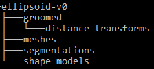
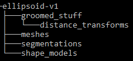

# When Modifying Existing Datasets

When modifying use case datasets, you must adhere to the use dataset control system to prevent everyone's use cases from breaking.  If you want to change the dataset in a way that breaks the use case script, you must upload a new version of the dataset using a suffix `<dataset-name>-vN`, where N is the dataset version.  

**Example:**
  
If I want to change the `groomed` folder in the ellipsoid use case to `groomed_stuff`.  The current python script looks for a `groomed` folder so this change will break the script.  Because of this, I upload a new version of the ellipsoid dataset with my change, leaving the old version untouched. Then I can proceed to change the script as needed.

