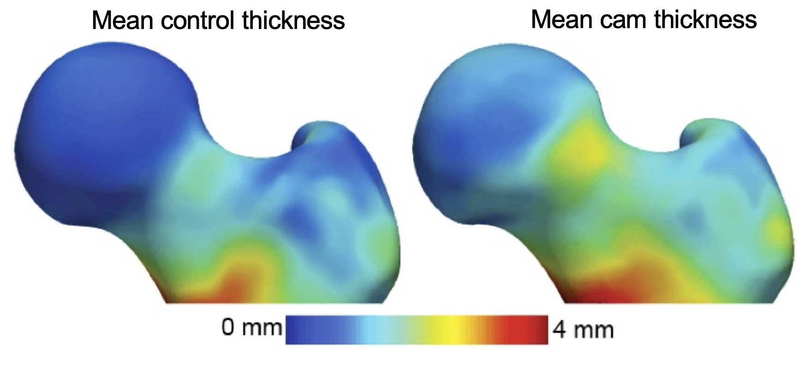
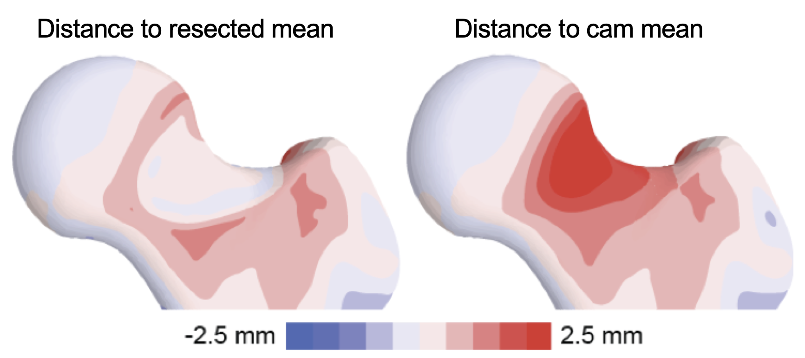
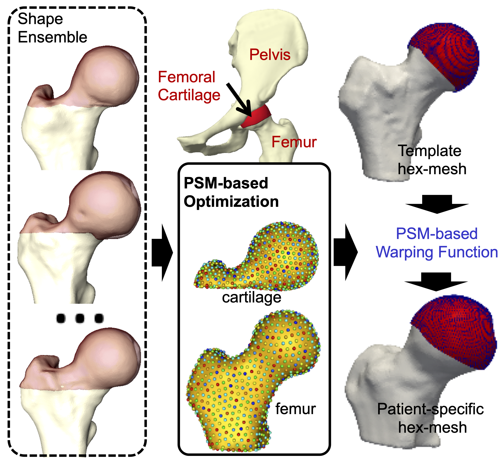
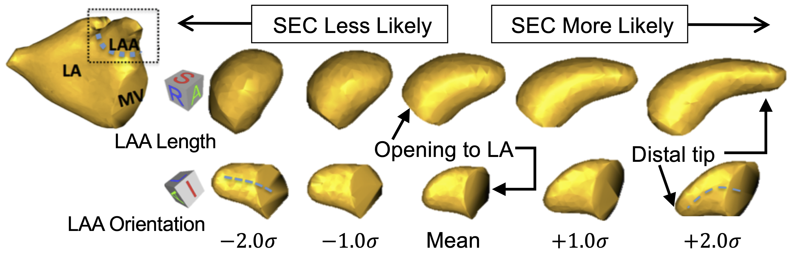
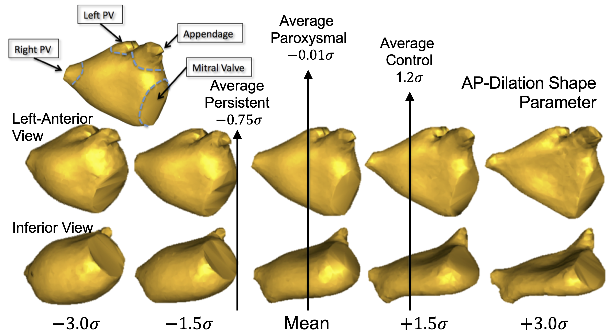
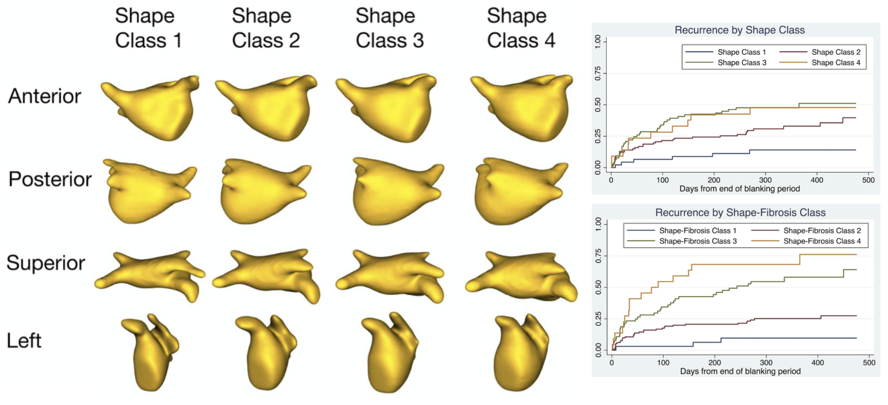
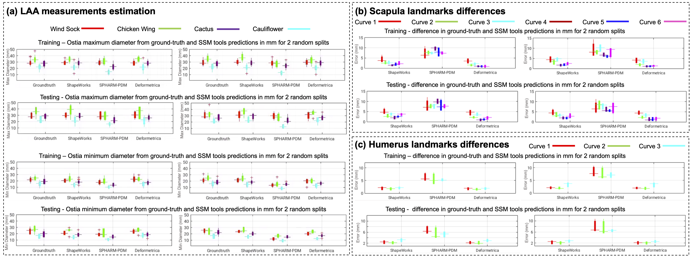

# ShapeWorks Success Stories (selected)

## Hip Joint FAI Pathology 

Cam-type femoroacetabular impingement (FAI) is a morphologic deformity of the femur that may reduce the femoral neck and acetabulum's clearance, resulting in high shear forces to the cartilage. 

By analyzing the femur cortical bone thickness between asymptomatic controls and cam-FAI patients, collaborators have used ShapeWorks to show that impingement likely induces bone hypertrophy. 

Information provided by ShapeWorks has resulted in resection guidelines that can be easily executed in the operating room.

 Moreover, the limitations of radiographic measurements of plain film radiographs were established, which are often used in the clinical diagnosis of cam-FAI. With a shape score that depends on group-specific mean shapes, the optimized correspondence model from ShapeWorks was used to place subject-specific anatomy on a disease spectrum that is statistically derived from the shape population, providing an objective metric to assess severity. 
 

 
 
ShapeWorks has further helped develop cost-effective patient-specific meshes (which otherwise require hundreds of man-hours) of the cartilage and labrum to develop computational models and simulations to model contact mechanics and the pathogenesis of hip osteoarthritis.

 

!!! note "Relevant Papers"
    - P. Atkins, P. Mukherjee, S. Elhabian, S. Singla, M. Harris, J. Weiss, R. Whitaker, and A. Anderson. Proximal femoral cortical bone thickness in patients with femoroacetabular impingement and normal hips analyzed using statistical shape modeling. In Summer Biomechanics, Bioengineering and Biotransport Conference, 2015.
    - P. R. Atkins, S. Y. Elhabian, P. Agrawal, M. D. Harris, R. T. Whitaker, J. A. Weiss, C. L. Peters, and A. E. Anderson. Quantitative comparison of cortical bone thickness using correspondence-based shape modeling in patients with cam femoroacetabular impingement. Journal of Orthopaedic Research, 35(8):1743–1753, 2017.
    - P. R. Atkins, S. K. Aoki, R. T. Whitaker, J. A. Weiss, C. L. Peters, and A. E. Anderson. Does removal of subchondral cortical bone provide sufficient resection depth for treatment of cam femoroacetabular impingement? Clinical Orthopaedics and Related ResearchR , 475(8):1977–1986, 2017.
    - P. R. Atkins, S. K. Aoki, S. Y. Elhabian, P. Agrawal, R. T. Whitaker, J. A. Weiss, C. L. Peters, and A. E. Anderson. Evaluation of the Sclerotic Subchondral Bone Boundary as a Surgical Resection Guide in the Treatment of Cam-type Femoroacetabular Impingement. In Annual Meeting of Orthopaedic Research Society, 2017.
    - P. Atkins, S. Elhabian, P. Agrawal, R. Whitaker, J. Weiss, S. Aoki, C. Peters, and A. Anderson. Can the sclerotic subchondral bone of the proximal femur cam lesion be used as a surgical resection guide? An objective analysis using 3D computed tomography and statistical shape modeling. In International Society of Hip Arthroscopy Annual Scientific Meeting, 2016.
    - P. Atkins, S. Elhabian, P. Agrawal, R. Whitaker, J. Weiss, C. Peters, S. Aoki, and A. Anderson. Which radiographic measurements best identify anatomical variation in femoral head anatomy? Analysis using 3D computed tomography and statistical shape modeling. In International Society of Hip Arthroscopy Annual Scientific Meeting, 2016.
    - P. Atkins, Y. Shin, P. Agrawal, S. Elhabian, R. Whitaker, J. Weiss, S. Aoki, C. Peters, and A. Anderson. Which Two-dimensional Radiographic Measurements of Cam Femoroacetabular Impingement Best Describe the Three-dimensional Shape of the Proximal Femur? Clinical Orthopaedics and Related ResearchR, 477(1):242–253, 2019.
    - P. Atkins, P. Mukherjee, S. Elhabian, S. Singla, R. Whitaker, J. Weiss, and A. Anderson. Warping of template meshes for efficient subject-specific FE mesh generation. In International Symposium of Computer Methods in Biomechanics and Biomedical Engineering, 2015.
    
## Pose and Shape of the Dysplastic Hip Joint

Developmental dysplasia of the hip (DDH) describes an undercoverage of the femoral head by the acetabulum and is most often described using angular measurements from radiographs used to estimate joint coverage. Since 3D analyses of the hip joint would be advantageous to defining the true morphology of DDH, an articulated, multiple-domain SSM was developed in ShapeWorks to isolate the morphological variation of the disease. The first four modes of variation largely represented variation in scale and pose, while all six modes included some subtle variations in bone morphology. 

While radiographic measurements provide some insight to joint morphology, there may be additional morphological features that better explain joint coverage and hip degeneration in these patients. By evaluating the modes of variation from our joint model against 3D measurements of coverage, we isolated the morphology associated with increased and decreased coverage within this population.

!!! note "Relevant Papers"
	- P. Agrawal, J.D. Mozingo, S.Y. Elhabian, A.E. Anderson, R.T. Whitaker. Combined Estimation of Shape and Pose for Statistical Analysis of Articulating Joints. Proceedings of Shape in Medical Imaging: International Workshop, ShapeMI 2020, pp. 111-121, 2020.
	- J.D. Mozingo, P.R. Atkins, P. Agrawal, K. Uemura, S.Y. Elhabian, R.T. Whitaker, A.E. Anderson. Morphology of Hip Dysplasia in Japanese Females: A Statistical Shape Modeling Study. Abstract for poster presentation at the 45th Meeting of the American Society of Biomechanics, 2021.
	- P.R. Atkins, P. Agrawal, J.D. Mozingo, K. Uemura, A.E. Anderson. Application of an Articulated Statistical Shape Model of the Hip to Predict Clinical Measures of Coverage. Abstract for podium presentation for the International Symposium on Computer Methods in Biomechanics and Biomedical Engineering, 2021.
    
    
## Scapular Morphology in Hill-Sachs Patients 

Surgical procedures for anterior shoulder instability reconstruct the glenoid and its soft tissue by creating an anterior buttress or overcome glenoid bone loss with an additional dynamic stabilizer (e.g., Latarjet procedure). However, the native anatomy must be sacrificed to obtain a stable shoulder. Recent findings suggest that there might be a place for more subtle changes of the periarticular structures, using, for example, a directional osteotomy of the coracoid, so that more normative anatomy is obtained. 

To this end, ShapeWorks has been used to define a data-driven linear discriminant between the Hill-Sachs lesions and control shapes in the shape space that demonstrates the spectrum of normal and pathologic scapulae (PDF - probability density function).

 

Modes of variations discovered by ShapeWorks were found to relate to clinically relevant shape variations. Mode 1 (33.0% of variation) represented scaling differences. Mode 2 (32.0% of variation) demonstrated large differences around the acromion. In Mode 3 (11.8% of variation), the glenoid inclination and concavity of the glenoid surface were the most substantial. Mode 4 (9.0% of variation) captured primarily differences in orientation of the coracoid pillar, coracoid process size, and bony prominence. Variation in deviation of the coracoid process and the resulting coracoacromial relationship were captured in Mode 5 (3.1% of variation).

 

!!! note "Relevant Papers"
    - Matthijs Jacxsens, Shireen Y. Elhabian, Sarah Brady, Peter Chalmers, Andreas Mueller, Robert Tashjian, Heath Henninger. Thinking outside the glenohumeral box: Hierarchical shape variation of the periarticular anatomy of the scapula using statistical shape modeling. Journal of Orthopaedic Research, in press, 2020.
    - Matthijs Jacxsens, Shireen Y. Elhabian, Sarah Brady, Peter Chalmers, Robert Tashjian, Heath Henninger. Coracoacromial Morphology: A Contributor to Recurrent Traumatic Anterior Glenohumeral Instability?. Journal of Shoulder and Elbow Surgery, 28(7), pp. 1316-1325, 2019.
    - Matthijs Jacxsens, Shireen Y. Elhabian, Robert Z. Tashjian1, Heath B. Henninger. Scapular Morphology In Patients With Hill-Sachs Lesions Using Statistical Shape Modeling. Abstract for podium presentation for the 27th Congress of the European Society for Surgery of the Shoulder and the Elbow (SECEC-ESSSE) conference, 2017.

    
## Shape Changes in Atrial Fibrillation

Shape changes of the left atrium (LA) and LA appendage (LAA) in AF are hypothesized to be linked to AF pathology and may play a role in thrombogenesis. Thrombus in the LA or LAA, due to stagnant blood flow in these chambers, is thought to be a significant cause of cardioembolic stroke in AF patients. However, many aspects of shape variation in the
heart are poorly understood. 

ShapeWorks models have been used to develop predictive indices of spontaneous echocardiographic contrast (SEC) and thrombus using LAA/LA shape (an indicator for the risk of stroke). Results showed distinct patterns of shape that are statistically more likely to be observed in patients with SEC. 

 

Shape-based AF severity has indicated significant differences (p-value < 0.001) in the LA among normal controls, paroxysmal AF, and persistent AF populations. 

 

In a recent study, ShapeWorks was used to discover that LA shape was shown to be an independent predictor of AF recurrence after ablation. Hence, ShapeWorks may become a useful tool to improve patient selection for ablation.

 

!!! note "Relevant Papers"
    - J. Cates, E. Bieging, A. Morris, G. Gardner, N. Akoum, E. Kholmovski, N. Marrouche, C. McGann, and R. S. MacLeod. Computational shape models characterize shape change of the left atrium in atrial fibrillation. Clinical Medicine Insights. Cardiology, 8(Suppl 1):99, 2015.
    - E. T. Bieging, A. Morris, B. D. Wilson, C. J. McGann, N. F. Marrouche, and J. Cates. Left atrial shape predicts recurrence after atrial fibrillation catheter ablation. Journal of Cardiovascular Electrophysiology, 2018.

    
## Benchmarking ShapeWorks in Clinical Applications

A recent benchmarking study has evaluated and validated ShapeWorks, Deformetrica, and SPHARM-PDM in clinical applications that rely on morphometric quantifications, particularly anatomical landmark/measurement inference and lesion screening. 

Results demonstrate that SSM tools display different levels of consistency. ShapeWorks and Deformetrica models are more consistent than models from SPHARM-PDM due to the groupwise approach of estimating surface correspondences. 

Furthermore, ShapeWorks and Deformetrica shape models are found to capture clinically relevant population-level variability compared to SPHARM-PDM models.

!!! note "Relevant Papers"
    - Anupama Goparaju, Ibolya Csecs, Alan Morris, Evgueni Kholmovski, Nassir Marrouche, Ross T. Whitaker, and Shireen Y. Elhabian. On the Evaluation and Validation of Off-the-shelf Statistical Shape Modeling Tools: A Clinical Application. ShapeMI-MICCAI 2018: Workshop on Shape in Medical Imaging, 2018.
    - Anupama Goparaju, Alexandre Bone, Nan Hu, Heath Henninger, Andrew Anderson, Stanely Durrleman, MatthijsJacxsens, Alan Morris, Ibolya Csecs, Nassir Marrouche, Shireen Elhabian, 2020. Benchmarking off-the-shelf statistical shape modeling tools in clinical applications. arXiv preprint arXiv:2009.02878.

    

## Next Story Can be Yours!

