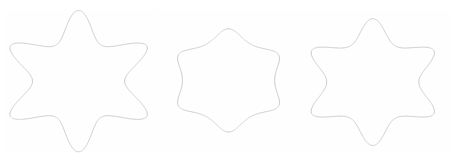

# Supershapes:Shape Model for Contour Domains

## What is the Use Case?

The `supershapes_1mode_contour` use case demonstrates using ShapeWorks tools to perform optimization for N-dimensional contours.
Contours are represented as a series of lines, that may be a closed loop. We consider 2D shapes generated from [the supershape equation](http://paulbourke.net/geometry/supershape/), with a single parameter sampled from a chi-squared distribution.
Here is an example of the data:


## Grooming Steps

In this use case, we download pre-groomed data.
The input contours are: 

## Relevant Arguments

This use case does not support any arguments

## Optimizing Shape Model
The python code for the use case calls the `optimize` command of ShapeWorks which requires the parameters of the optimization to be specified in a python dictionary. Please refer to [Parameter Dictionory in Python](../../workflow/optimize.md#parameter-dictionary-in-python) for more details.
Below are the default optimization parameters for this use case.


```python
{
        "number_of_particles" : 64,
        "use_normals": 0,
        "normal_weight": 0.0,
        "checkpointing_interval" : 5000,
        "keep_checkpoints" : 0,
        "iterations_per_split" : 100,
        "optimization_iterations" : 500,
        "starting_regularization" : 100,
        "ending_regularization" : 1,
        "recompute_regularization_interval" : 1,
        "domains_per_shape" : 1,
        "domain_type" : 'contour',
        "relative_weighting" : 5,
        "initial_relative_weighting" : 0.1,
        "procrustes_interval" : 2,
        "procrustes_scaling" : 0,
        "save_init_splits" : 0,
        "verbosity" : 0,
        "use_shape_statistics_after": 4,
}
```

## Analyzing Shape Model
Once the python code runs the optimization, the files are saved in the `Output` folder after which ShapeWorks Studio is launched from the python code to analyze the model. 
           
During the generation of the input supershapes data,the n2 and n3 variables were kept constant, and only the n1 variable was varied according to values sampled from a chi squared distribution. We obtain a shape model that accurately captures this variation(first mode variance = 98%)

