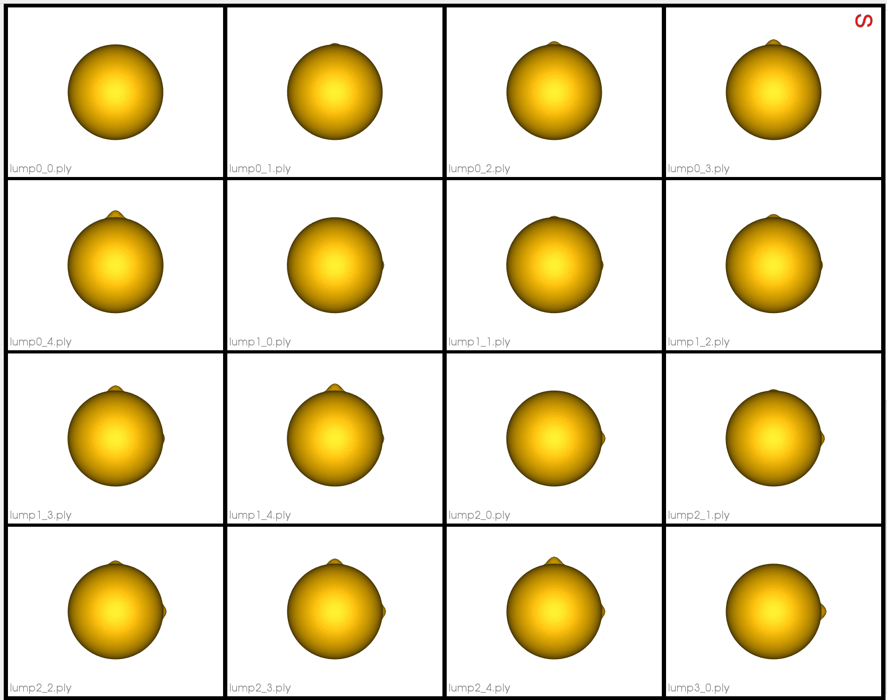
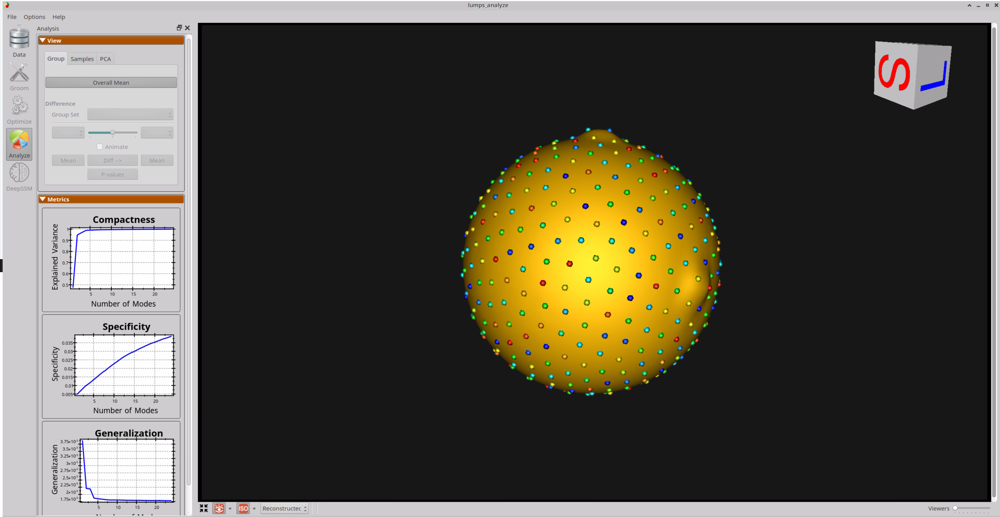
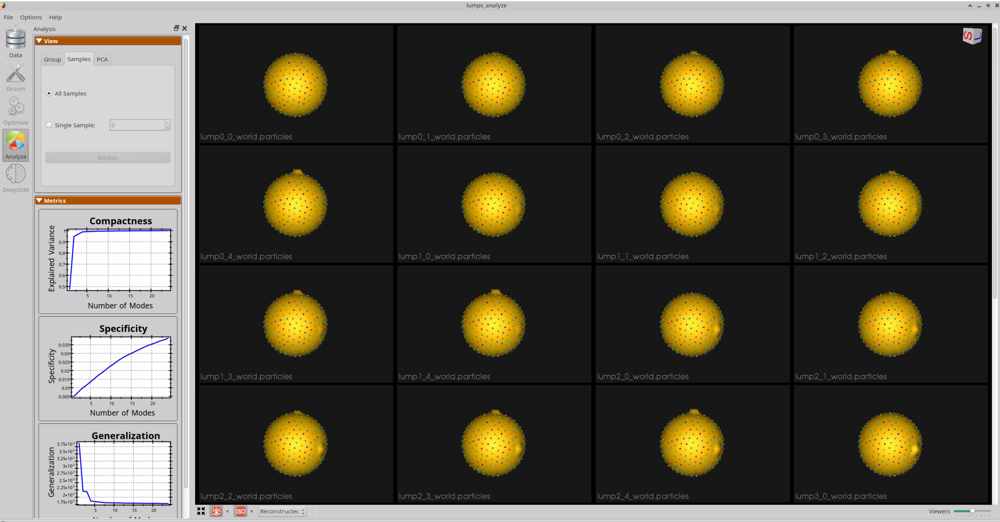

# Lumps: Shape Model directly from Mesh

## What is the Use Case?
The `lumps` use case demonstrates a minimal example of running ShapeWorks directly on a mesh using a synthetic dataset. The shapes in this dataset are spheres with two lumps or nodes that vary in size. The use case demonstrates that the ShapeWorks workflow results in a correct shape model- i.e., only the position of particles on the lumps vary; the rest are constant across the shape population.

## Grooming Steps
This is a synthetic dataset that is already in alignment and does not require grooming.
Here are some examples of the meshes:


## Relevant Arguments
[--use_subsample](../use-cases.md#-use_subsample)
[--num_subsample](../use-cases.md#-use_subsample)
[--use_single_scale](../use-cases.md#-use_single_scale)
[--tiny_test](../use-cases.md#-tiny_test)

## Optimization Parameters
The python code for the use case calls the `optimize` command of ShapeWorks, which requires that the optimization parameters are specified in a python dictionary. Please refer to [Parameter Dictionary in Python](../../workflow/optimize.md#parameter-dictionary-in-python) for more details. 
Below are the default optimization parameters for this use case.

```python
{        
        "number_of_particles": 512,
        "use_normals": 0,
        "normal_weight": 10.0,
        "checkpointing_interval": 100,
        "keep_checkpoints": 0,
        "iterations_per_split": 2000,
        "optimization_iterations": 500,
        "starting_regularization": 10,
        "ending_regularization": 1,ss
        "recompute_regularization_interval": 1,
        "domains_per_shape": 1,
        "domain_type": "mesh",
        "relative_weighting": 10,
        "initial_relative_weighting": 1,
        "procrustes_interval": 0,
        "procrustes_scaling": 0,
        "save_init_splits": 0,
        "verbosity": 1
}
```

## Analyzing Shape Model         
Here is the mean shape of the optimized shape mode using single-scale optimization. Note the two tiny lumps at the top, and towards the right.



Here are lumps samples with their optimized correspondences.


Here is a video showing the shape modes of variation (computed using principal component analysis - PCA) of the lumps dataset using single-scale optimization.

<p><video src="https://sci.utah.edu/~shapeworks/doc-resources/mp4s/lumps_pca.mp4" autoplay muted loop controls style="width:100%"></p>

Note that the particles which do not lie on the lumps remain stationary. The shape model correctly caputures the modes of variation.
