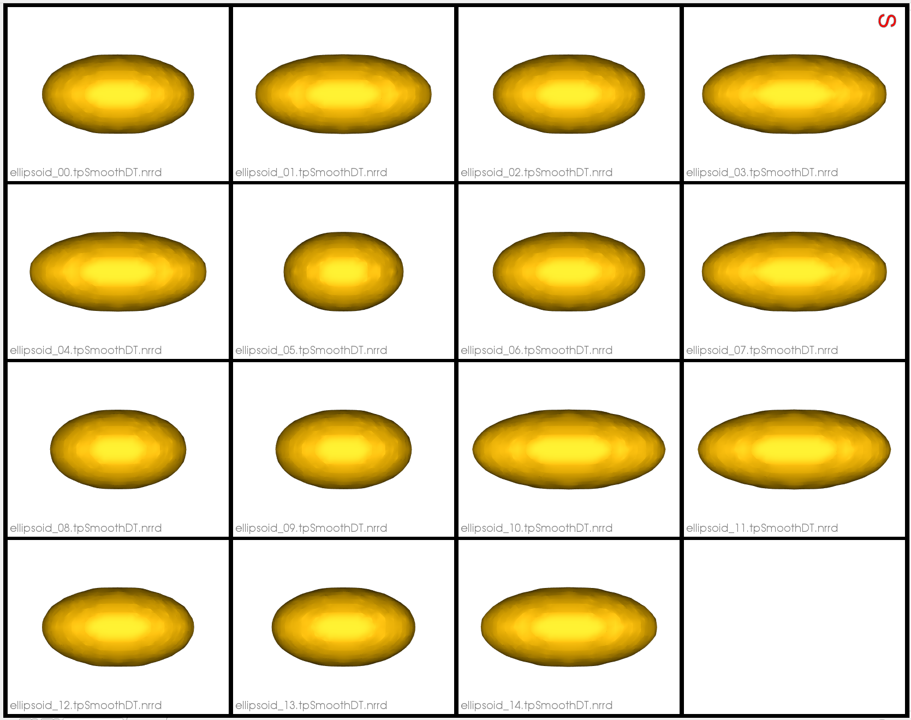

# Ellipsoid: Cutting Planes

## What is the Use Case? 
The `ellipsoid_cut` example demonstrates using multiple cutting planes to constrain the distribution of particles on ellipsoids which are already aligned. This can be used in modeling scenarios where statistical modeling/analysis is needed for a region-of-interest on the anatomy/object-class at hand without having to affect the input data. 

Here is an example of where the cutting planes intersect and ellipsoid:
<p><video src="https://sci.utah.edu/~shapeworks/doc-resources/mp4s/ellipsoid_cut_trim.mp4" autoplay muted loop controls style="width:100%"></p>

## Grooming Steps
This use case starts with pre-aligned segmentations. The only grooming step is [computing the signed distance transform](../../workflow/groom.md#converting-segmentations-to-smooth-signed-distance-transforms) for each segmentation.


## Relevant Arguments
[--use_subsample](../use-cases.md#-use_subsample)
[--num_subsample](../use-cases.md#-use_subsample)
[--skip_grooming](../use-cases.md#-skip_grooming)
[--use_single_scale](../use-cases.md#-use_single_scale)
[--mesh_mode](../use-cases.md#-mesh_mode)
[--tiny_test](../use-cases.md#-tiny_test)

## Optimization Parameters
The python code for the use case calls the `optimize` command of ShapeWorks, which requires that the optimization parameters are specified in a python dictionary. Please refer to [Parameter Dictionary in Python](../../workflow/optimize.md#parameter-dictionary-in-python) for more details. 
Below are the default optimization parameters for this use case.

```python
        "number_of_particles": 32,
        "use_normals": 1,
        "normal_weight": 15.0,
        "checkpointing_interval": 200,
        "keep_checkpoints": 0,
        "iterations_per_split": 3000,
        "optimization_iterations": 3000,
        "starting_regularization": 100,
        "ending_regularization": 10,
        "recompute_regularization_interval": 2,
        "domains_per_shape": 1,
        "domain_type": 'image',
        "relative_weighting": 15,
        "initial_relative_weighting": 0.05,
        "procrustes_interval": 0,
        "procrustes_scaling": 0,
        "save_init_splits": 0,
        "verbosity": 0,
        "adaptivity_mode": 0,
        "cutting_plane_counts": cutting_plane_counts,
        "cutting_planes": cutting_planes
```

Here `cutting_plane_counts` is two for every ellipsoid and there are 15 ellipsoids so it is a list of twos of length 15.
The `cutting_planes` parameter is a list of the two cutting plane points of length 15.

## Analyzing Shape Models
Below we can see the resulting shape model where correspondence points do not lie beyond the cutting planes and only a secton of the ellipsoids are modeled. 

<p><video src="https://sci.utah.edu/~shapeworks/doc-resources/mp4s/ellipsoid_cut_studio.mp4" autoplay muted loop controls style="width:100%"></p>

