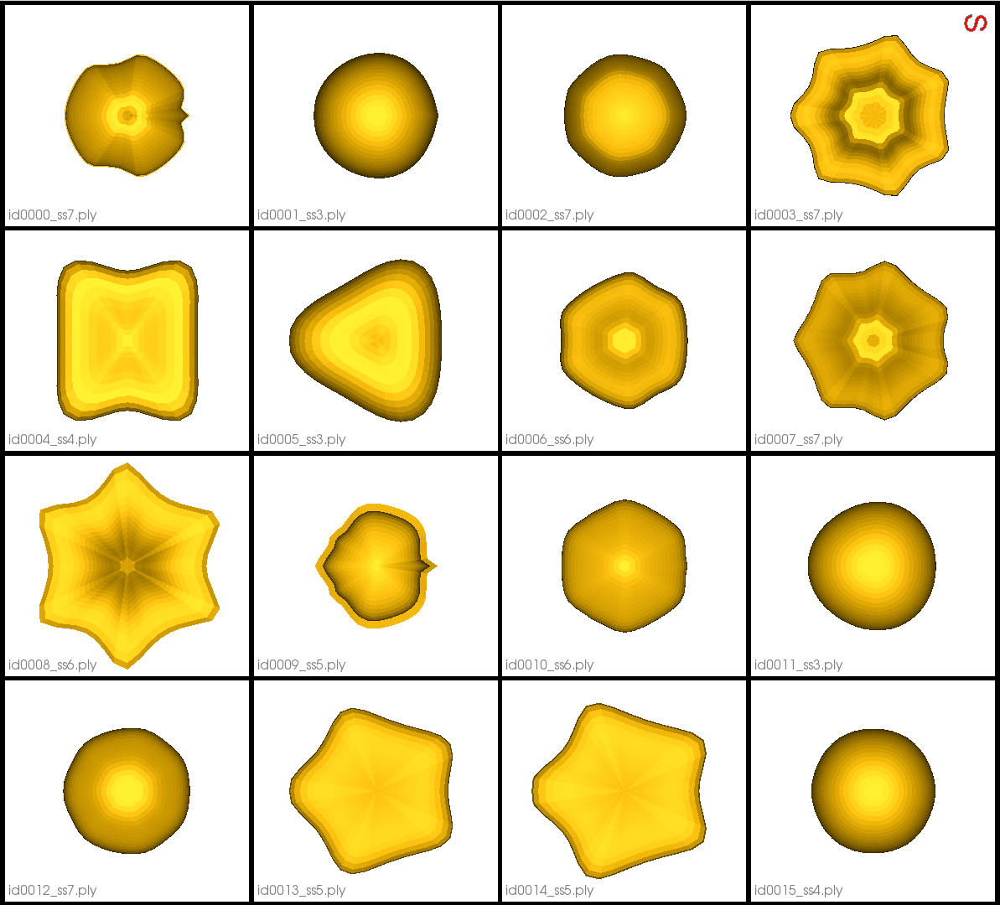
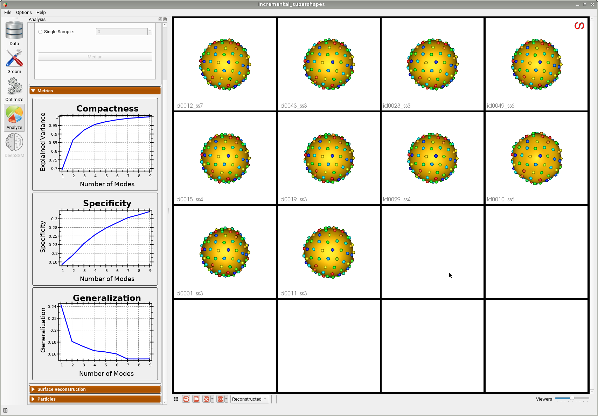
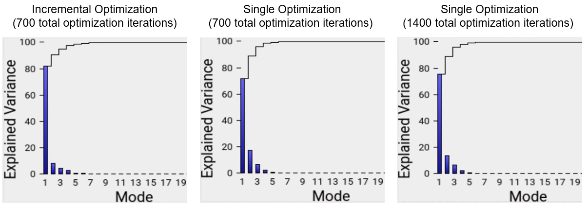
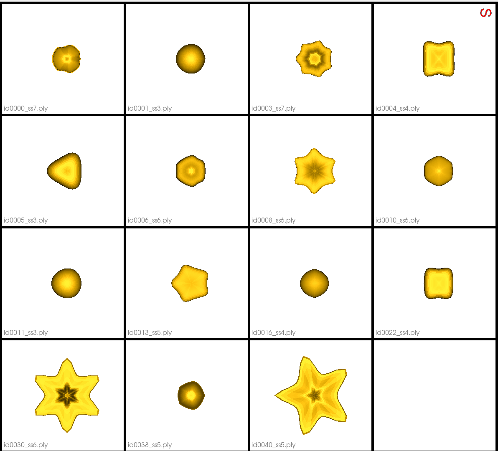

# Incremental Supershapes: Building a Shape Model Incrementally

## What is the Use Case? 
The `incremental_supershapes` use case demonstrates how a shape model can be built incrementally. This approach is beneficial in two scenarios. The first is when the cohort of shapes is very large, where optimizing particle position across all shapes at once would take a very long time. In this case, by fitting a shape model on a subset of the data, then incrementally updating the shape model using the previous model as initialization, the total time for optimization can be greatly reduced. The second scenario is when the dataset is small but contains a large amount of shape variation. In this case, by initally fitting a model on the most similar shapes, then incrementally adding outlier shapes, we can achieve a more compact shape model with better correspondence then if we were to optimize on the whole dataset at once.

The use case dataset is comprised of parameterized meshes called Supershapes generated using the ShapeWorks [Shape Cohort Generation](../..//notebooks/getting-started-with-shape-cohort-generation.ipynb) package.
There are 50 meshes that vary greatly in shape. They have 2 to 7 lobes and the parameters are sampled from a chi-squared distribution. The function used to generate the data is included in the Python script.

## Grooming Steps
In this use case, the Superhapes are generated so that they are already aligned/groomed.
Here are some examples of the meshes:


## Relevant Arguments
[--use_subsample](../use-cases.md#-use_subsample)
[--num_subsample](../use-cases.md#-use_subsample)
[--tiny_test](../use-cases.md#-tiny_test)

## Incremental Optimization
In incremental optimization an intial shape model is fit by running optimization as usual. Additional shapes are then added and the shape model is incrementally updated by initalizing particles using the previous shape model and running optimization again. The mean particles from the existing shape model are used to initalize particles on new shapes.

We define the order in which shapes are added so that particles are fit to inlier shapes first, then outliers. This results in quicker optimization and a better shape model. To determine this order we sort the meshes using surface-to-surface distance to a reference mesh so that they are ordered from least unque to most unique, then create batches.

The first batch is used to create an initial shape model and the remaining batches are incrementally added and optimized on.

## Optimization Parameters
The python code for the use case calls the `optimize` command of ShapeWorks, which requires that the optimization parameters are specified in a python dictionary. Please refer to [Parameter Dictionary in Python](../../workflow/optimize.md#parameter-dictionary-in-python) for more details. 

Here are the parameters used for optimizing the intial shape model:
```python
{        
        "number_of_particles": 128,
        "use_normals": 0,
        "normal_weight": 10.0,
        "checkpointing_interval": 300,
        "keep_checkpoints": 0,
        "iterations_per_split": 300,
        "optimization_iterations": 1400,
        "starting_regularization": 10,
        "ending_regularization": 1,
        "recompute_regularization_interval": 1,
        "domains_per_shape": 1,
        "relative_weighting": 1,
        "initial_relative_weighting": 0.05,
        "procrustes_interval": 0,
        "procrustes_scaling": 0,
        "save_init_splits": 0,
        "verbosity": 0,
        "multiscale": 1,
        "multiscale_particles": 32
}
```
After the initial optimization, the follwoing parameters are updated for each incremental optimization:
```python
{        
        "use_landmarks": 1,
        "iterations_per_split": 0,
        "optimization_iterations": 100,
        "multiscale": 0
}
```
Here "use_landmarks" enables particle initalization. We use single scale optimization with no initialization iterations since the particles are already intialzed by the former shape model or mean particles. We can also reduce the optization iterations as we are not starting from scratch.

## Analyzing Shape Model
Below is the intial shape model after optimizing on the first batch of 10 meshes. We can see all 10 are relatively similar. 


Below is the final shape model after incrementally adding batches and running optimization. We can see the shape model accurately captures the original shapes as well as the more unique ones.


Here is the mean shape of the final shape model along the first PCA mode. Almost all of the variance is captured by the first four PCA modes.


## Comparison to Single Optimization

### Full Dataset

To see the benefit of incremental optimization, we can compare the results of this use case to the results we'd get from running a single optimization on all of the shapes at once. For a far comparison, the single optimization is done using the same parameters as the intial optimization in the incremental case, except the number of optimization iterations is increased to match the total number of optimization iterations performed across the entire incremental process.

By comparing the vairance graphs below, we can see that the incremental optimization results in a mode compact shape model. In the shape model optimized incrementally the primary mode of variation exaplins 82.1% of the shape variation whereas in the shape model optimized all at once, the primary mode only captures 71.6% of the shape variation. If we double the amount of optimization iterations in the single optimization case, we get closer to the incremental model, with 75.3% of the variation captured by the first mode. But the model is still not as compact and takes much longer to run.



### Subsample of Dataset

The benefit of incremental optimization is even more apparent in the case where the datsaset is small and varies greatly. To see this we can run the use case with the `--use_subsample` tag. The subsample is automatically selected using clustering so that it is representative of the entire dataset, thus it is defined to have as much variation as possible. For example, when `--num_subsample` is set to 9, the selected meshes are shown below.



Below is the first mode of variation from the shape model optimized incrementally on the subset. 


Below is the first mode of variation from a shape model optimized on the whole subset at once for the same total number of optimization iterations as the incremental model. 


We can see that the incremental optimization approach resulted in a much better shape model.
