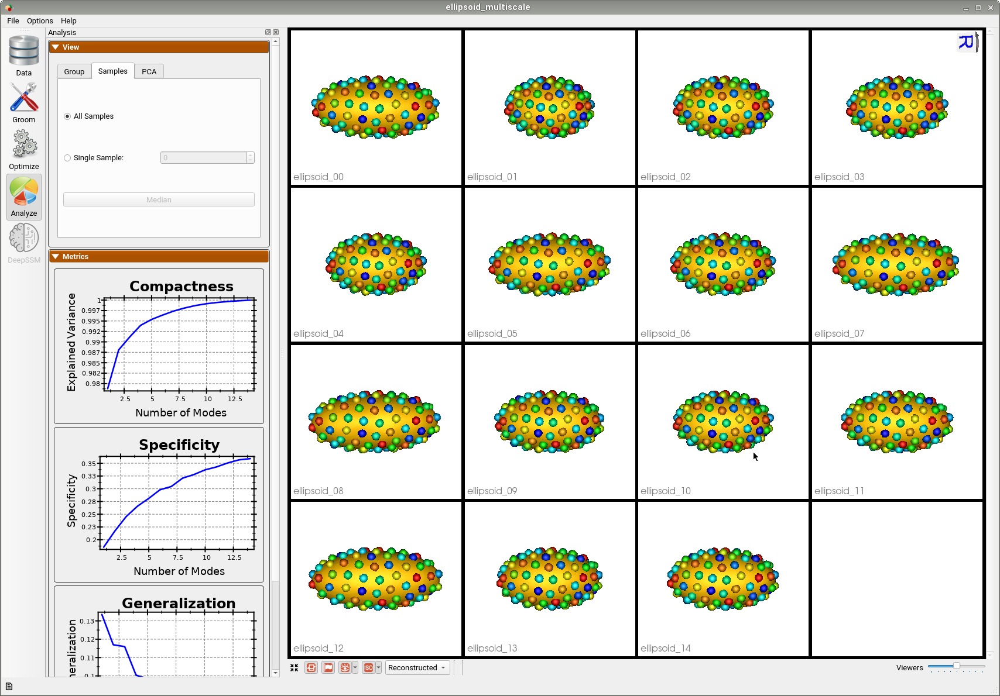

# Ellipsoid: Shape Evaluation in Python

## What is the Use Case?

The `ellipsoid_evaluate` use case demonstrates the functionality of shape evaluation tools of ShapeWorks python API. These API's include calculation of quantitative evaluation metrics such as specificity, generalization, and compactness.For detailed explaination of the evaluation metrics, refer to [Shape Model Evaluation.](../../new/ssm-eval.md) 
This use case reads the correspondence model of the ellipsoid segmentation images use case.




## Relevant Arguments

[--tiny_test](../use-cases.md#-tiny_test)

## Analyzing Shape Model Using Python APIs
The `ShapeEvaluation()` module of `ShapeWorks` python API, calcutates the three evaluation metrics given the correspondence model. The correspondence model can be read using the `ParticleSystem()` module. 

```python
# Read the particle files from a pre-trained shape model
particle_data = sw.ParticleSystem(<list of local point files>)
```

The `ShapeEvaluation()` module has two types of commands which can query either a particular metric at the specified mode of variation or get the metric values for all the modes of variation. 

To access the metrics at a specified mode of variation:


```python
# Get the compactness of a specific mode 
nCompactness = sw.ShapeEvaluation.ComputeCompactness(particleSystem=particle_data,Modes=3)

# Get the generalization of a specific mode and saves the reconstructions
nGeneralization = sw.ShapeEvaluation.ComputeGeneralization(particleSystem=particle_data, nModes=3,saveTo=save_dir)

# Calculate specificity of a given mode and saves the reconstructions
nSpecificity = sw.ShapeEvaluation.ComputeSpecificity(particleSystem=particle_data, nModes=3,saveTo=save_dir)
```

To access the metrics for all the modes of variations:

```python
# Get compactness of all the modes
allCompactness = sw.ShapeEvaluation.ComputeFullCompactness(particleSystem=particle_data)

#Get generalization values for all modes
allGeneralization = sw.ShapeEvaluation.ComputeFullGeneralization(particleSystem=particle_data)

#Get specificity values for all modes
allSpecificity = sw.ShapeEvaluation.ComputeFullSpecificity(particleSystem=particle_data)
```
Generalization value of the 3rd mode -  0.09600121582319728

Generalization Best Reconstruction
Generalization Worst Reconstruction

Specificity value of the 3rd mode -  0.21431799055403217

Specificity Best Reconstruction
Specificity Worst Reconstruction