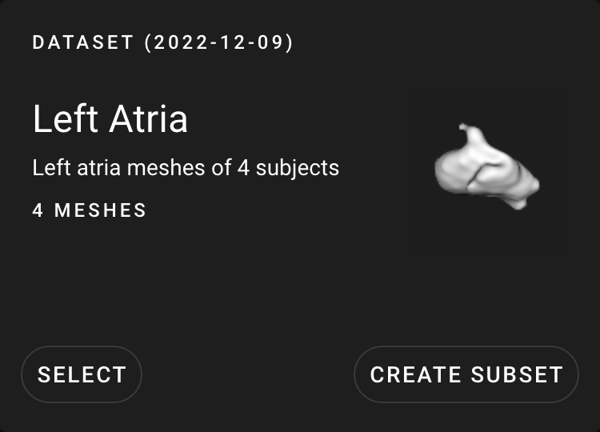

# ShapeWorks Cloud Dataset

**Note**: This documentation version could be outdated. [Click here](http://sciinstitute.github.io/ShapeWorks/dev/cloud/cloud-dataset.html) to get the most up-to-date version.

The dataset list displays the uploaded datasets. Each dataset contains [projects](cloud-project.md), which are where you interact with the data. A dataset can contain [meshes](../dev/datasets.md#meshes) and [segmentations](../dev/datasets.md#segmentations).

## Create Subset

The "Create Subset" option allows you to create a new subset dataset from the selected dataset. Here, you are able to provide a name, description, and keywords. You are also able to select which anatomies and subjects you wish you include in the subset.

## Thumbnail

{: width="400"}

The thumbnail for a dataset can be generated in the [Shape Viewer](cloud-shape-viewer.md#thumbnail). The thumbnail will appear as a preview on the dataset view.

## Upload Dataset

Uploading a dataset to Shapeworks Cloud can only be done from SWCC, the ShapeWorks Cloud Client. Go to [ShapeWorks Cloud Client](swcc.md#datasets) for more information.
