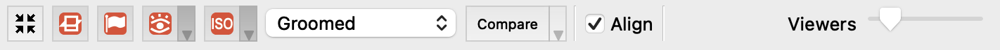
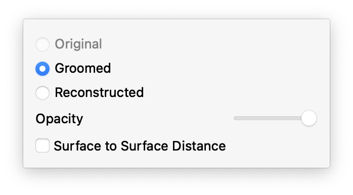
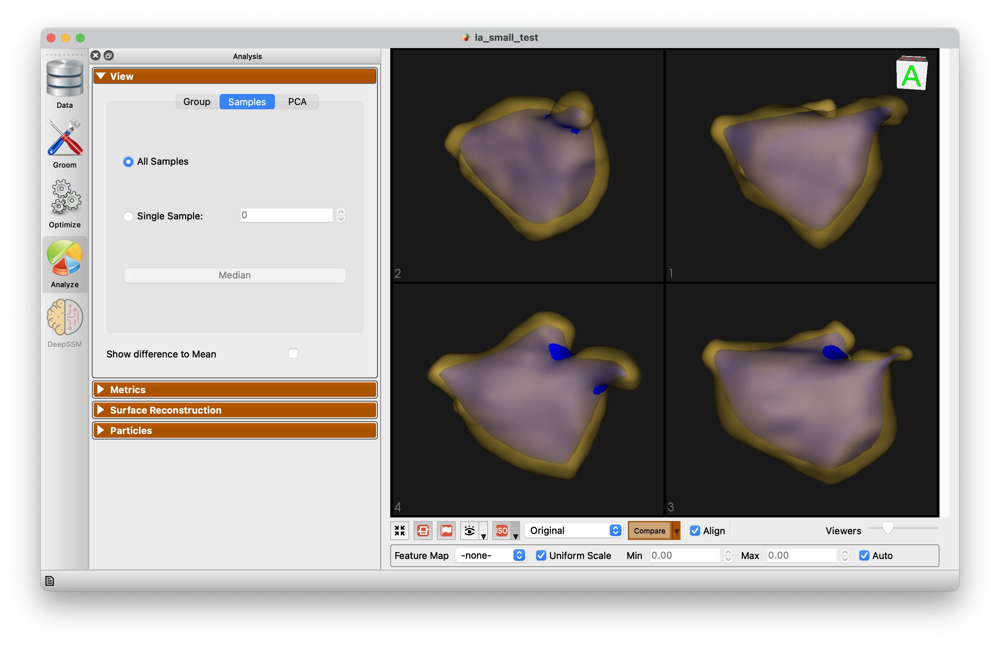
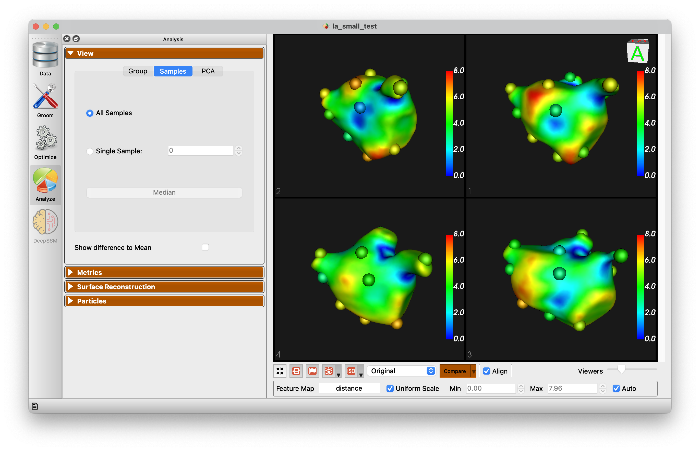
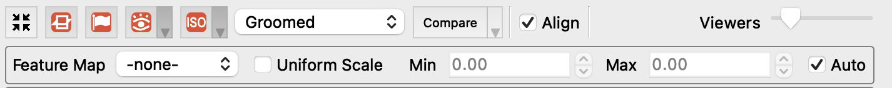
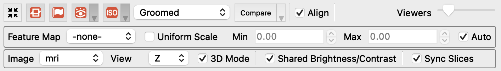
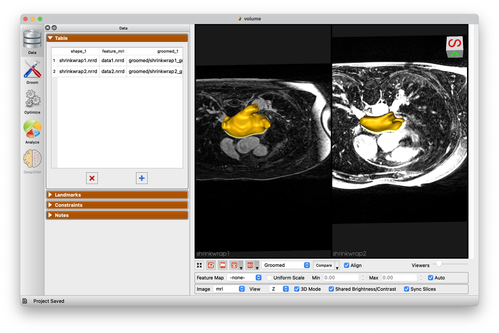
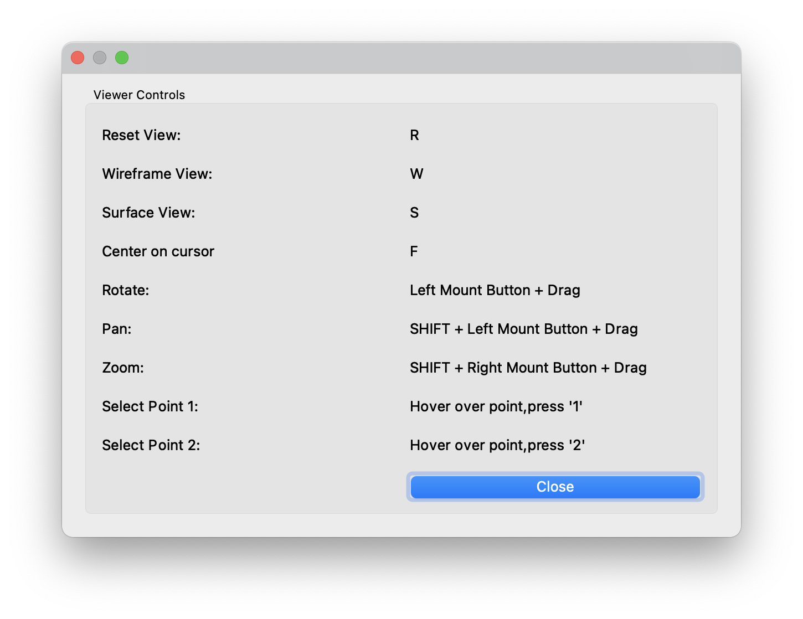
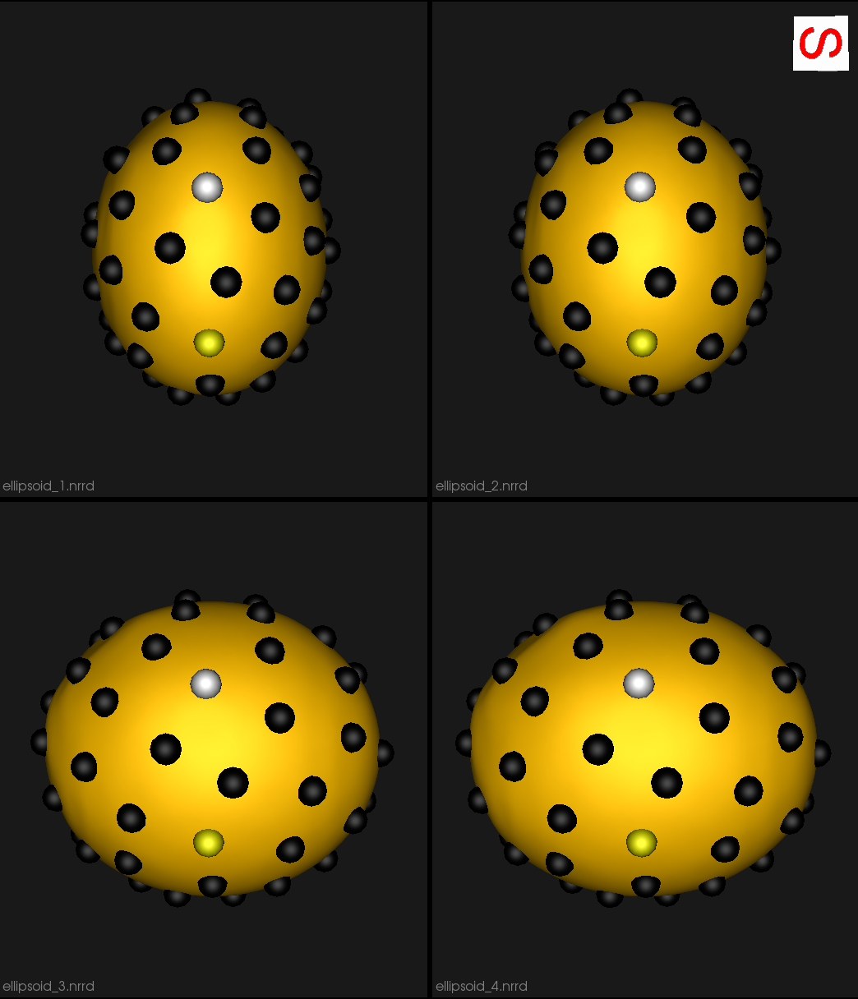

# ShapeWorks Studio Viewer Controls

At the bottom of the viewers are the controls for the viewers:

Each button has tooltips with descriptions.  The controls from left to right are:

* Autoview / reset view
* Cutting plane visibility
* Landmark visibility
* Glyph visibility with dropdown for glyph size and detail
* Isosurface visibility with dropdown for surface opacity (of each domain)
* View mode (original/groomed/reconstructed)
* Align (whether to align each object based on the alignment strategy)
* Compare mode (e.g. compare original vs groomed)
* Number of views in lightbox (1,2,4,9,16,25,36,49,64)

## Comparing mesh types

The comparison mode toggle also has a dropdown with additional controls:

{: width="300" }

Comparison can be performed either as an overlay (with individual opacity controls):

Or comparison can be performed showing a surface to surface distance:

## Feature maps and scalars controls

When feature volumes or meshes with scalars are loaded, or other scalar values are present, the extended panel will be displayed:

This adds the feature map / scalar selection and a checkbox to apply a uniform scale to all viewers, vs local scale for each.  Additionally, the auto range can be turned off and specified range can be set.

## Image volume support

When image volumes are provided, another extended panel will be displayed:

* Image selection
* Plane direction (X/Y/Z)
* Enabled 2D/3D viewere mode
* Shared Brightness/Contrast between viewers
* Sync slice position between viewers

## Keyboard Shortcuts

The keyboard shortcuts are available from the Help -> Keyboard Shortcuts menu item.

## Point selection 

As shown in the keyboard shortcuts panel, you can hover over a particle and press the '1' key.  This will select this point on all viewers.

The selected point will become white and all other points will change to a color based on the distance to the chosen point.

To turn off this display, press '1' while hovering over something other than a particle.

Additionally, after selecting a point, you may select another point by pressing '2' while hovering.  This will set the first point to white, the second point to yellow and the rest to black.  This is an easy way to see how particlar particles vary and correspond across shapes.

