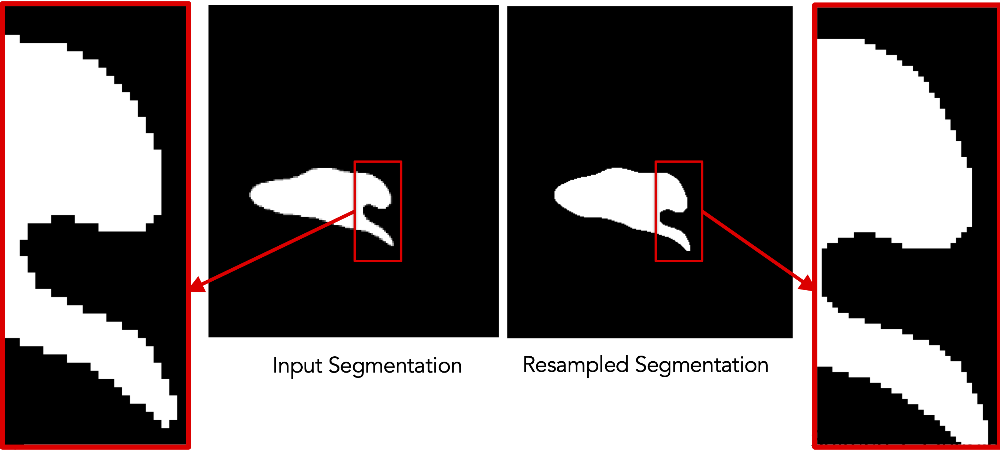

# ShapeWorks Command

ShapeWorks was a conglomeration of independent executables for grooming and optimization with a GUI (ShapeWorks Studio) for analysis and visualization. This design is highly inflexible, task specific, and poorly documented, and Studio duplicated a significant portion of their functionality.

We have made significant efforts in organizing the codebase based on functionalities, implementing them as libraries rather than executables to provide a common backbone to command-line and GUI-based tools, and syncing ShapeWorks Studio to use the same underlying libraries.


To retain command line usage, we have created a single [`shapeworks`](../tools/ShapeWorksCommands.md) command with subcommands exposing this functionality along with greater flexibility and interactive `--help` for each subcommand. 

This consolidation makes the framework more powerful and flexible. It also enables ShapeWorks functionality to be used as libraries linked to new applications. 

All the executables used for the segmentation-driven grooming have been consolidated, documented, tested against the original command line tools, and functionally debugged

Comprehensive unit testing is implemented and executed as part of automatic validation run with each addition to the code. This also serves as independent examples of its use 


## Example: ResampleVolumesToBeIsotropic


!!! note "Old command-line: `ResampleVolumesToBeIsotropic `"
    ```
    ./ResampleVolumesToBeIsotropic --inFilename <input-file> --outFilename <output-file> 
                                   --isoSpacing <voxel-spacing>
                                  [--isBinaryImage] [--isCenterImageOn]
    ```


**Disadvantages of the old command-line tool:**        

- Cannot be used by other classes or other APIs or other functions
- Not adaptable (need to edit script files to customize it)
- Each command needs to be given input and output paths
- Creates IO bottlenecks
- Fixed parameters cannot be changed (e.g., num iterations for binarization)
- All logic is buried behind a single command line tool


### Resampling images

!!! note "Old command-line: `ResampleVolumesToBeIsotropic` (for images)"
    ```
    ./ResampleVolumesToBeIsotropic --inFilename <input-file> --outFilename <output-file> 
                                   --isoSpacing <voxel-spacing>
                                   --isCenterImageOn
    ```

!!! important "New command-line: `isoresample` (for images)"
    ```
    shapeworks readimage --name <input-file> recenter 
               isoresample --isospacing <voxel-spacing>
               writeimage --name <output-file>
    ```

!!! important "C++ (without chaining): `isoresample` (for images)"
    ```c++
    Image img(<input-file>);
    img.recenter();
    img.isoresample(<voxel-spacing>);
    img.write(<output-file>);
    ```
    
!!! important "C++ (with chaining): `isoresample` (for images)"
    ```c++
    Image img(<input-file>).recenter().isoresample(<voxel-spacing>).write(<output-file>);
    ```


### Resampling segmentations

!!! note "Old command-line: `ResampleVolumesToBeIsotropic` (for segmentations)"
    ```
    ./ResampleVolumesToBeIsotropic --inFilename <input-file> --outFilename <output-file> 
                                   --isoSpacing <voxel-spacing>
                                  --isBinaryImage --isCenterImageOn
    ```

The old executable’s functionalities are broken down further to make it more modular:

- Antialias using `shapeworks antialias` 
- Recenter using `shapeworks recenter`
- Binarize using `shapeworks binarize`


**Advantages for the new shapeworks API:**

- Promotes user’s understanding of the underlying functionality (more transparency and equivalent simplicity)
- Allows the user to choose the set of commands to be run
- User can know what parameters are considered to perform each command
- User can modify parameter values each step of the way
- User can save/visualize intermediate outputs for troubleshooting 


!!! important "New command-line: `isoresample` (for segmentations)"
    ```
    shapeworks readimage --name <input-file> 
               recenter antialias --iterations <num-iter> 
               isoresample --isospacing <voxel-spacing> binarize 
               writeimage --name <output-file>
    ```

!!! important "C++ (without chaining): `isoresample` (for segmentations)"
    ```c++
    Image img(<input-file>);
    img.recenter();
    img.antialias(<num-iter>);
    img.isoresample(<voxel-spacing>);
    img.binarize();
    img.write(<output-file>);
    ```
    
!!! important "C++ (with chaining): `isoresample` (for images)"
    ```c++
    Image img(<input-file>).recenter().antialias(<num-iter>).isoresample(<voxel-spacing>).binarize().write(<output-file>);

    ```
