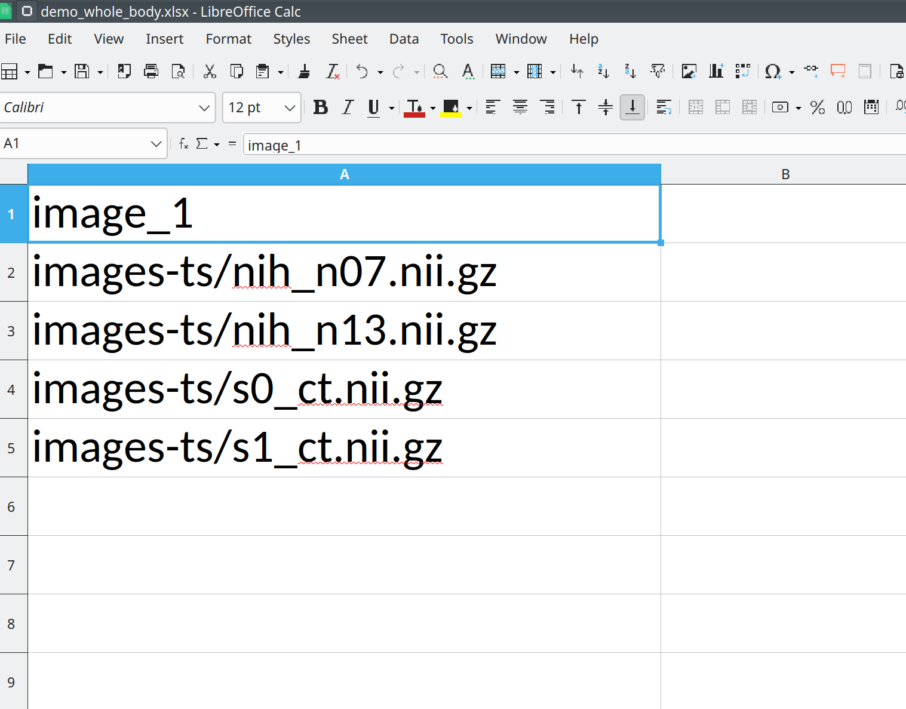
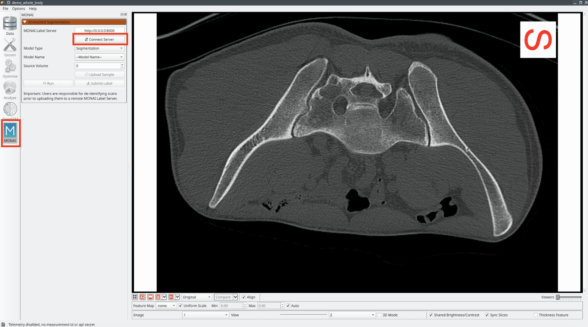
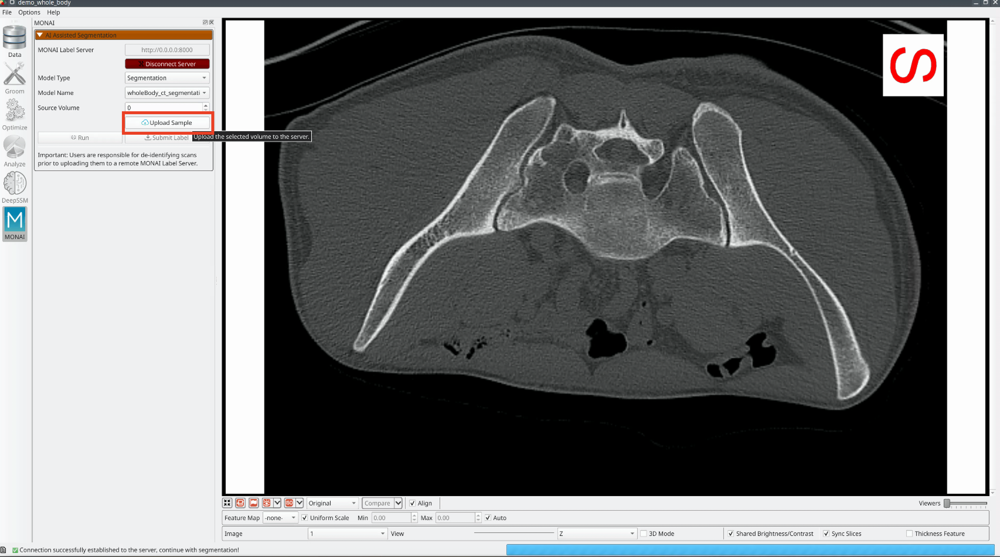
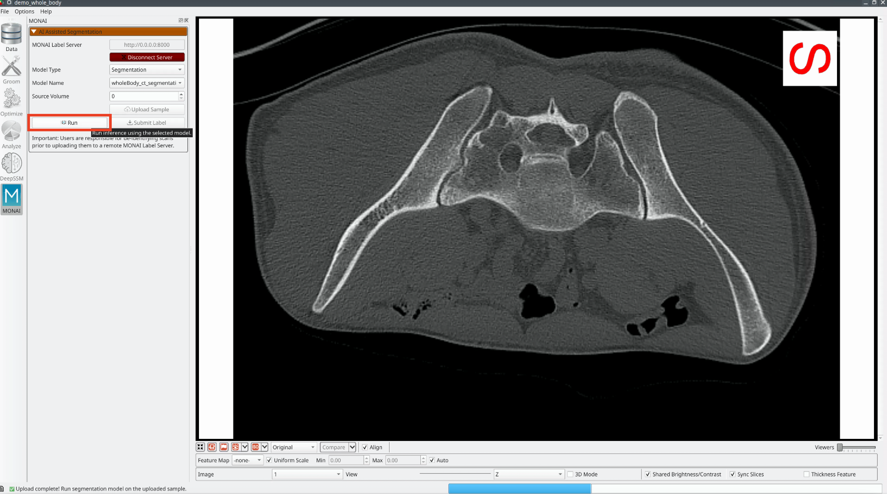

# **Why Use AI-Assisted Segmentation in ShapeWorks?**  

AI-assisted segmentation revolutionizes medical image analysis by delivering **fast, accurate, and reproducible** segmentation results. Traditional manual segmentation is not only **time-consuming** but also prone to **inter-observer variability**, leading to inconsistencies in analysis.  

By leveraging **AI models** such as those provided by [**MONAI Label**](https://docs.monai.io/projects/label/en/latest/), users can **automate and refine segmentation** tasks with minimal manual effort. This enhances workflow efficiency and **improves clinical decision-making** by providing reliable and high-quality segmentation results.  

ShapeWorks now seamlessly integrates **MONAI Label**, enabling **end-to-end AI-assisted segmentation** within its ecosystem. This allows users to directly generate **precise shape models** from AI-derived segmentations and utilize the full functionality of ShapeWorks—**including statistical shape analysis, shape modeling, and visualization**—without additional manual processing. This integration accelerates research, improves reproducibility, and facilitates more advanced shape-based analyses from medical images.

---

# **MONAI Label Steps**

This guide walks through setting up and using **MONAI Label** for AI-assisted segmentation within **ShapeWorks**.

## **Installation Prerequisites**

Before starting, ensure you meet the necessary requirements.

### **1. Install MONAI Label**

**Supported Platforms:**
- Ubuntu and Windows OS with **GPU/CUDA enabled**
- Requires **Python 3.8 or 3.9** with **PyTorch and CUDA installed**

!!! note "Note"
    MONAI Label features are not verified on other Python versions.

To install MONAI Label, run:

```sh
pip install monailabel
```

---

### **2. Download MONAI Label Applications**

Once installed, set up the MONAI Label application.

#### **Download the MONAI Bundle App**

The [**MONAI Bundle**](https://monai.io/model-zoo.html) App enables easy import of any model present in **MONAI Model Zoo Bundles** into **MONAI Label**, but models must comply with the [**MONAI Bundle Specification**](https://docs.monai.io/en/latest/mb_specification.html).

```sh
monailabel apps --download --name monaibundle --output path/to/workspace_dir
```

This command downloads the ``monaibundle`` app into the specified workspace directory.

Other supported MONAI Label app:
  - 
  - [**Radiology** ](https://monai.io/label.html)

---

# **Steps for AI-Assisted Segmentation in ShapeWorks**  

Once all the prerequisites are met, follow these steps to use **MONAI Label** feature in **ShapeWorks** for AI-assisted segmentation.

### **1. Start the MONAI Label Server**  
To launch the **MONAI Label server**, run the following command in your terminal:

```sh
monailabel start_server --app path/to/monaibundle --studies path/to/images --conf models model_name
```

#### **Command Arguments**  
- **`--app`**: Specifies the path to the **MONAI Label app** in the workspace directory.  
  - Example: `path/to/monaibundle`  
- **`--studies`**: Defines the directory where input images are stored for MONAI Label.  
  - Example: `path/to/images`  
- **`--conf`**: Configuration settings for the selected model.  
  - Example: `--conf model model_name`  
  - `model_name`: The AI model used for segmentation (refer to the **Supported Models** section below).


#### **📌 Supported Models**  

The **MONAI Model Zoo** provides a variety of AI models for automated medical image segmentation. Below is a list of supported models and their functionalities:

| **model_name**                            | **Model Type**       | **Targeted Structures**        | **Modality** | **Description** |
|--------------------------------------|---------------|------------------------------|-------------|----------------------------------|
| spleen_ct_segmentation              | UNet          | Spleen                       | CT          | 3D segmentation of the spleen |
| swin_unetr_btcv_segmentation        | SwinUNETR     | Multi-Organ                  | CT          | 3D multi-organ segmentation |
| prostate_mri_anatomy                 | UNet          | Prostate                     | MRI         | 3D prostate segmentation from MRI |
| pancreas_ct_dints_segmentation      | DiNTS         | Pancreas/Tumor               | CT          | AutoML method for pancreas/tumor segmentation |
| renalStructures_UNEST_segmentation  | UNesT         | Kidney Substructures         | CT          | Kidney cortex, medulla, and pelvis segmentation |
| wholeBrainSeg_UNEST_segmentation    | UNesT         | Whole Brain                  | MRI T1      | 3D segmentation of 133 brain structures |
| lung_nodule_ct_detection            | RetinaNet     | Lung Nodule                  | CT          | AI-powered detection of lung nodules in 3D CT scans |
| wholeBody_ct_segmentation           | SegResNet     | 104 Body Structures          | CT          | 3D segmentation of whole-body structures (TotalSegmentator dataset) |

🔗 **More details on supported models:** [MONAI Model Zoo](https://monai.io/model-zoo.html)  

### **2. Create a ShapeWorks Project**
- Ensure that the **input image paths** (relative to the project file) are defined under the field ``images_*name*``, e.g., ``images_ct``.

<!--  -->
<p align="center">
  
</p>

### **3. Open ShapeWorks Studio and Connect to MONAI Label**
- Open your project file in **ShapeWorks Studio** and navigate to the **MONAI Tab**.
- Enter the MONAI Label server address (default: `http://127.0.0.1:8000/`).
- Click the ***Connect Server*** button.
<p align="center">
  
</p>

### **4. Start Segmentation**
Follow these steps to segment your images:

1. **Upload Sample**  
   - Click ***Upload Sample*** to send the selected sample to the MONAI Label server for inference.  
   !!! danger " "
    Ensure PHI (Protected Health Information) is removed from the scans if using a remote server.
   <p align="center">
        
    </p>


2. **Run Segmentation**  
   - Click ***Run*** to apply AI inference on the current sample.  
   - The segmentation results will be displayed in a few seconds.
   <p align="center">
        
    </p>   


3. **Process More Samples**  
   - Use the ***Source Volume*** combo box to navigate to the next sample and repeat the segmentation steps.
   - If using a **DeepEdit model**, before proceeding with the next sample, click ***Submit Label*** to send user-edited predictions back to the MONAI Label server for model refinement.
   <p align="center">
        
    </p>   
