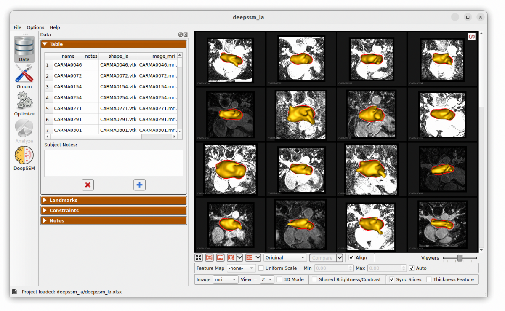
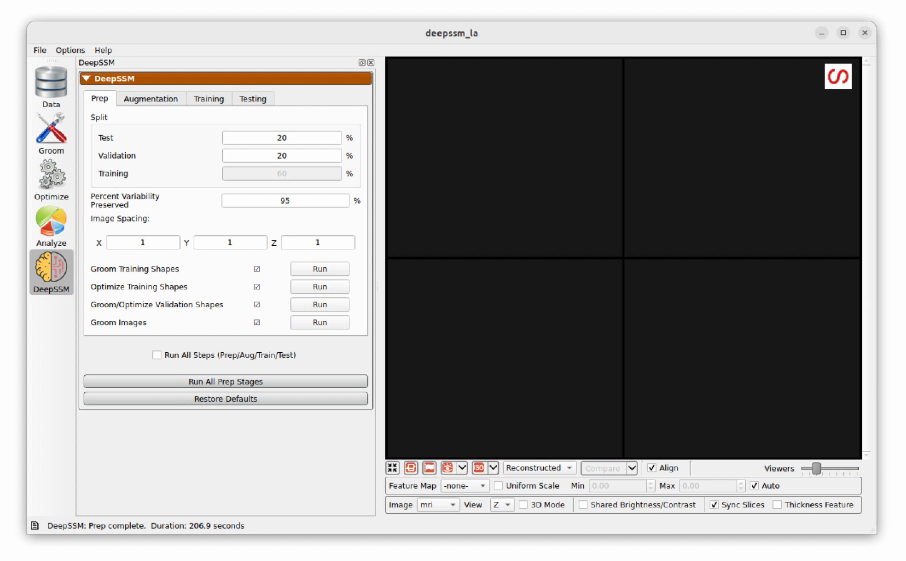
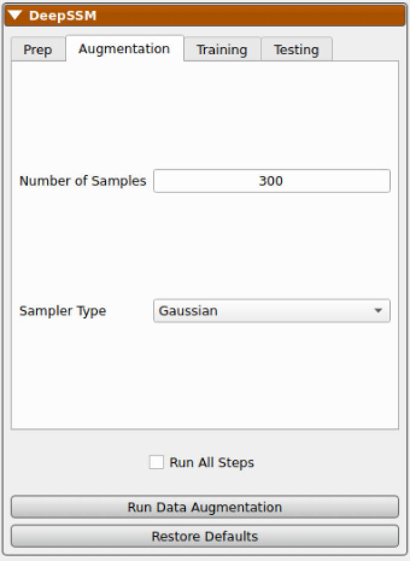
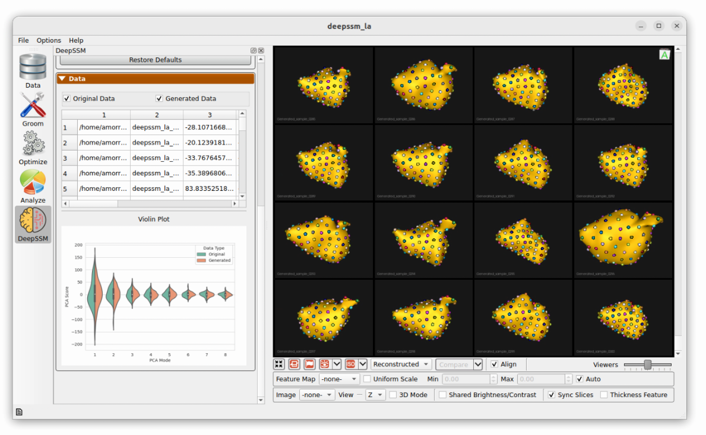
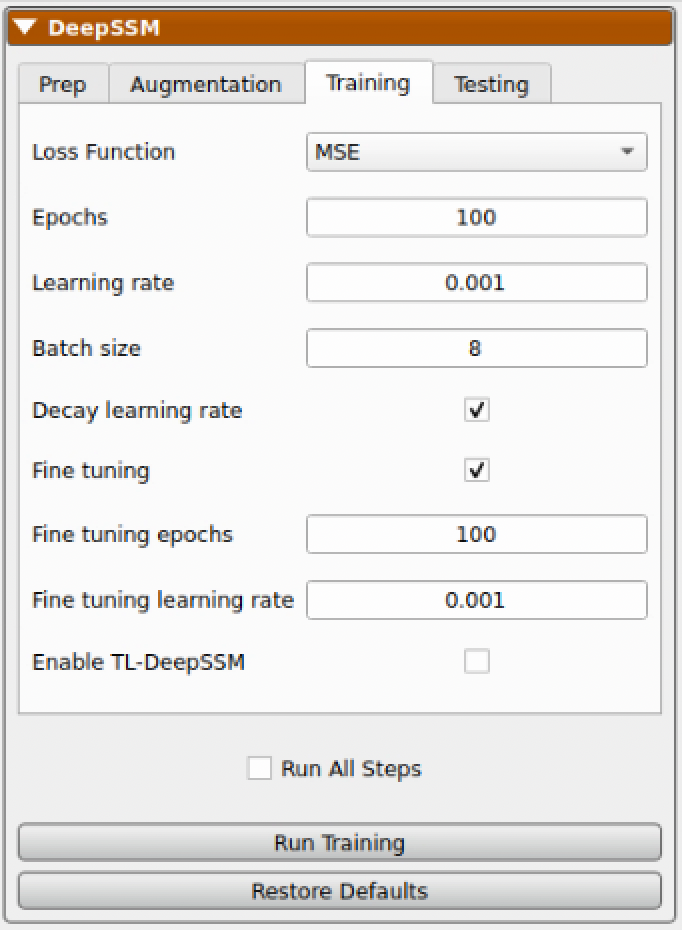
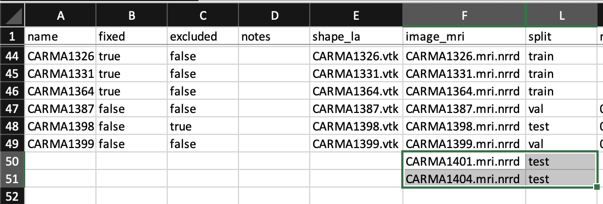
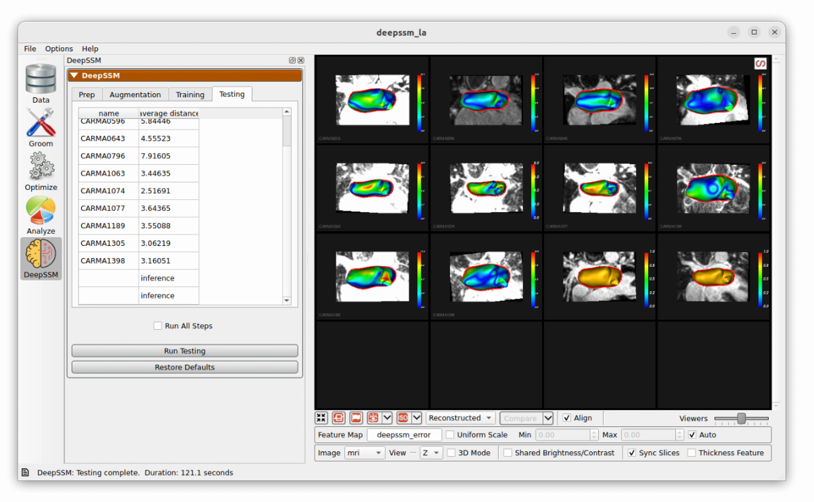

# DeepSSM in Studio

ShapeWorks Studio supports the full DeepSSM pipeline, including prep (groom/optimize), data augmentation and DeepSSM model training and testing. For a full explanantion of the process see: [Data Augmentation for Deep Learning](../deep-learning/data-augmentation.md) and [SSMs Directly from Images](../deep-learning/deep-ssm.md). 

Running DeepSSM in Studio requires a project with both images and shapes that will be used for training, validation and testing.  

To run DeepSSM in Studio, load a ShapeWorks Project Spreadsheet with the following columns: ``shape_*name*``, ``image_*name*`` (e.g. ``shape_la``, ``image_mri``).  For example:

{: width="300" }

## Example Data for DeepSSM

In this example, we demonstrate DeepSSM in studio with a left atrim dataset. The data is available at [https://www.sci.utah.edu/~shapeworks/doc-resources/zips/deepssm_la.zip](https://www.sci.utah.edu/~shapeworks/doc-resources/zips/deepssm_la.zip).

To view the data, download and unzip the file.  Then open the project in ShapeWorks Studio.  Switching to the Data tab, you should see the following:

{: width="600" }

## Defining Data Split

The first step is to define what percentage of the input data to use in training, validation, and testing. First, the testing data is split from the dataset and kept out of data augmentation and model training. For example, if the dataset is comprised of 10 samples and the test split is set to 20 percent, then the test set will have two samples. After data augmentation, the validation split is used to define a validation set. For example, if there are 8 real samples (excluding test examples) and 2 are augmented and the validation split is set to 30 percent, then the validation set will have 3 of those 10. 

{: width="300" }

Two other parameters to define for DeepSSM are the Percent of Variability Preserved and the Image Spacing.

| Parameter | Description |
| --------- | ----------- |
| Percent of Variability Preserved | This parameter is used in data augmentation to determine how many PCA dimensions to use.  DeepSSM will use the number of dimension required to meet the percent of variability requested.|
| Image Spacing | This parameter defines the image spacing to use for the images.  Images will be resampled to this spacing. |

## Prep

The next step is to run the prep phase which will perform the following tasks:

| Task | Description |
| ---------- | ----------- |
| Groom Training Shapes | The shapes marked "training" (see split column) will be groomed according to the parameters in the groom tab|
| Optimize Training Shapes | The shapes marked "training" will have correspondence particles generated and optimized according to the parameters in the optimize tab |
| Groom/Optimize Validation Shapes | The validation shapes will have correspondence particles generated and optimized according to the parameters  n the optimize tab using the training shapes as fixed domains|
| Groom Images | The training images will be aligned and prepped according to the grooming parameters. The validation images will be aligned and prepped using image to image registration with the training images. |

After running the prep stage, you should see the following with all five stages done:

{: width="600" }

## Augmentation

The next step is to run data augmentation to create more training examples. Users can specify how many samples to generate and what type of sampling distribution to use. For a more detailed description of these parameters, please see: [Data Augmentation for Deep Learning](../deep-learning/data-augmentation.md) and [Data Augmentation Notebook](../notebooks/getting-started-with-data-augmentation.ipynb).

{: width="300" }

While data augmentation is running a progress bar is displayed across the bottom. After it has completed, the newly generated data is displayed below the real data in the right panel for comparison. A table is shown which contains the real and augmented image paths, particle paths, and PCA scores. Parallel violin plots are displayed to compare the distribution of each PCA score across the real and augmented data. This can be helpful in visually assessing if the type of distribution used in augmentation provided a good fit for the data. 

{: width="600" }

## Training

The next step is to train the DeepSSM model. Some training parameters are exposed which are explained in detail here: [SSMs Directly from Images](../deep-learning/deep-ssm.md).

{: width="300" }

As the model trains, each epoch the display updates. The "Training Output" table logs the epochs, learning rate, and training and validation errors. The training and validation error are also plotted over epochs in a scatterplot below. To the right, examples of training andvalidation predictions are displayed and updated every epoch. Here we can see the examples with the greatest, smallest, and median error. The distance from the predicted particles to the true particles is displayed as a heat map with a corresponding scale. This gives an idea of model prediction quality as the model trains. 

{: width="600" }

## Testing

In the final step, predictions are made on the testing set which is unseen to the DeepSSM model. A mesh is created based on these particle positions and the surface to surface distance from this mesh to the true mesh is calculated. This is displayed as a heat map on the predictions and the average for each sample is shown in the table. 

{: width="600" }

## Inference

To use an completed DeepSSM model for inference, simply add additional images to the project spreadsheet and run the test step again.  In the example, we have provided two more images that can be used to try this out.

{: width="600" }

The new shapes won't have distance differences as they have no ground truth.  However, the predicted particles will be displayed and the mesh will be created and displayed.  The mesh can be saved by right clicking on the mesh and selecting "Save Mesh".  

{: width="600" }

