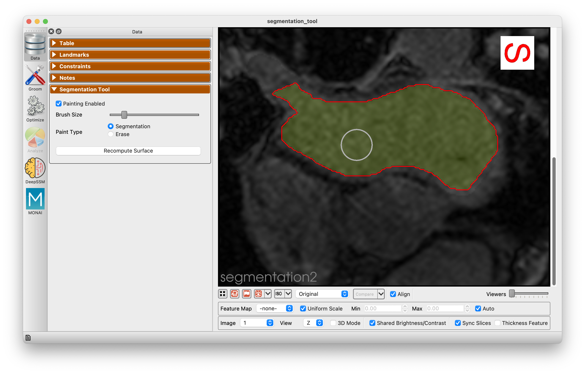
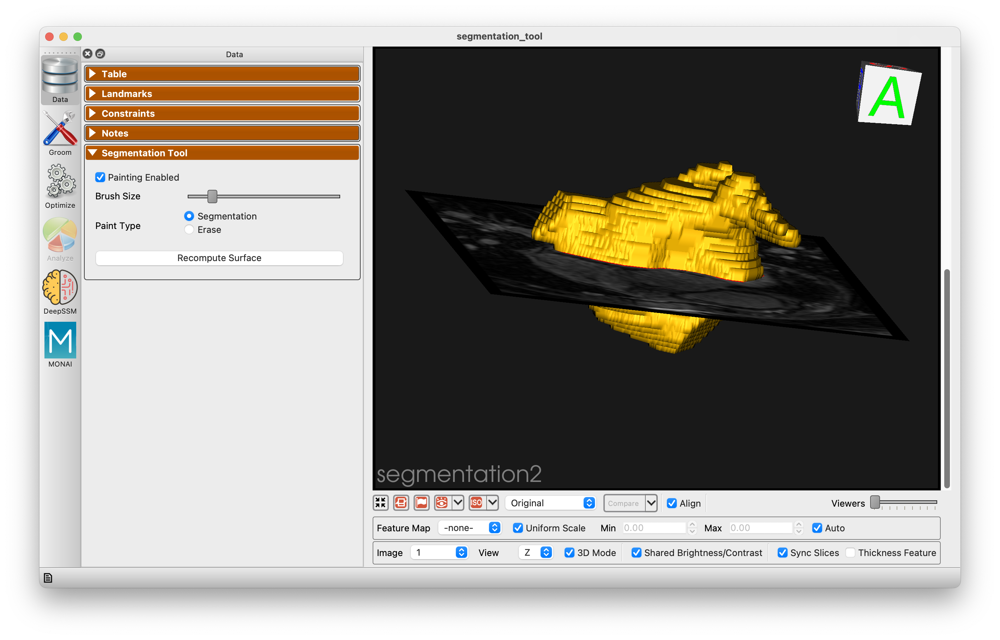

# ShapeWorks Studio Segmentation Tool

ShapeWorks Studio includes a segmentation tool that allows users to segment images using a paintbrush tool.

When painting is enabled, you can choose either segmenting or erasing mode. In segmenting mode, you can paint on the image to segment the object of interest. In erasing mode, you can paint on the image to remove the unwanted segmentations. You can also adjust the brush size.

Segmentation can be performed on each slide and in any of the three views (X, Y, or Z).

Click "Recompute Surface" to regenerate the surface mesh based on the updated segmentation.

