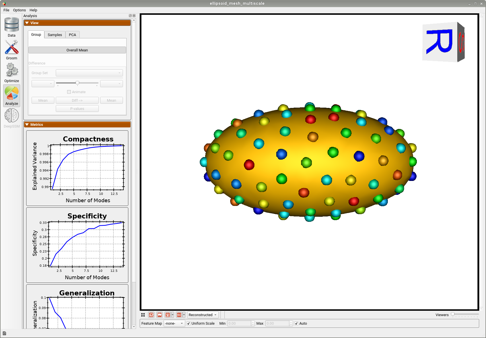

# Ellipsoid Mesh: Basic Example

## What is the Use Case? 
The `ellipsoid_mesh` use case uses the same dataset as the `ellipsoid` use case, but optimization is done on meshes rather than distance transforms. The dataset comprises of axis-aligned ellipsoids with varying radii along the x-axis. The `ellipsoid_mesh` use case represents the standard use version of a shape modeling workflow from meshes using ShapeWorks. 

## Grooming Steps

This is how the meshes in the dataset look before grooming. The ellipsoids have random orientations.


1. [**Remeshing**](../../workflow/groom.md#remesh): Meshes are remeshed to ensure uniform vertices.
2. [**Reference Selection**](../../workflow/groom.md#aligning-meshes): The reference is selected by first computing the mean (average) mesh, then selecting the sample closest to that mean (i.e., medoid).
3. [**Rigid Alignment**](../../workflow/groom.md#aligning-meshes): For all the shapes, the transformation is calculated to factor out translation and rotation based on the reference shape.This transformation matrix will be sent to the optimizer as a 'prefix transform'

Here we show how the shapes would look like if the transforms are applied.


## Relevant Arguments
[--use_subsample](../use-cases.md#-use_subsample)
[--num_subsample](../use-cases.md#-use_subsample)
[--use_single_scale](../use-cases.md#-use_single_scale)
[--tiny_test](../use-cases.md#-tiny_test)

## Optimization Parameters
The python code for the use case calls the `optimize` command of ShapeWorks which reads the project sheet with the shape filenames and optimization parameter values. See [Project excel file](../../workflow/parameters.md#project-excel-file) for details regarding creating the project sheet.
Below are the default optimization parameters for this use case.

```python
{
        "number_of_particles": 128,
        "use_normals": 0,
        "normals_strength": 10.0,
        "checkpointing_interval": 1000,
        "keep_checkpoints": 0,
        "iterations_per_split": 1000,
        "optimization_iterations": 1000,
        "starting_regularization": 10,
        "ending_regularization": 1,
        "recompute_regularization_interval": 1,
        "domains_per_shape": 1,
        "relative_weighting": 1,
        "initial_relative_weighting": 0.05,
        "procrustes_interval": 0,
        "procrustes_scaling": 0,
        "save_init_splits": 0,
        "verbosity": 0
}
```

## Analyzing Shape Model
Below is the mean shape reulting from optimization. Here we can see that there is only one major mode of variation.


Animating along the first PCA mode we can see the variation in the radius along the x-axis.


