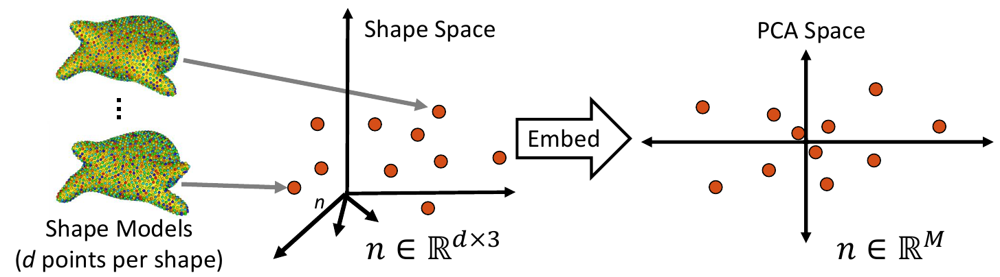
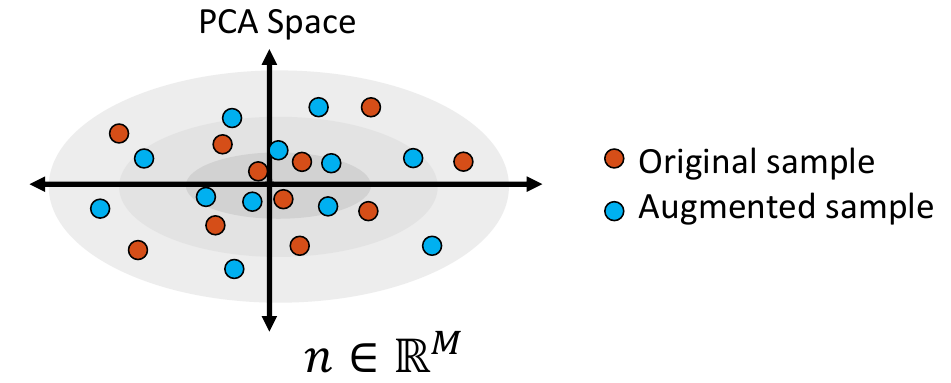
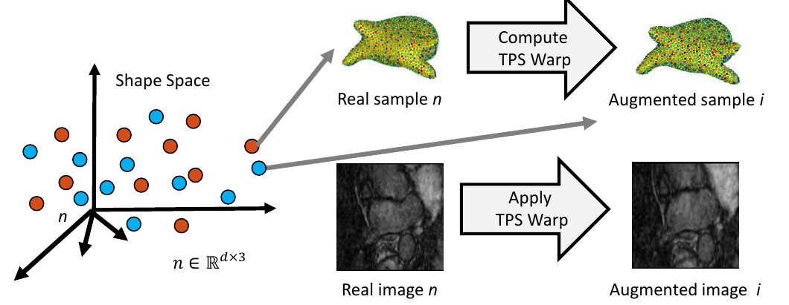
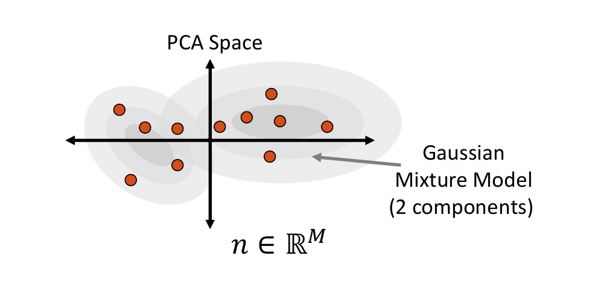

# Data Augmentation for Deep Learning

ShapeWorks includes a Python package, `DataAugmentationUtils`, that supports model-based data augmentation. This package is useful to increase the training sample size to train deep networks such as DeepSSM (see [SSMs Directly from Images](../deep-learning/deep-ssm.md)). The `DataAugmentationUtils` particularly has tools to generate thousands of image-shape pairs based on the available real data. Fabricated (i.e., augmented) examples are generated to preserve the population shape statistics and exhibit realistic intensity variations.

## Using the Data Augmentation Package

The ShapeWorks data augmentation package, `DataAugmentationUtils`, is installed with the rest of the ShapeWorks Anaconda environment using `install_shapeworks`.


!!! danger "Activate shapeworks environment"
    Each time you use ShapeWorks and/or its Python packages, you must first activate its environment using the `conda activate shapeworks` command on the terminal.


To use the `DataAugmentationUtils ` package, make sure you have the shapeworks conda environment is activated and add the following import to your Python code.

```python
import DataAugmentationUtils
```


### Running Data Augmentation

To run the complete data augmentation process as detailed in [Data Augmentation Steps](#data-augmentation-steps), add the following to your Python code.


```python
DataAugmentationUtils.runDataAugmentation(out_dir, img_list, 
                                          world_point_list, num_samples, 
                                          num_dim, percent_variability, 
                                          sampler_type, mixture_num)
```

This generates image/particle pairs in the world coordinate system and assumes the images in `img_list` are groomed/aligned.

Local image/particle pairs can alos be generated using:

```python
DataAugmentationUtils.runLocalDataAugmentation(out_dir, img_list, 
                                          world_point_list, local_point_list, 
                                          num_samples, num_dim, percent_variability, 
                                          sampler_type, mixture_num)
```
This generates image/particle pairs in the local coordinate system and assumes the images in img_list are the original/unaligned images. The world_point_list needs to be provided in this case so that PCA is done in the world coordinate system. New samples are generated by sampling the world PCA subspace, then mapping it to local points using the transform from world to local of the closest real example.


**Input arguments:**

* `out_dir`: Path to the directory where augmented data will be stored
* `img_list`: List of paths to images of the original dataset.
* `world_point_list`: List of paths to the world `.particles` files of the original dataset. Note, this list should be ordered in correspondence with the `img_list`.
* `num_dim`: The number of dimensions to reduce to in PCA embedding. If zero or not specified, the percent_variability option is used to select the numnber of dimensions.
* `percent_variability`: The proportion of variability in the data to be preserved in embedding. Used if `num_dim` is zero or not specified. Default value is 0.95 which preserves 95% of the varibaility in the data.
* `sampler_type`: The type of parametric distribution to fit and sample from. Options: `gaussian`, `mixture`, or `kde`. Default: `kde`.
* `mixture_num`: Only necessary if `sampler_type` is `mixture`. The number of clusters (i.e., mixture components) to be used in fitting a mixture model. If zero or not specified, the optimal number of clusters will be automatically determined using the [elbow method](https://en.wikipedia.org/wiki/Elbow_method_(clustering)).

For `runLocalDataAugmentation()` the following argument must also be provided:
* `local_point_list`: List of paths to local `.particles` files of the original dataset. Note, this list should be ordered in correspondence with the `img_list` and `world_point_list`.

### Visualizing Data Augmentation

This function creates a visualization for augmented data. It creates a matrix of scatterplots that opens automatically in the default web browser. The scatterplots show the PCA values of the real and augmented data so that they can be compared pairwise across the PCA dimensions.


```python
DataAugmentationUtils.visualizeAugmentation(data_csv, viz_type)
```

**Input arguments:**

* `data_csv`: The path to the CSV file created by running the data augmentation process.
* `viz_type`: The type of visulazation to display. Options `splom` or `violin` (default: `splom`). If set to `splom`, a scatterplot matrix of pairwise PCA comparisions will open in the default browser. If set to `violin` a violin plot or rotated kernel density plot will be displayed. 


## Data Augmentation Steps

### 0. Collect Real Data

As a preliminary step, the data on which augmentation will be based on is needed. This includes the shape model `.particles` files and their corresponding images. This can be acquired using ShapeWorks or any other method of generating point distribution models (PDM).


### 1. Embed Real Data

First, the real shape data (i.e., PDM) is embedded into a lower-dimensional subspace. This is done by creating a matrix that contains all of the real examples, then reducing the dimension via Principal Component Analysis (PCA).



### 2. Fit a Parametric Distribution

Next, a parametric distribution that can be sampled from is fit to the shape examples embedded in the low-dimension subspace.


### 3. Sample from the Distribution 

Shape samples are randomly drawn from this distribution, and the closest real shape example to each sample is saved.



### 4. Project Samples

The embedded shape samples are then projected back to shape space, providing new generated shape/correspondence examples.


### 5. Complete Sample Generation

The closest real shape example to each generated shape sample is then used to generate the image corresponding to the fabricated shape sample, giving the full pair of generated samples. This is done by finding the warp between the closest real correspondence points and the generated correspondence points, then applying that warp to the corresponding image of the closest real example. This provides us with an image with the intensity profile of the real example but the shape of the generated sample. 



## Sampling Distributions

The `sampler_type` parameter determines which type of distribution to fit to the embedded data. The options are `Gaussian` (a single multivariate Gaussian distribution), `mixture` (a mixture of Gaussian distributions) or `KDE` (kernel density estimate).

### Multivariate Gaussian Distribution

To fit a multivariate Gaussian distribution (which can be seen in Step 2 of [Data Augmentation Steps](#data-augmentation-steps)), the probability density function is parameterized by the mean and the covariance matrix of the embedded data matrix. New samples are then randomly sampled for this normal distribution. The closest real example to each sampled point is found by calculating the Mahalanobis distance within the embedded space. 

### Mixture of Multivariate Gaussians Distribution

A Gaussian mixture model can provide a more appropriate probability density function when the embedded data distribution is mutli-modal. To fit a mixture model, first we cluster the embedded samples and select the optimal number of clusters by minimizing Akaike information criterion (AIC) and Bayesian information criterion (BIC). This number determines how many Gaussian distributions (or components) should be used. Next, the expectation-maximization (EM) algorithm is used to fit a mixture-of-Gaussian model with this number of components. This distribution can then be randomly sampled from, and the closest real example is chosen using Mahalanobis distance within the embedded space.  



### Kernel Density Estimate Distribution

Kernel density estimate (KDE) is a non-parametric way of estimating the probability density function of the embedded data. It is fit by defining a Gaussian ball around each real data point in the embedded space, the combination of which provides the distribution. The kernel bandwidth or variance of the Gaussian balls is computed as the average distance to the nearest neighbor computed using the Mahalanobis distance within the embedded space.  


To sample from the KDE distribution, a real example is randomly selected, then a point is randomly sampled from its kernel. The selected real example is also returned to use its corresponding image to generate the augmented image-shape pair.


!!! note "Relevant papers"
    - Jadie Adams, Riddhish Bhalodia, Shireen Elhabian. Uncertain-DeepSSM: From Images to Probabilistic Shape Models. In MICCAI-ShapeMI, Springer, Cham, 2020.
    - Riddhish Bhalodia, Shireen Elhabian, Ladislav Kavan, and Ross Whitaker. DeepSSM: a deep learning framework for statistical shape modeling from raw images. In MICCAI-ShapeMI, pp. 244-257. Springer, Cham, 2018.
    - Riddhish Bhalodia, Anupama Goparaju, Tim Sodergren, Alan Morris, Evgueni Kholmovski, Nassir Marrouche, Joshua Cates, Ross Whitaker, Shireen Elhabian. Deep Learning for End-to-End Atrial Fibrillation Recurrence Estimation. Computing in Cardiology (CinC), 2018.

