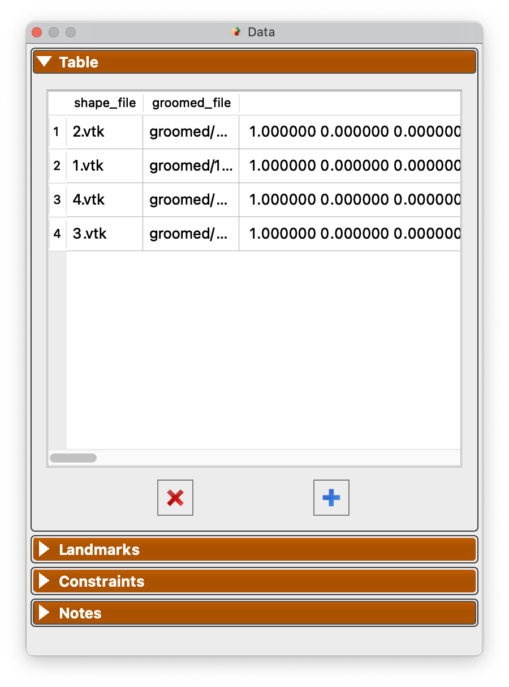
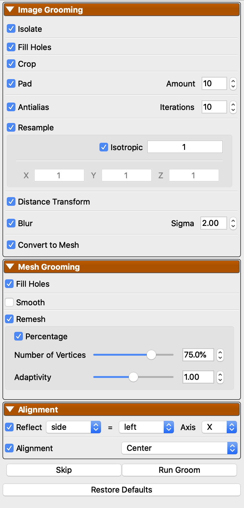

# Getting Started With ShapeWorks Studio

ShapeWorks Studio provides an all-in-one GUI based interface to the
ShapeWorks toolkit.  In Studio, you can manage input Data, Groom, Optimize and Analyze your data all within a single interface.

## Splash Screen

The splash screen provides access to recent projects and an option to create a new blank project.

## Data Module

The Data Module shows the project data table, landmarks, constraints as well as user-defined/saved notes. This module enables you to add and remove shapes (segmentations and surface meshes) to your cohort, define anatomical landmarks, place cutting planes and free form constraints for surface exclusion.

{: width="300" }

See [Studio Data Module](studio-data.md) for more information.

## Groom Module

The Groom module provides options to preprocess/groom the input data.  Options differ for binary segmentations and meshes. You also have the option of skipping grooming if your data is already prepped.

{: width="300" }

See [Studio Groom Module](studio-groom.md) for more information.

## Optimize Module

The Optimize module provides options for the particle-based optimization.  After selecting options and clicking "Run Optimize", you can monitor the process of the optimization in real-time.  Particle positions will be displayed on individual shapes as they progress where color encodes surface correspondences across different shapes in your cohort.

{: width="300" }

See [Studio Optimize Module](studio-optimize.md) for more information.

## Analysis Module

After optimization is complete, you may analyze the data in Studio using the Analysis module.  There are several panels available in the Analysis Module.

See [Studio Analyze Module](studio-analyze.md) for more information.

## Preferences

Studio provides a number of preference options.

| Option | Description |
| --- | ----------- |
| Color Scheme | Base foreground and background colors for viewers |
| Particle Colors | Choice of color for particles |
| Color Map | Color map used for scalar ranges |
| Reverse Color Map | Option to reverse the color map |
| Discrete Color Mode | Option to use discrete colors for color map |
| Groom Output | Folder name for groom output |
| Optimize Output | Folder name for optimize particle output |
| Parallel Processing Enabled | Whether to use parallelized grooming, optimizing and mesh reconstruction |
| Parallel Number of Threads | How many threads to use for parallelized operations |
| Mesh Cache Enabled | Whether to use a cache of meshes |
| Mesh Cache Memory to Use | Percentage of phyisical memory to allow mesh cache to use |
| Log Location | A display of where the current log file is located |
| Orientation Marker Type | Medical, Triad, or None |
| Orientation Marker Corner | Upper Right, Upper Left, Lower Left, Lower Right |
| PCA Range | Number of standard deviations for PCA slider |
| Number of PCA Steps | Number of steps for PCA slider bar |
| Geodesics Cache Size Multiplier |  Multiplier value for geodesics caching |
| Automatically Check for Updates | Whether Studio should automatically check for updates to ShapeWorks |
| Send Anonymous Usage Statistics | Whether Studio should send anonymous usage statistics to the ShapeWorks team to help improve the software |
 

## Data Collection  

ShapeWorks Studio can optionally send anonymous usage statistics to the ShapeWorks team.  This data helps the team by providing basic user tracking numbers that we report to funding agencies to help in acquiring additional funding.  Additionally, we are prospectively collecting a few usage parameters that may aid in development of particular features.  No user data (images, meshes, segmentations, etc) are ever transferred, only basic user event information (e.g. number of times optimize is run).

## Viewer Controls

See [Studio Viewer Controls](studio-viewer.md) for details on viewer controls.

## Menus
### File Menu

{: width="300" }

* `New Project` - Create a new project
* `Open Project` - Open a project from disk
* `Show Project folder` - Open Explorer/Finder for project location (windows/mac)
* `Save Project` - Save project to disk
* `Save Project As` - Save a copy of the project to a new file
* `Import Shapes...` - Import new shapes
* `Export` - See export below
* Up to 8 recent projects are shown at the bottom

### Export Menu

See [Studio Export Options](studio-export.md) for details on export options.

## Project setup
ShapeWorks Studio and the `shapeworks` commands `groom` and `optimize` store project data in an XLSX spreadsheet. The spreadsheet format profiles a uniform, easy to edit, easy to organize way of inputing data into shapeworks for grooming, optimizing and analyzing data.
See [Here](../workflow/parameters.md) for more details regaring the project sheet and the python API available to generate the project sheet. 

