# ShapeWorks Studio Analyze Module

After optimization is complete, you may analyze the data in Studio using the Analysis module.  There are several panels available in the Analysis Module.

## View Panel

The View panel contains all of the options for controlling the analyis viewer options.

### Group

The Group mode allows for group comparison to quantify and visualize population-level differences.  Each `group_<value>` column from the project can be selected and the differences between any two values (i.e., group identifiers) in the groups can be displayed by selecting the group values in the left and right dropdown boxes.  A group difference display showing vectors and a colormap of distance can be shown using the "Diff -->" button.

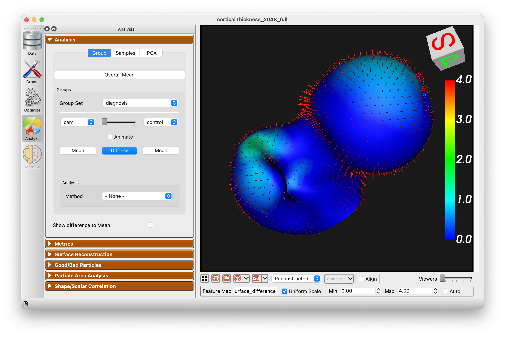

There are three different group analysis options available:

* LDA
* Group Particle P-Values
* Network Analysis

### LDA

Selecting LDA from the analysis method dropdown will generate an LDA chart based on the two groups:

{: width="300" }

### Group Particle P-Values

Performs per particle p-value computation for each group.  

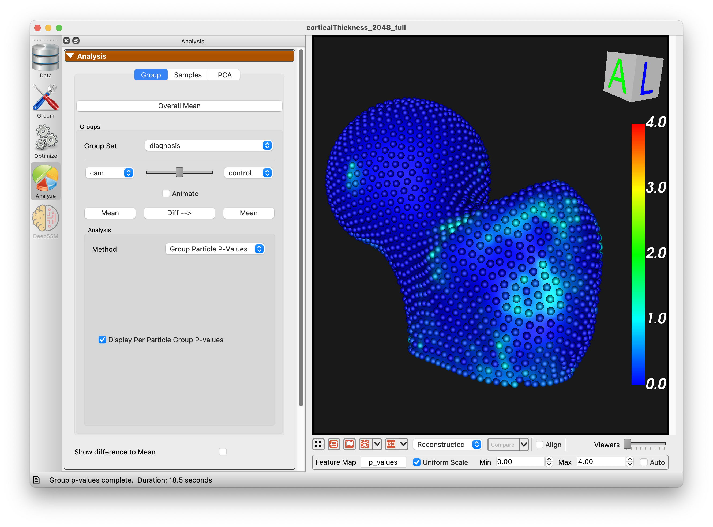{: width="300" }

### Network Analysis

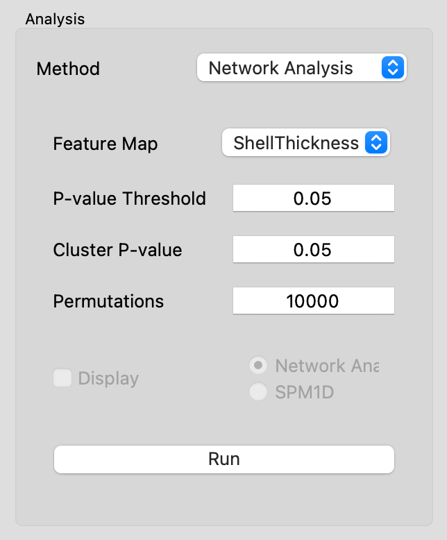{: width="300" }

The Network Analysis tool provides a method to statistically analyze data captured in feature maps. Two implementations have been included: Network Analysis and SPM1D. Statistical parametric mapping (SPM, https://www.fil.ion.ucl.ac.uk/spm/) was introduced for the analysis of brain imaging data and has since been used in statistical analysis of surface-based group differences. The SPM1D option uses this technique without consideration of the connectivity and spatial relationship of the input data. The Network Analysis method uses the relative size of the network of connected correspondence particles to identify significant differences amongst groups, as originally described by Forman and colleagues (Forman SD, et al. Magnetic Resonance in Medicine33:636-647, 1995). Our publication on the specifics of this method and example applications is in review and will be referenced here when available.

| Option            | Description                                                                                                                                                      |
|-------------------|------------------------------------------------------------------------------------------------------------------------------------------------------------------|
| Feature Map       | Choose which feature to operate on.                                                                                                                              |
| P-value Threshold | The initial p-value used to threshold particles as an initial step to the evaluation of cluster size. Only modify from 0.05 for adjusted statistical assumptions.|
| Cluster P-value   | The cluster p-value defines the p-value used to identify significant clusters for the group. Traditional statistics would assume a p-value of 0.05.              |
| Permutations      | This is the number of permutations used in the analysis. The maximum value is driven by the sample size, however 10,000 is generally considered acceptably large.|
| Display           | Choose to display Network Analysis output or SPM1D                                                                                                               |

After running the Network Analysis, you can enable the display of values with the "Display" checkbox:

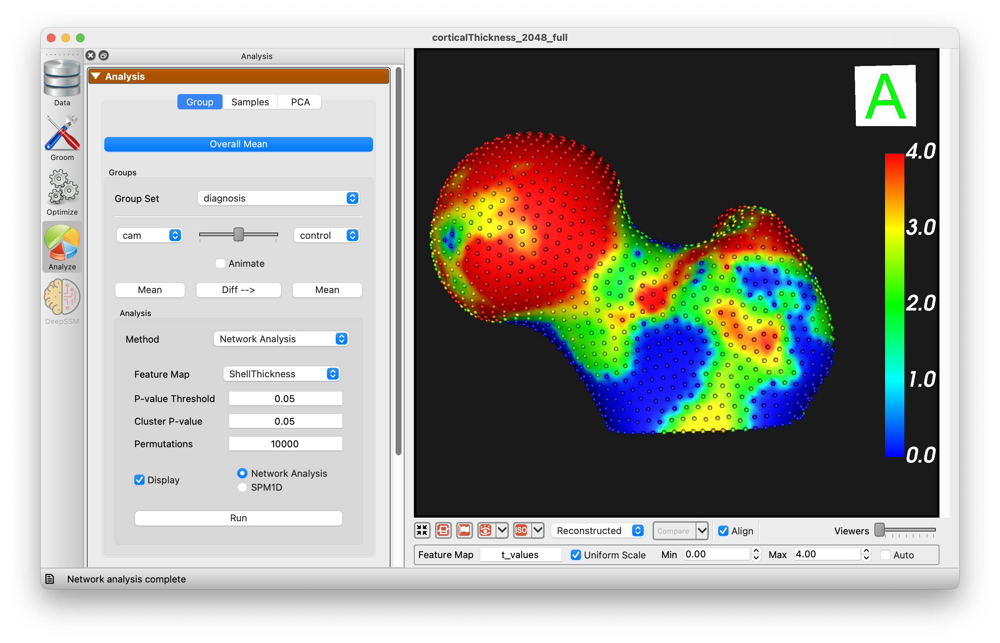

### Samples

The Samples tab of the view panel allows you to view all of the samples in your cohort, view a single sample by index, or view the median sample.

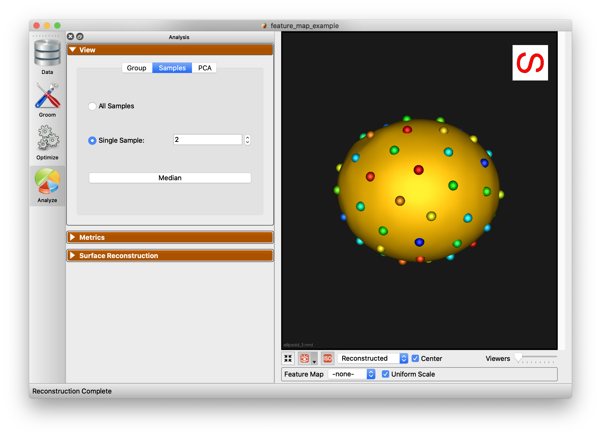

### PCA

The PCA tab of the View panel shows reconstructed shapes (surface meshes) along PCA modes of variation. Modes of variations are shape parameters learned/discovered from your data that describes shape variations. You can control the location along the PCA mode with the Standard Deviation slider.  The extent of this slider is configurable in [Preferences](#preferences).  Values displayed:

`Lambda` - This shows the PCA loading of current position of the slider.  The middle of the slider, at the mean value, will be 0.  The extent of lambda is defined by the number of standard deviations of the slider as described above.  At standard deviation of 1.0, it will be the square root of the mode's eigenvalue.

`Eigenvalue` - This shows the eigenvalue of the currently selected mode.  This is a unitless measure of how much variance is explained by this mode.  The modes are sorted in decreasing order of eigenvalue, corresponding to the most variance explained first.

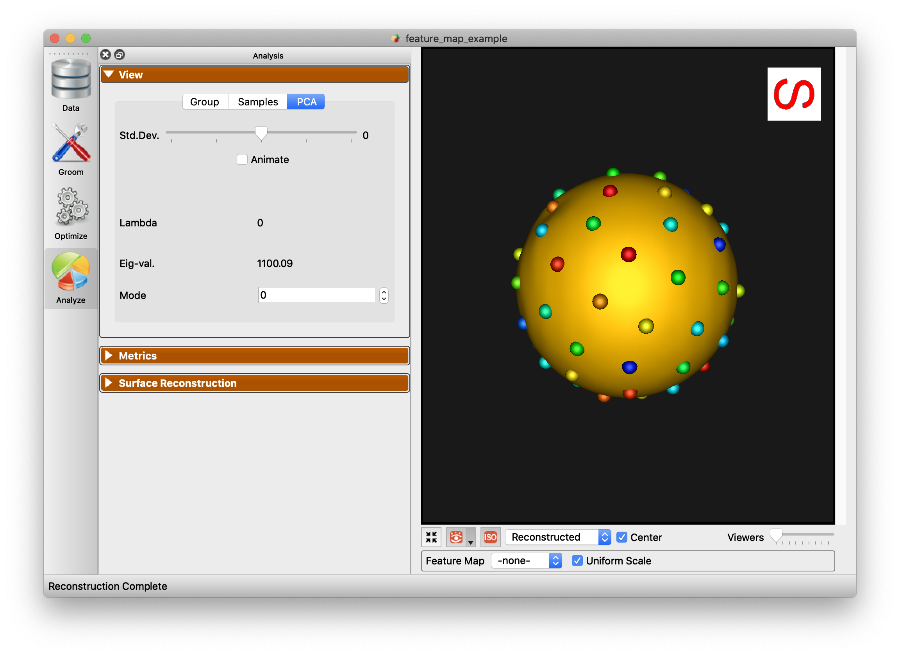

### Multi-Level PCA

The PCA tab of the View panel shows options to select modes of variation in different subspaces when a multiple domain shape model is loaded:

`Shape and Relative Pose` - Selecting this option shows reconstructed shapes and it's eigenvalue and lambda, along ordinary PCA modes of variation. PCA is done in the shared space of the multi-object shape structure and thus  the shsape and pose variations are entangled here.

`Shape` - Selecting this option shows reconstructed shapes and it's eigenvalue and lambda, along only morphological modes of variation. Multi-Level Component Analysis is done in the shape subspace (within-object) of the multi-object shape structure. Shape and pose variations are disentangled here and we only see morphological changes of each object in the shape structure.

`Relative Pose` - Selecting this option shows reconstructed shapes and it's eigenvalue and lambda, along only relative pose modes of variation. Multi-Level Component Analysis is done in the relative pose subspace (between-objects) of the multi-object shape structure. Shape and pose variations are disentangled here and we only see alignment changes between the objects in the multi-object shape structure.

### Show Difference to Mean

This checkbox allows for visualization from any surface to the mean.  Arrow glyphs can be shown to display the difference as well.

## Metrics Panel

The Metrics panel shows the Compactness, Specificity, and Generalization charts.  These are interactive charts with hover menus and the ability to zoom, pan, etc.

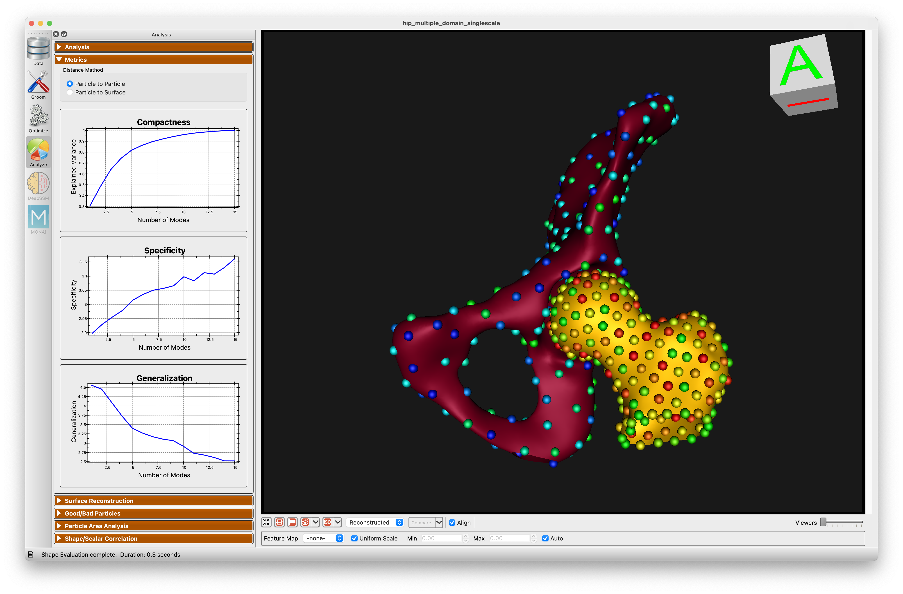

### Distance Calculation Options

1. **Particle to Particle** (Default): Calculates the distance directly between particles when evaluating the metrics.

2. **Particle to Surface**: Calculates the distance between particles and the actual shape surface. This method enhances accuracy by measuring generalization as the distance between reconstructed particles and the true shape surface. Specificity is determined by the distance between sampled particles and the surface, ensuring generated shapes accurately reflect the true shape population and providing reliable and consistent metrics.

See [Shape Model Evaluation](../new/ssm-eval.md) for more information about shape evaluation.

## Surface Reconstruction Panel

The surface reconstruction panel provides options for the surface reconstruction method.  There are three surface reconstruction methods available depending on the data you supply.

`Legacy` - If an older XML file with only particle files is supplied, then only this option is available.  This is the fallback option since it requires only the particles.

`Mesh Warping Based` - Mesh warping based method that utilizes the mean mesh.  You must have either meshes supplied or image based (distance transforms).

`Distance Transform Based` - Surface reconstruction based on distance transforms.  Project must have distance transforms.

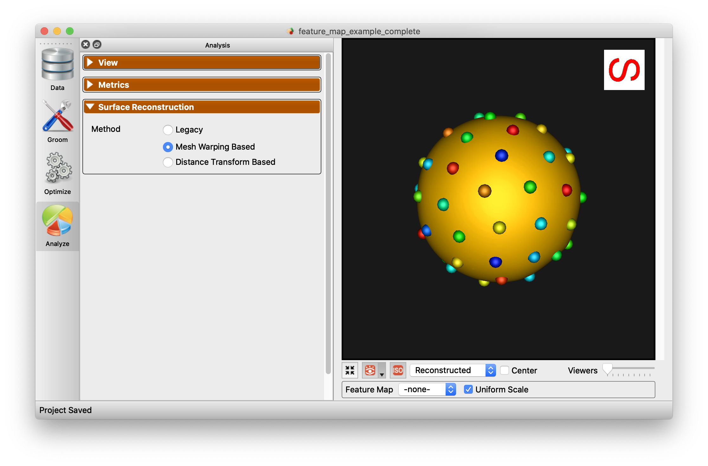

Below is an example of the difference in using this option.

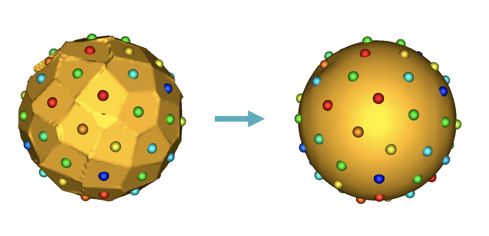

## Good/Bad Particles Panel ##

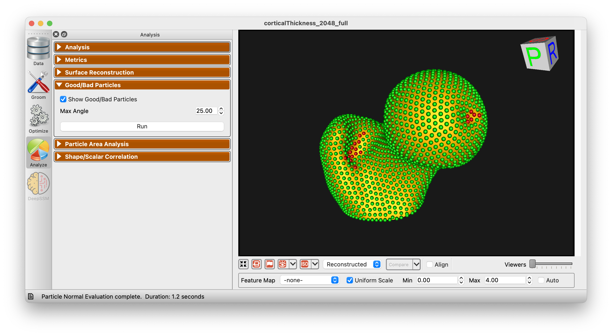

The *Good/Bad Particles Panel* enabled the display of "good/bad particles" in ShapeWorks Studio.  A *maximum angle* parameter is given (default 45 degrees).  When a particle's surface normal across subjects (averaged) exceeds this angle, the particle will be marked "bad" and shown in red.  Good particles are shown in green.  This can help in identifying problems with correspondence as it is typically expected that surface normals for given particles should be similar across subjects.

## Particle Area Analysis ##

The *Particle Area Analysis* panel allows for the visualization of the area of each particle in the shape model.  This can be useful for identifying areas that are not being captured well by the modell.  There are two options for visualization, mean and standard deviation.

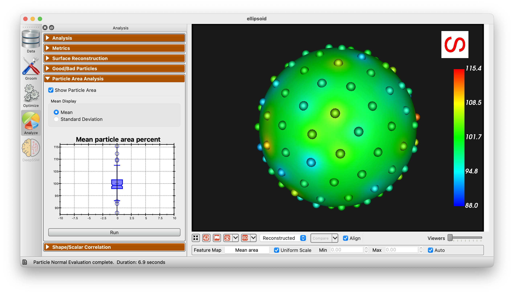

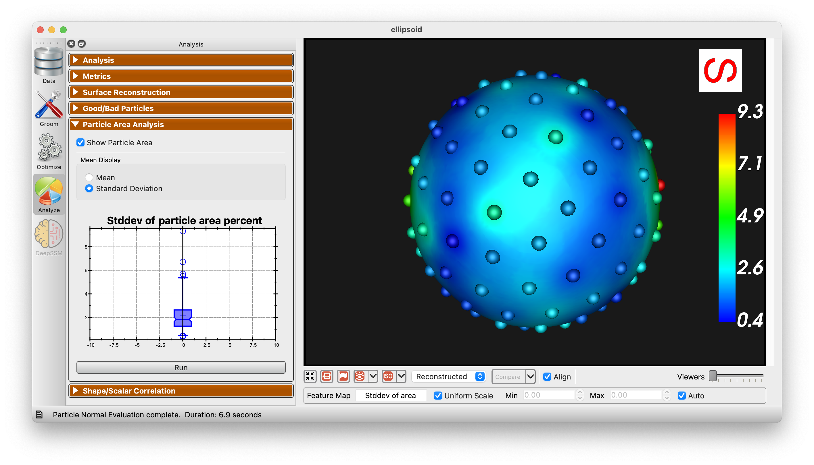

## Shape/Scalar Correlation ##

The *Shape/Scalar Correlation* panel uses 2 block PLS regression to identify the relationship between shape and scalar data. 

To use this panel, you must have scalar values (feature map).  Choose the desired feature map from the dropdown menu.

Use the "Determine number of components" option to show the mean squared error for each number of components:

After choosing the desired number of components, you can plot the relationship between shape and scalar data:

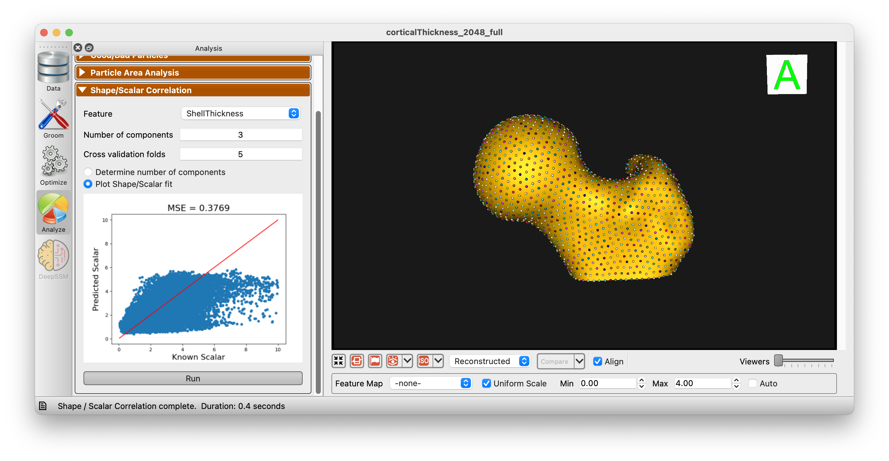

Additionally, you can use the 2 Block PLS regression to predict the scalar value from the shape data and vice versa:

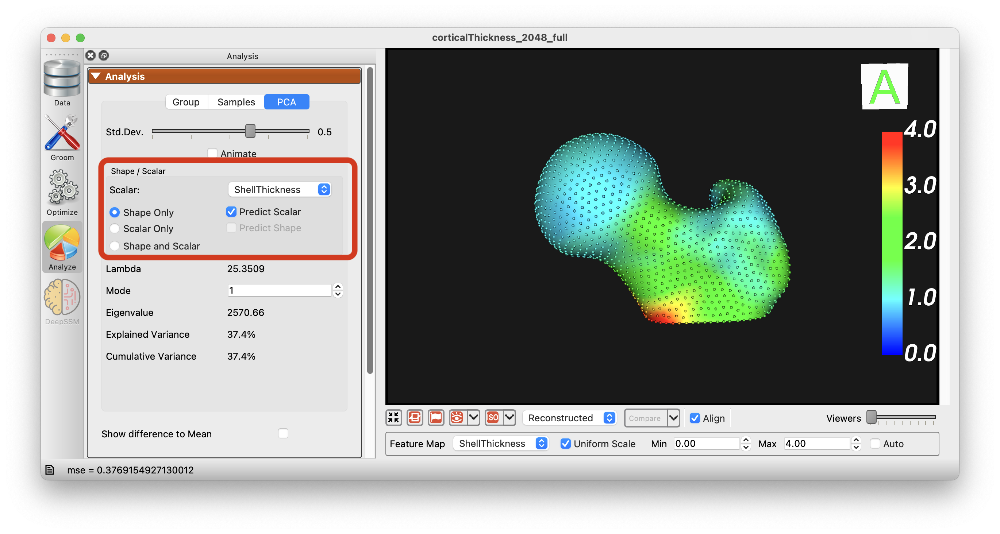

The options "Shape Only", "Scalar Only", and "Shape and Scalar" are available to choose from and the PCA will be performed accordingly.