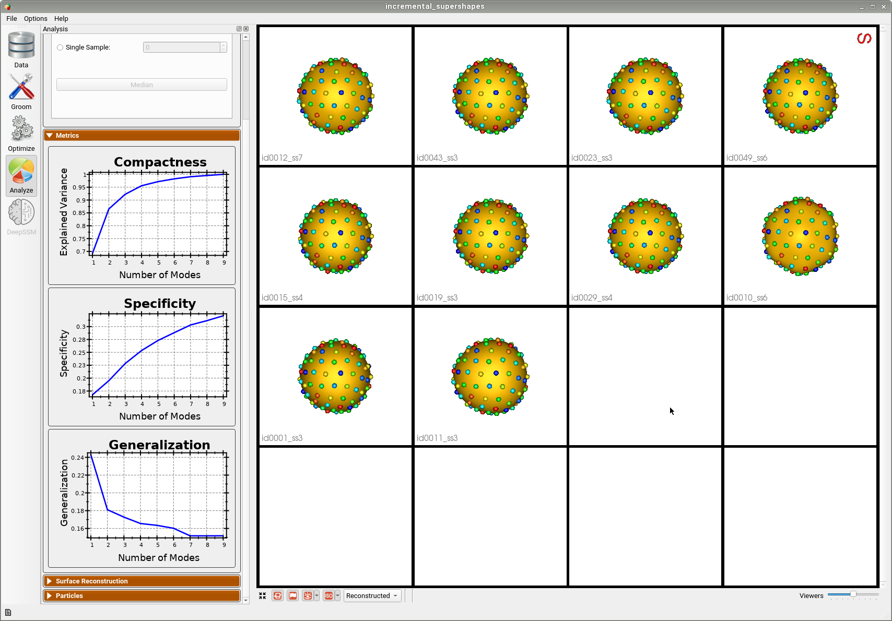

# Incremental Supershapes: Building a Shape Model Incrementally

## What is the Use Case? 
The `incremental_supershapes` use case demonstrates how a shape model can be built incrementally. This approach is beneficial in two scenarios. The first is when the cohort of shapes is very large, where optimizing particle position across all shapes at once would take a very long time. In this case, by fitting a shape model on a subset of the data, then incrementally updating the shape model using the previous model as initialization, the total time for optimization can be greatly reduced. The second scenario is when the dataset is small but contains a large amount of shape variation. In this case, by initially fitting a model on the most similar shapes, then incrementally adding outlier shapes, we can achieve a more compact shape model with better correspondence than if we were to optimize the whole dataset at once.

The use case dataset is comprised of parameterized meshes called Supershapes generated using the ShapeWorks [Shape Cohort Generation](../..//notebooks/getting-started-with-shape-cohort-generation.ipynb) package.
There are 50 meshes that vary greatly in shape. They have 2 to 7 lobes, and the parameters are sampled from a chi-squared distribution. The function used to generate the data is included in the Python script.

## Use Case Options
When this use case is run with the `--interactive` tag, the user is prompted to set the following options: sorting method, initial model size, and incremental batch size.

### Sorting Method
The sorting method determines how the shapes are sorted to be added incrementally. There are three options:
        - random : This option results in sorting the shapes randomly. It may be appropriate to use when the cohort of shapes is very large and the effect of outliers is likely small.
        - median : When this option is used, the pairwise surface-to-surface distance between all of the meshes is first computed. Then the median shape (the shape with minimum distance to all other shapes) is found. The meshes are then sorted from closest to the median to furthest. The shapes furthest from the median typically represent outliers.
        - distribution : Similar to median, when this option is used, the pairwise surface-to-surface distances are computed and the median mesh is selected. We then incrementally add one mesh at a time to the distribution (starting with the median), selecting the mesh with minimum distance to all others in the distribution. This results in meshes sorted from most inlying to most outlying. 
The default option is median.

### Initial Model Size
The initial model size specifies how many shapes to use in the initial optimization. This can range between 2 and 50 and the default value is 10. Note when 50 is used, all of the shapes are used in the initial model; thus the use case is not incremental. The initial shapes are the first of the sorted shapes. After the initial shape model is optimized, Studio opens to allow for visualization. Incremental optimization pursues after Studio is closed.

### Incremental Batch Size
The incremental batch size specifies how many shapes to add in each incremental optimization. This can range from 1 to (50 - initial model size) and the default is 5. After all batches have been incrementally optimized, Studio opens to allow for visualization.


## Grooming Steps
In this use case, the Superhapes are generated so that they are already aligned/groomed.
Here are some examples of the meshes:


## Relevant Arguments
[--use_subsample](../use-cases.md#-use_subsample)
[--num_subsample](../use-cases.md#-use_subsample)
[--tiny_test](../use-cases.md#-tiny_test)
[--interactive](../use-cases.md#-interactive)

## Incremental Optimization
In incremental optimization, an initial shape model is fit by running optimization as usual. Additional shapes are then added, and the shape model is incrementally updated by initializing particles using the previous shape model and running optimization again. The mean particles from the existing shape model are used to initialize particles on new shapes.

The order in which shapes are added depends on the specified sorting method. The first batch is used to create an initial shape model and the remaining batches are incrementally added and optimized.

## Optimization Parameters
The python code for the use case calls the `optimize` command of ShapeWorks, which requires that the optimization parameters are specified in a python dictionary. Please refer to [Parameter Dictionary in Python](../../workflow/optimize.md#parameter-dictionary-in-python) for more details. 

Here are the parameters used for optimizing the initial shape model:
```python
{        
        "number_of_particles": 128,
        "use_normals": 0,
        "normals_strength": 10.0,
        "checkpointing_interval": 300,
        "keep_checkpoints": 0,
        "iterations_per_split": 300,
        "optimization_iterations": 1400,
        "starting_regularization": 10,
        "ending_regularization": 1,
        "recompute_regularization_interval": 1,
        "domains_per_shape": 1,
        "relative_weighting": 1,
        "initial_relative_weighting": 0.05,
        "procrustes_interval": 0,
        "procrustes_scaling": 0,
        "save_init_splits": 0,
        "verbosity": 0,
        "multiscale": 1,
        "multiscale_particles": 32
}
```
After the initial optimization, the following parameters are updated for each incremental optimization:
```python
{        
        "use_landmarks": 1,
        "iterations_per_split": 0,
        "optimization_iterations": 100,
        "multiscale": 0
}
```
Here "use_landmarks" enables particle initialization. We use single scale optimization with no initialization iterations since the particles are already initialized by the former shape model or mean particles. We can also reduce the optimization iterations as we are not starting from scratch.

## Analyzing Shape Model
The following example output was generated using the default options: median sorting, initial model size of 10, and incremental batch size of 5.

Below is the initial shape model after optimizing on the first batch of 10 meshes. We can see all 10 are relatively similar. 


Below is the final shape model after incrementally adding batches and running optimization. We can see the shape model accurately captures the original shapes as well as the more unique ones.


Here is the mean shape of the final shape model along the first PCA mode. Almost all of the variance is captured by the first four PCA modes.


## Evaluation of the Benefits of Incremental Optimization

To see the benefit of incremental optimization, we can compare the results from running the use case with different options. 
By comparing the variance graphs below, we can see that the incremental optimization results in a mode compact shape model. Sorting the shapes using either median or distribution so that optimization is done on inliers first and then outliers are incrementally added, results in a better model.


### Subsample of Dataset

The benefit of incremental optimization is even more apparent in the case where the dataset is small and varies greatly. To see this, we can run the use case with the `--use_subsample` tag. The subsample is automatically selected using clustering so that it is representative of the entire dataset, thus it is defined to have as much variation as possible. For example, when `--num_subsample` is set to 9, the selected meshes are shown below.


Below is the first mode of variation from the shape model optimized incrementally on the subset. 


Below is the first mode of variation from a shape model optimized on the whole subset at once for the same total number of optimization iterations as the incremental model. 


We can see that the incremental optimization approach resulted in a much better shape model.
