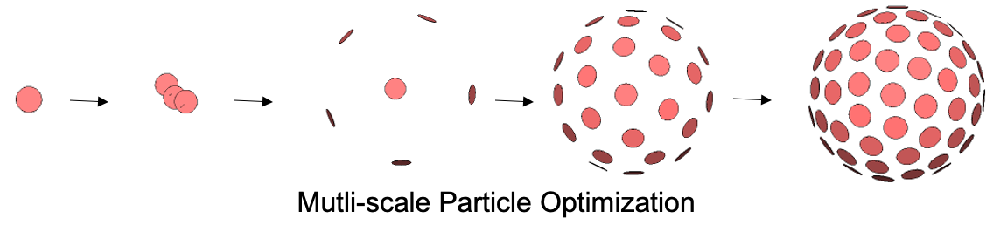

# Getting Started with ShapeWorks 

ShapeWorks is an open-source software that learns population-specific shape parameterization directly from user data. It enables the automated placement of dense corresponding landmarks on a group of shapes given as either binary volumes or surface meshes. 

Table of Contents
====================
- [Shape Modeling Workflow](#shape-modeling-workflow)  
- [ShapeWorks Interfaces](#shapeworks-interfaces)
- [Use Cases](#use-cases) 
- [How Tos](#how-tos)

Shape Modeling Workflow
=====================

ShapeWorks supports the typical three-stage workflow for shape modeling. 

Groom Stage
---------------------

The [groom stage](Workflow/Groom.md) entails data inspection and preprocessing, including conversion of the input segmentations and surface meshes into the appropriate data types that are optimization friendly so that landmarks can be optimized in a numerically stable way. It also includes visualization for preprocessed/groomed data for quality control and we are planning to include annotations for user-defined modeling preferences such as landmarks and constraints.

The grooming stage entails rigid transformations to align samples for groupwise modeling and analysis. Imaging data (e.g., CT, MRI) becomes out of alignment and cannot be tied to the resulting shape models. We have developed [segmentation-based](UseCases/LeftAtrium.md) and [mesh-based](UseCases/Femur.md) grooming tools and associated python scripts (i.e., use cases) to carry volumetric data through each grooming step with the shapes (meshes or segmentations) such that they can be used for subsequent analysis and visualization. These tools include image reflection (for paired anatomies), isotropic voxel resampling, image padding, applying shape-based alignment to images (center of mass and rigid alignment), and image cropping.

Optimize Stage
---------------------

The [optimize stage](Workflow/Optimize.md) is an iterative cycle of correspondences (landmarks/particles) optimization, visualization/quality control of resulting correspondence model and parameter tuning. 

The model initialization proceeds simultaneously with the optimization in a multiscale fashion using an iterative particle splitting strategy to generate progressively detailed correspondence models with each split.

Analyze Stage
---------------------

The [analyze stage](Workflow/Analyze.md) is the model analysis phase that supports the computation and visualization of the principal components of shape variation, average shapes, and group differences. 

ShapeWorks Interfaces
=====================

ShapeWorks tools are designed to support different usage scenarios, including execution on a local computing platform through terminal ([command line](#shapeworks-command)) and the user-friendly [Studio](#shapeworksstudio) application, and remote systems such as [Jupyter notebooks](#shapeworks-in-python) and private or public [clouds](#shapeworks-in-the-cloud). 

ShapeWorks Command
---------------------

ShapeWorks is currently a set of independent command line tools for preprocessing binary segmentations and surface meshes ([Groom](Workflow/Groom.md)) and computing landmark-based shape models ([Optimize](Workflow/Optimize.md)). It also includes an interactive user interface called [ShapeWorksStudio](#shapeworksstudio) to analyze and visualize the optimized shape models ([Analyze](Workflow/Analyze.md)). 

**Coming soon!** We are consolidating these tools into a single, reusable API (command) for ShapeWorks that is shared across different computational libraries in ShapeWorks. This single executable is highly flexible, modular, and loosely coupled, with standardized subcommands and interactive help to perform individual operations needed for a typical shape modeling workflow that includes the Groom, Optimize, and Analyze phases. 

ShapeWorks in Python
---------------------
**Coming soon!**  We are developing Python bindings to enable users to script their customized shape modeling workflows. Exemplar [use cases](UseCases/UseCases.md) will be updated to use these Python APIs to showcase their use and flexibility.

ShapeWorksStudio
---------------------

ShapeWorksStudio is a cross-platform graphical user interface (GUI) to support the standard shape analysis workflow needed by most ShapeWorks users, enabling a wide variety of research scenarios. It is currently supporting image-based grooming and is actively under developement to support surface meshes, more sophisticated grooming operations (including user annotations) and offline processing.  ShapeWorksStudio enable real-time parameter tuning and visualization of the optimization process, and statistical analyses.

ShapeWorks in the Cloud 
---------------------
*Under construction ... Stay tuned!*

Use Cases
=====================

Ellipsoid Use Case
---------------------

This [example](UseCases/Ellipsoid.md) is a steeping stone for the user to get familiar with the workflow of ShapeWorks. This use case represent the standard use version of a shape modeling workflow using ShapeWorks. 

Fixed Domains Ellipsoid Use Case
---------------------

This [use case](UseCases/FixedDomainEllipsoid.md) is designed for the fixed domains functionality of ShapeWorks. The fixed domains are used for the cases where we need to place correspondences on new shapes using a pre-existing shape model. 

Left Atrium Use Case
---------------------

This segmentation-based [use case](UseCases/LeftAtrium.md) demonstrates using the ShapeWorks functionality to groom shapes (given as binary segmentations) and their corresponding imaging data (e.g., MRI). This use case also showcase single scale and multiscale optimization for correspondence models.

Femur Use Case
---------------------

This mesh-based [use case](UseCases/Femur.md) demonstrates using ShapeWorks tools to convert shapes (femurs in this case) given as surface mehes to signed distance maps (the currently supported data type to optimize the particle system). It also show grooming imaging data (CT scans) of the hip to be tied with the groom shape data. As femur meshes in this dataset have been segmented with various shaft lengths, this use case include an interactive tool for the user to select a cutting plane on a single mesh (e.g., representative sample) to remove this variablity so that it is not captured in the shape model. 

Your Own Use Case
---------------------

You can use any of these use cases as a starting point and customize it to your own dataset. Please [contact ShapeWorks team](../README.md#contact-us) for questions and guidance to customize a use case to your data.

How Tos
=====================
- How to run and see ShapeWorks in action on exemplar [use cases](UseCases/UseCases.md). 
- How to preprocess or [groom](Workflow/Groom.md) your dataset.
- How to [optimize](Workflow/Optimize.md) your shape model.
- How to [visualize and analyze](Workflow/Analyze.md) your optimized shape model.
- How to [contact ShapeWorks team](../README.md#contact-us) to help you customize a use case to your own dataset.
- How to get the [latest ShapeWorks binary release](https://github.com/SCIInstitute/ShapeWorks/releases/latest) or up-to-date development builds from the master branch for [Windows](https://github.com/SCIInstitute/ShapeWorks/releases/tag/dev-windows), [Mac](https://github.com/SCIInstitute/ShapeWorks/releases/tag/dev-mac), or [Linux](https://github.com/SCIInstitute/ShapeWorks/releases/tag/dev-linux). *Please understand that these are in-progress development builds, not official releases.*
- How to install ShapeWorks on [Windows](Install/Windows_README.md), [Mac](Install/Mac_README.md), or [Linux](Install/Linux_README.md).
- How to [build](Build/BUILD.md) ShapeWorks from source (for developers).
