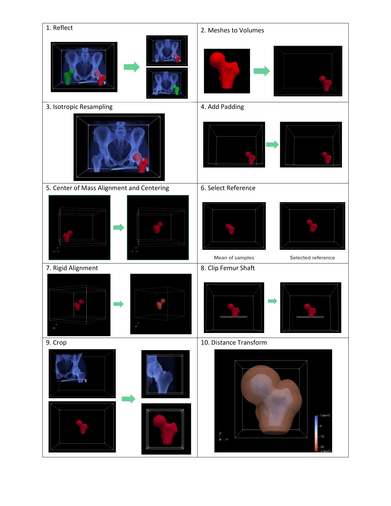

# Use Cases


## Downloading Datasets

Use Case datasets such as the ellipsoid and left atrium datasets will be downloaded
automatically from the ShapeWorks Data Portal.  
When running one of the use case example scripts, you will see something like this:
```
Can't find Ellipsoids.zip in the current directory.
.___________________________.
|                           |
|     ShapeWorks Portal     |
|___________________________|

Downloading Ellipsoids.zip from the ShapeWorks Portal
Login info not found in current directory.
New ShapeWorks Portal users: Register an account at http://cibc1.sci.utah.edu:8080/#?dialog=register
Returning ShapeWorks Portal users: Enter your username and password

Username: 
```


**Do not use the same password as for your bank account or email!**  
After registering a free account, you can log in from within the script

```
Username: joeshmoe
Password:
[1/1 MB]
joeshmoe downloaded Ellipsoids.zip from the ShapeWorks Portal.
```

##Left Atrium Use Case


The goal of this use case is using the ShapeWorks functionality to groom different type of input data (raw and segmentation images),
and different methods to optimize the particles.
ShapeWorks needs binary input images for grooming and running the optimization, in this use case we use the grooming 
functionality of ShapeWorks to groom the raw input images alongside with binary segmentations.
This example helps us to process the data (raw and binary images) with the same parameters for downstream tasks.
For this use case, we have the raw images of the left atrium and their corresponding binary segmentations. 

### Running the Use Case
The use case is located at: [https://github.com/SCIInstitute/ShapeWorks/Python/](https://github.com/SCIInstitute/ShapeWorks)

To run the use case, run LAMain.py with proper tags. The tags control the type of input data and the optimization method.
* --start_with_image_and_segmentation_data: to groom raw images as well as segmentation, the default is only segmentation
* --use_single_scale: to use the single scale optimization, the default is multiscale optimization
            
            python LAMain.py 

This calls RunLeftAtrium.py which:
* Loads data (uses local data if it exists, otherwise data is automatically downloaded from SCI servers)
* Grooms the images and segmentations by calling methods in GroomUtils.py
* Optimizes particle distribution by calling methods in OptimizeUtils.py
* Opens View2  to visualize results by calling methods in AnalyzeUtils.py

### Grooming
1. Isotropic Resampling - Both the image and mesh are resampled to have uniform voxel spacing. 
2. Apply Padding- Segmentations which lie on the image boundary will have a hole on that intersection. Padding is added to the images and segmentations prevent this.
3. Center of Mass Alignment - Center of mass alignment is performed before aligning the samples to a reference. This factors out translations reducing the risk of misalignment and allows for a median sample to be selected as the reference.
4. Reference Selection - The reference is selected by first getting the mean distance transform of the segmentations, then selecting the sample closest to that mean.
5. Rigid Alignment - All of the segmentations and images are now aligned to the reference using rigid alignment.
6. Crop - The images and segmentations are cropped so that all of the samples are within the same bounding box.
7. Distance Transform - Finally, the distance transform is taken and the data is ready for ShapeWorks optimize.
### Optimize
* Single scale optimization uses the user defined number of particles for optimization and uses procrustes scaling to factor out size as a mode of variation. 
Below are the default optimization parameters for this use case. 

            "number_of_particles" : 1024, 
            "use_normals": 0,
            "normal_weight": 10.0,
            "checkpointing_interval" : 200,
            "keep_checkpoints" : 1,
            "iterations_per_split" : 4000,
            "optimization_iterations" : 4000,
            "starting_regularization" : 50000,
            "ending_regularization" : 0.1,
            "recompute_regularization_interval" : 2,
            "domains_per_shape" : 1,
            "relative_weighting" : 50,
            "initial_relative_weighting" : 1,
            "procrustes_interval" : 1,
            "procrustes_scaling" : 1,
            "save_init_splits" : 1,
            "debug_projection" : 0,
            "verbosity" : 3,
            "use_statistics_in_init" : 0

* Multiscale optimization uses use defined starting number of particles and number of optimization levels, 
and the optimized particles of each level are used to initialize the next level particles. 
This method runs single scale optimization for each level and generates robust particle system.
The default values of this use case are as below.

            "starting_particles" : 128,
            "number_of_levels" : 4,
            "use_normals": 1,
            "normal_weight": 10.0,
            "checkpointing_interval" : 200,
            "keep_checkpoints" : 0,
            "iterations_per_split" : 4000,
            "optimization_iterations" : 4000,
            "starting_regularization" : 50000,
            "ending_regularization" : 0.1,
            "recompute_regularization_interval" : 2,
            "domains_per_shape" : 1,
            "relative_weighting" : 50,
            "initial_relative_weighting" : 0.1,
            "procrustes_interval" : 0,
            "procrustes_scaling" : 1,
            "save_init_splits" : 0,
            "debug_projection" : 0,
            "verbosity" : 3
            
            
## Femur Use Case

In this use case we start with full unsegmented images (CT scans) of the hip and segmented meshes of each femur.
ShapeWorks requires a binary volume format for input segmentations so these meshes must first be converted into binary volumes. Additionally, the corresponding unsegmented images need to be carried through each grooming step with the meshes so that they can be used for analysis.

### Running the Use Case
The use case is located at: [https://github.com/SCIInstitute/ShapeWorks](https://github.com/SCIInstitute/ShapeWorks)

To run the use case, run FemurMain.py with the tags --start_with_image_and_segmentation_data and --use single scale:
            
            python FemurMain.py --start_with_image_and_segmentation_data --use_single_scale

This calls RunFemur.py which:
* Loads data (uses local data if it exists, otherwise data is automatically downloaded from SCI servers)
* Grooms the images and meshes by calling methods in GroomUtils.py
* Optimizes particle distribution by calling methods in OptimizeUtils.py
* Opens View2  to visualize results by calling methods in AnalyzeUtils.py

### Grooming
The steps are described below and the results of each step are shown for the meshes (note every step is perfmored on both the meshes the images although the resulting images are not shown here).
1. Reflect - In this use case we often have both right and left femur surface meshes. We want to align all the femurs, so we choose one side to reflect both the image and mesh.
2. Meshe to Volumes - Meshes must be turned into binary volumes using rasterization. The corresponding image origin, size, and spacing are used to generate the volume. 
3. Isotropic Resampling - Both the image and mesh are resampled to have uniform voxel spacing. 
4. Apply Padding- Segmentations which lie on the image boundary will have a hole on that intersection. Padding is added to the images and segmentations prevent this.
5. Center of Mass Alignment - Center of mass alignment is performed before aligning the samples to a reference. This factors out translations reducing the risk of misalignment and allows for a median sample to be selected as the reference.
6. Reference Selection - The reference is selected by first getting the mean distance transform of the segmentations, then selecting the sample closest to that mean.
7. Rigid Alignment - All of the segmentations and images are now aligned to the reference using rigid alignment.
8. Clip Segmentations - Because the femur segmentations vary in shaft lengths, we define a cutting plane to clip them so only the region of interest remains.
9. Crop - The images and segmentations are cropped so that all of the samples are within the same bounding box.
10. Distance Transform - Finally the distance transform it taken and the data is ready for ShapeWorks optimize.



### Optimize
Single scale optimization is used with procrustes scaling to factor out size as a mode of variation. Below are the default optimization parameters for this use case. 

            "number_of_particles" : 1024, 
            "use_normals": 0,
            "normal_weight": 10.0,
            "checkpointing_interval" : 10,
            "keep_checkpoints" : 1,
            "iterations_per_split" : 4000,
            "optimization_iterations" : 4000,
            "starting_regularization" : 100,
            "ending_regularization" : 0.1,
            "recompute_regularization_interval" : 2,
            "domains_per_shape" : 1,
            "relative_weighting" : 10,
            "initial_relative_weighting" : 1,
            "procrustes_interval" : 1,
            "procrustes_scaling" : 1,
            "save_init_splits" : 1,
            "debug_projection" : 0,
            "verbosity" : 3,
            "use_statistics_in_init" : 0

## Analyze

The PBM for the mean and samples and the primary modes of variation are visualized using ShapeWorks Studio.

