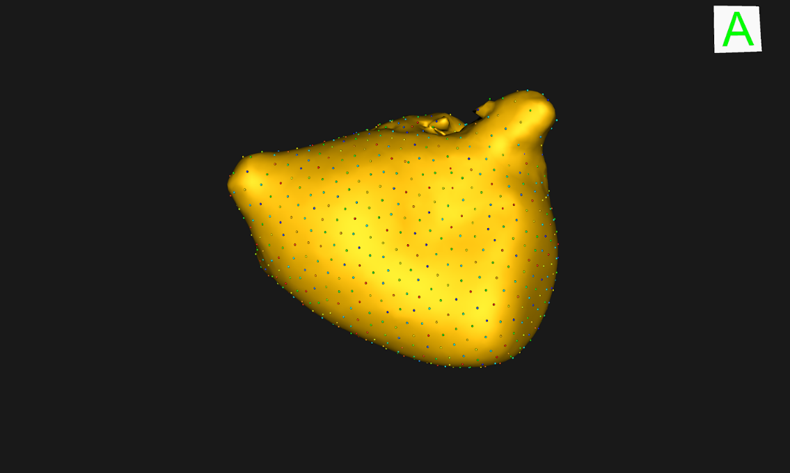
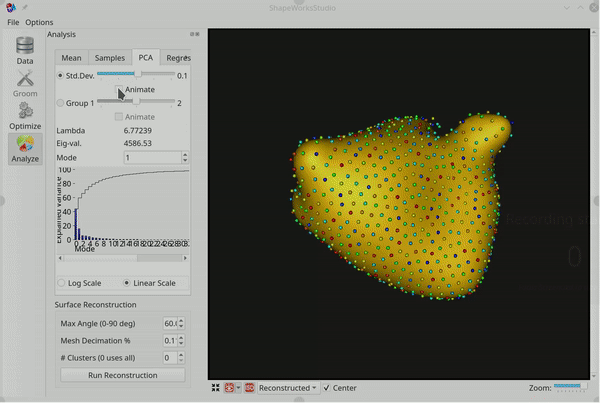
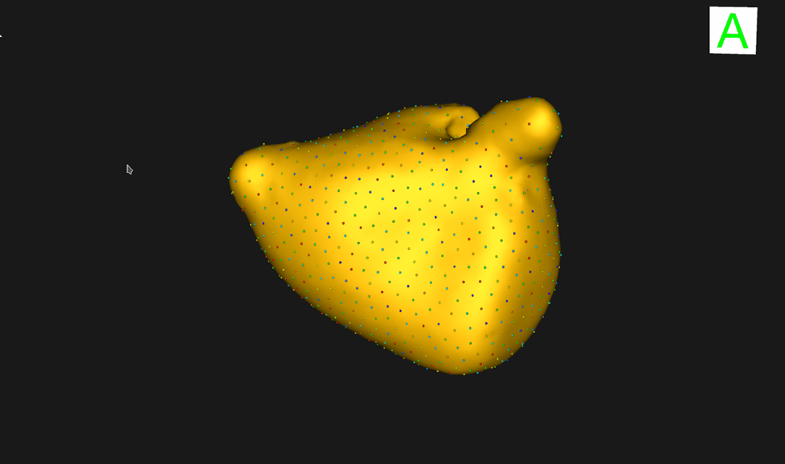
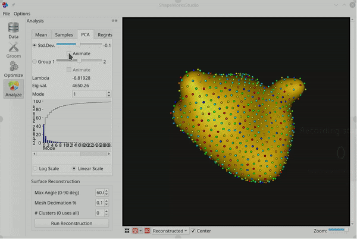
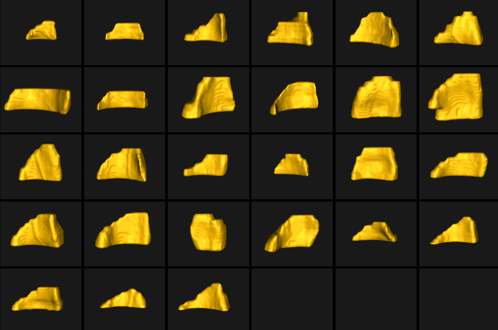

# Use Cases

- [Downloading Datasets](#Downloading-Datasets)
- [Running Use Cases](#Running-the-Use-Cases)
  - [Ellipsoid](#Ellipsoid-Use-Case)
  - [Fixed Domains Ellipsoid](#Fixed-Domains-Ellipsoid-Use-Case)
  - [Left Atrium](#Left-Atrium-Use-Case)
  - [Femur](#Femur-Use-Case)
- [Dataset Guidelines](#Dataset-Guidelines)

## Downloading Datasets

Use Case datasets such as the ellipsoid and left atrium datasets will be downloaded
automatically from the ShapeWorks Data Portal.  
When running one of the use case example scripts, you will see something like this:
```
Can't find ellipsoid.zip in the current directory.
.___________________________.
|                           |
|     ShapeWorks Portal     |
|___________________________|

Downloading the ellipsoid dataset from the ShapeWorks Portal
Login info not found in current directory.
New ShapeWorks Portal users: Register an account at http://cibc1.sci.utah.edu:8080/#?dialog=register
Returning ShapeWorks Portal users: Enter your username and password

Username: 
```


**Do not use the same password as for your bank account or email!**  
After registering a free account, you can log in from within the script

```
Username: joeshmoe
Password:
[1/1 MB]
joeshmoe downloaded the ellipsoid dataset from the ShapeWorks Portal.
```

## Running the Use Cases

The use cases are located at: [/Examples/Python](https://github.com/SCIInstitute/ShapeWorks/tree/master/Examples/Python). When a use case is run the data is automatically downloaded but you must make an account as described above first.

To run a use case, run the following command from the [/Examples/Python](https://github.com/SCIInstitute/ShapeWorks/tree/master/Examples/Python) directory:
            
            python RunUseCase.py --use_case [insert name of use case here]
            
        
The following use case names are currently supported:
* ellipsoid
* ellipsoid_fd
* left_atrium
* femur

To see the full list of optional tags, run:
          
            python RunUseCase.py --help
            
### Running a Subset

To run on a subset of the data in the use case, add the --use_subsample tag followed by the number of samples you wish to use. For example:

            python RunUseCase.py --use_case [insert name of use case here] --use_subsample 4

This will select a representative sample of the specified size to run through the pipeline so that it runs faster and uses less memory. The sample is selected by running k-mean clustering, then picking one sample from each cluster so that the resulting sample is representative of all the data.

## Ellipsoid Use Case

This dataset comprises of axis-aligned ellipsoids which are varying along a singular axis. This examples is a steeping stone for the user to get familiar with the workfolw of ShapeWorks. The ellipsoid.py use case represent the standard use version of shapeworks, it includes the full pipeline for processed as well as unprocessed data. 

The use case is located at: [/Examples/Python](https://github.com/SCIInstitute/ShapeWorks/Examples/Python)

To run the use case, run ellipsoid.py with proper tags. The tags control the type of input data and the optimization method.
* --start_with_prepped_data: just does the optimization on previously processed data
* --use_single_scale: to use the single scale optimization, the default is multiscale optimization
            
              python RunUseCase.py --use_case ellipsoid 

This calls ellipsoid.py which:
* Loads data (uses local data if it exists, otherwise data is automatically downloaded from SCI servers)
* Grooms the images and segmentations by calling methods in GroomUtils.py
* Optimizes particle distribution by calling methods in OptimizeUtils.py
* Opens View2  to visualize results by calling methods in AnalyzeUtils.py

### Grooming

These are pre-processing steps which are only performed when we start with unprepped data, i.e. the tag --start_with_prepped_data is not used.

For a description of the grooming tools and parameters, see: [Groom.md](https://github.com/SCIInstitute/ShapeWorks/Documentation/Groom.md)
1. Isotropic Resampling - Both the image and mesh are resampled to have uniform voxel spacing. 
2. Apply Padding- Segmentations which lie on the image boundary will have a hole on that intersection. Padding is added to the images and segmentations prevent this.
3. Center of Mass Alignment - Center of mass alignment is performed before aligning the samples to a reference. This factors out translations reducing the risk of misalignment and allows for a median sample to be selected as the reference.
4. Reference Selection - The reference is selected by first getting the mean distance transform of the segmentations, then selecting the sample closest to that mean.
5. Rigid Alignment - All of the segmentations and images are now aligned to the reference using rigid alignment.
6. Crop - The images and segmentations are cropped so that all of the samples are within the same bounding box.
7. Distance Transform - Finally, the distance transform is taken and the data is ready for ShapeWorks optimize.

### Optimize
For a description of the optimize tools and parameters, see: [Optimize.md](https://github.com/SCIInstitute/ShapeWorks/Documentation/Optimize.md)

* Single scale optimization uses the user defined number of particles for optimization and uses procrustes scaling to factor out size as a mode of variation. 
Below are the default optimization parameters for this use case. 

            "number_of_particles" : 128,
            "use_normals": 0,
            "normal_weight": 10.0,
            "checkpointing_interval" : 200,
            "keep_checkpoints" : 0,
            "iterations_per_split" : 100,
            "optimization_iterations" : 2000,
            "starting_regularization" : 100,
            "ending_regularization" : 0.1,
            "recompute_regularization_interval" : 2,
            "domains_per_shape" : 1,
            "relative_weighting" : 10,
            "initial_relative_weighting" : 0.01,
            "procrustes_interval" : 0,
            "procrustes_scaling" : 0,
            "save_init_splits" : 0,
            "debug_projection" : 0,
            "verbosity" : 3

* Multiscale optimization uses use defined starting number of particles and number of optimization levels, 
and the optimized particles of each level are used to initialize the next level particles. 
This method runs single scale optimization for each level and generates robust particle system.
The default values of this use case are as below.

            "starting_particles" : 32,
            "number_of_levels" : 3,
            "use_normals": 1,
            "normal_weight": 10.0,
            "checkpointing_interval" : 200,
            "keep_checkpoints" : 0,
            "iterations_per_split" : 100,
            "optimization_iterations" : 2000,
            "starting_regularization" : 100,
            "ending_regularization" : 0.1,
            "recompute_regularization_interval" : 2,
            "domains_per_shape" : 1,
            "relative_weighting" : 10,
            "initial_relative_weighting" : 0.01,
            "procrustes_interval" : 0,
            "procrustes_scaling" : 0,
            "save_init_splits" : 0,
            "debug_projection" : 0,
            "verbosity" : 3
            
            
## Fixed Domains Ellipsoid Use Case

This use case is designed for the fixed domains functionality of ShapeWorks. The fixed domains are used for the cases where we need to place correspondences over new shapes using a pre-existing shape model. In this example we use the example dataset in Ellipsoids_FD.zip which contains a previously generated shape model on ellipsoids, plus prepped segmentations of two new ellipsoids scans.

To run the use case, run ellipsoid_fd.py with proper tags. This optimization is done only with asingle scale support.
            
              python RunUseCase.py --use_case ellipsoid_fd

This calls ellipsoid_fd.py which:
* Loads data (uses local data if it exists, otherwise data is automatically downloaded from SCI servers)
* Loads the exisitng shape model and converts the new segmentations into distance transforms.
* Optimizes particle distribution by calling in OptimizeUtils.py
* Opens View2 to visualize results by calling methods in AnalyzeUtils.py

### Optimize

For a description of the optimize tools and parameters, see: [Optimize.md](https://github.com/SCIInstitute/ShapeWorks/Documentation/Optimize.md)

* Single scale optimization uses the user defined number of particles for optimization and uses procrustes scaling to factor out size as a mode of variation. 
Below are the default optimization parameters for this use case. 

          
        "number_of_particles" : 128,
        "use_normals": 0,
        "normal_weight": 10.0,
        "checkpointing_interval" : 200,
        "keep_checkpoints" : 0,
        "iterations_per_split" : 100,
        "optimization_iterations" : 2000,
        "starting_regularization" : 100,
        "ending_regularization" : 0.1,
        "recompute_regularization_interval" : 2,
        "domains_per_shape" : 1,
        "relative_weighting" : 10,
        "initial_relative_weighting" : 0.01,
        "procrustes_interval" : 0,
        "procrustes_scaling" : 0,
        "save_init_splits" : 0,
        "debug_projection" : 0,
        "verbosity" : 3,
        "number_fixed_domains": len(fileListDT),
        "fixed_domain_model_dir": shapemodelDir,
        "mean_shape_path": meanShapePath,
    

The meanShapePath and shapemodelDir are specified in the example itself, but they correspond to points which we initialize the new shape and the directory path to the new shape model.


## Left Atrium Use Case
##### Minimum of 32GB of RAM required to run full use case.

The goal of this use case is using the ShapeWorks functionality to groom different types of input data (MRI and segmentation images),
and test two methods to optimize the particles.
ShapeWorks needs binary input images for grooming and prepares the data for optimization, in this use case we use the grooming 
functionality of ShapeWorks to groom the raw input images(MRI/CT) alongside with binary segmentations.
This example shows how to process the data (MRI and binary images) with the same parameters for downstream tasks.
There are multiple steps in the grooming stage to have proper data for optimization, these steps change the origin, 
voxel size, image size, orientation, etc. of input data. Although we don't need the raw images for the optimization, 
we might need them for any downstream task or warping the optimized particle system. 
For this purpose, we need to be consistent in term of changes between segmentation and raw files. 
In each step of grooming, we use the segmentation files to find the grooming parameters such as finding reference image 
for alignment or the bounding box for cropping, then we save them in a TXT file and use the same set of parameters 
to groom the raw images. At the end of this stage, we have groomed segmentations to convert to distance transforms 
and run the optimization and also, grooming parameters, and groomed raw files.
For this use case, we have 58 MRI images and their corresponding binary segmentation of left atrium(more details of 
[data](https://www.insight-journal.org/midas/collection/view/197))

This use case also demonstrates evaluation of different methods for optimization. 
We optimized the particle system with two different optimization methods available in ShapeWorks,
 single scale and multi-scale optimization. 
The single scale optimization takes a fixed number of particles (usually a power of 2 ) and performs the initialization step,
 then performs ShapeWorks optimization.  The multi-scale optimization runs the single scale optimization for different 
 number of particles in a hierarchical manner. It starts with a low number of particles, runs the single scale optimization
  until convergence, then uses optimum particles for the initialization of next level and increases particles by 
  the power of two at each level to reach the desired number of particles.

For the dataset like left atrium with lots of variation, it is hard  to tune parameters of single scale optimization. 
The multi-scale optimization is providing the optimize particle system at each level, so we can use them to tune the parameters
 and have more stable particle system for the desired number of particles.
 
 
##### Minimum of 32GB of RAM required to run full use case.

### Running Left Atrium
The use case is located at: [/Examples/Python](https://github.com/SCIInstitute/ShapeWorks/tree/master/Examples/Python)

To run the use case, run LAMain.py with proper tags. The tags control the type of input data and the optimization method.
* --start_with_image_and_segmentation_data: to groom raw images as well as segmentation, the default is only segmentation
* --use_single_scale: to use the single scale optimization, the default is multiscale optimization
            
              python RunUseCase.py --use_case left_atrium 

This calls left_atrium.py which:
* Loads data (uses local data if it exists, otherwise data is automatically downloaded from SCI servers)
* Grooms the images and segmentations by calling methods in GroomUtils.py
* Optimizes particle distribution by calling methods in OptimizeUtils.py
* Opens ShapeWorksStudio  to visualize results by calling methods in AnalyzeUtils.py

### Grooming
For a description of the grooming tools and parameters, see: [Groom.md](https://github.com/SCIInstitute/ShapeWorks/blob/master/Documentation/Groom.md)
1. Isotropic Resampling - Both the image and mesh are resampled to have uniform voxel spacing. 
2. Apply Padding- Segmentations which lie on the image boundary will have a hole on that intersection. Padding is added to the images and segmentations prevent this.
3. Center of Mass Alignment - Center of mass alignment is performed before aligning the samples to a reference. This factors out translations reducing the risk of misalignment and allows for a median sample to be selected as the reference.
4. Reference Selection - The reference is selected by first getting the mean distance transform of the segmentations, then selecting the sample closest to that mean.
5. Rigid Alignment - All of the segmentations and images are now aligned to the reference using rigid alignment.
6. Crop - The images and segmentations are cropped so that all of the samples are within the same bounding box.
7. Distance Transform - Finally, the distance transform is taken and the data is ready for ShapeWorks optimize.


### Optimize
For a description of the optimize tools and parameters, see: [Optimize.md](https://github.com/SCIInstitute/ShapeWorks/blob/master/Documentation/Optimize.md)

* Single scale optimization uses the user defined number of particles for optimization and uses procrustes scaling to factor out size as a mode of variation. 
Below are the default optimization parameters for this use case. 

            "number_of_particles" : 1024, 
            "use_normals": 0,
            "normal_weight": 10.0,
            "checkpointing_interval" : 200,
            "keep_checkpoints" : 1,
            "iterations_per_split" : 4000,
            "optimization_iterations" : 4000,
            "starting_regularization" : 50000,
            "ending_regularization" : 0.1,
            "recompute_regularization_interval" : 2,
            "domains_per_shape" : 1,
            "relative_weighting" : 50,
            "initial_relative_weighting" : 1,
            "procrustes_interval" : 0,
            "procrustes_scaling" : 1,
            "save_init_splits" : 1,
            "debug_projection" : 0,
            "verbosity" : 3,
            "use_statistics_in_init" : 0

#### Mean Shape


#### PCA


* Multiscale optimization uses use defined starting number of particles and number of optimization levels, 
and the optimized particles of each level are used to initialize the next level particles. 
This method runs single scale optimization for each level and generates robust particle system.
The default values of this use case are as below.

            "starting_particles" : 128,
            "number_of_levels" : 4,
            "use_normals": 1,
            "normal_weight": 10.0,
            "checkpointing_interval" : 200,
            "keep_checkpoints" : 0,
            "iterations_per_split" : 4000,
            "optimization_iterations" : 4000,
            "starting_regularization" : 50000,
            "ending_regularization" : 0.1,
            "recompute_regularization_interval" : 2,
            "domains_per_shape" : 1,
            "relative_weighting" : 50,
            "initial_relative_weighting" : 0.1,
            "procrustes_interval" : 0,
            "procrustes_scaling" : 1,
            "save_init_splits" : 0,
            "debug_projection" : 0,
            "verbosity" : 3

#### Mean Shape          


#### PCA



### Analyze

The particle based model for the mean shape and samples and the primary modes of variation are visualized using ShapeWorksStudio.
For more information see: [Analyze.md](https://github.com/SCIInstitute/ShapeWorks/blob/master/Documentation/Analyze.md)            
            
## Femur Use Case

In this use case we start with full unsegmented images (CT scans) of the hip and segmented meshes of each femur.
ShapeWorks requires a binary volume format for input segmentations so these meshes must first be converted into binary volumes. Additionally, the corresponding unsegmented images need to be carried through each grooming step with the meshes so that they can be used for analysis.

##### Minimum of 32GB of RAM required to run full use case.

The femur meshes in this data set have been segmented with various shaft lengths as can be seen below. In order to remove this variablity so that it is not captured in the shape model, the femurs are clipped using a cutting plane defined by the user. There are two ways to do so as explained below and they are differentiated by using the "--interactive" tag or not. 


### Running the Use Case
The use case is located at: [/Examples/Python](https://github.com/SCIInstitute/ShapeWorks/tree/master/Examples/Python)

To run the use case, run:
            
              python RunUseCase.py --use_case femur
              
This calls femur.py which:
* Loads data (uses local data if it exists, otherwise data is automatically downloaded from SCI servers)
* Grooms the images and meshes by calling methods in GroomUtils.py
* Optimizes particle distribution by calling methods in OptimizeUtils.py
* Opens View2  to visualize results by calling methods in AnalyzeUtils.py

#### Running without the --interactive tag

If the --interactive tag is not used, the user will select the cutting plane in the beggining of the grooming steps on a sample of their choice.

The user will be prompted with “Type the prefix of the sample you wish to use to select the cutting plane from listed options and press enter.” and the options are listed. After they've typed the chosen sample prefix, an interactive window will pop up in which they can select the cutting plane. When the user is content with their selection, they simply close this window and the grooming process will continue. This process can be seen below.


Note that internally, whatever transformations are done to the sample the user has defined the cutting plane on will be done to the cutting plane as well, so that when it is time to clip the samples the cutting plane is still well defined. 

#### Running with the --interactive tag
To run the use case interactively, either run:
            
              python RunUseCase.py --use_case femur --interactive

If the --interactive tag is used, the user will be asked to select a cutting plane for the femur shaft in the middle of the grooming process. Once the reference sample for alignment has been selected, an interactive window will pop up with the reference sample and the user can define the cutting plane. Closing the window will continue the grooming process. 


### Grooming
For a description of the grooming tools and parameters, see: [Groom.md](https://github.com/SCIInstitute/ShapeWorks/blob/master/Documentation/Groom.md)

The steps are described below and the results of each step are shown for the meshes (note every step is perfmored on both the meshes the images although the resulting images are not shown here).

0. Define cutting plane either in beginning or after rigid alignment using the interactive window. 

            Within this window:

            - Zoom in and out by scrolling
 
            - Rotate view point by clicking in the surrounding area
 
            - Move cutting plane by clicking on it and dragging
 
            - Change normal vector (represented with arrow) by clicking on it and dragging
  
1. Reflect - In this use case we often have both right and left femur surface meshes. We want to align all the femurs, so we choose one side to reflect both the image and mesh.
2. Meshes to Volumes - Meshes must be turned into binary volumes using rasterization. The corresponding image origin, size, and spacing are used to generate the volume. 
3. Isotropic Resampling - Both the image and mesh are resampled to have uniform voxel spacing. 
4. Apply Padding- Segmentations which lie on the image boundary will have a hole on that intersection. Padding is added to the images and segmentations prevent this.
5a. Center of Mass Alignment - Center of mass alignment is performed before aligning the samples to a reference. This factors out translations reducing the risk of misalignment and allows for a median sample to be selected as the reference. Images are then centered so the origin is in the center.
5b. Centering - The samples must be centered before they are aligned to a reference. This step can be performed with Isotropic Resampling as it is in the left atrium use case. In the Femur use case we do so separately so that we can get the translation and apply it to the cutting plane if it has already been selected.
6. Reference Selection - The reference is selected by first getting the mean distance transform of the segmentations, then selecting the sample closest to that mean.
7. Rigid Alignment - All of the segmentations and images are now aligned to the reference using rigid alignment.
8. Clip Segmentations - Because the femur segmentations vary in shaft lengths, we use the defined cutting plane to clip them so only the region of interest remains.
9. Crop - The images and segmentations are cropped so that all of the samples are within the same bounding box.
10. Distance Transform - Finally the distance transform it taken and the data is ready for ShapeWorks optimize.


### Optimize
For a description of the optimize tools and parameters, see: [Optimize.md](https://github.com/SCIInstitute/ShapeWorks/blob/master/Documentation/Optimize.md)

Single scale optimization is used with procrustes scaling to factor out size as a mode of variation. Below are the default optimization parameters for this use case. 

            "number_of_particles" : 1024, 
            "use_normals": 0,
            "normal_weight": 10.0,
            "checkpointing_interval" : 10,
            "keep_checkpoints" : 1,
            "iterations_per_split" : 4000,
            "optimization_iterations" : 4000,
            "starting_regularization" : 100,
            "ending_regularization" : 0.1,
            "recompute_regularization_interval" : 2,
            "domains_per_shape" : 1,
            "relative_weighting" : 10,
            "initial_relative_weighting" : 1,
            "procrustes_interval" : 1,
            "procrustes_scaling" : 1,
            "save_init_splits" : 1,
            "debug_projection" : 0,
            "verbosity" : 3,
            "use_statistics_in_init" : 0

### Analyze

The particle based model for the mean shape and samples and the primary modes of variation are visualized using ShapeWorksStudio.
For more information see: [Analyze.md](https://github.com/SCIInstitute/ShapeWorks/blob/master/Documentation/Analyze.md)

#### Mean Shape


#### Samples


#### PCA


##  Right Ventricle Use Case

The goal of this use case is, study the group difference of right ventricle between control and patients.
 In this study, we have two sets of data, the control group with six subjects and patient group consists of 26 subjects.
  For each group, we have diastole and systole segmentation. The goal is to study the variation of the systole and diastole in two groups.
   For this purpose, we pre-process diastole and systole data with the groom utils of ShapeWorks and then optimize the particle system for them, independently.
    Then using the group difference analysis tool of ShapeWorks we can study the difference of variation in control and patient group from diastole to systole stage of heart. 

### Grooming
For a description of the grooming tools and parameters, see: [Groom.md](https://github.com/SCIInstitute/ShapeWorks/blob/master/Documentation/Groom.md)
1. Isotropic Resampling - Segmentations are resampled to have uniform voxel spacing. 
2. Apply Padding- Segmentations which lie on the image boundary will have a hole on that intersection. Padding is added to the segmentations to prevent this.
3. Center of Mass Alignment - Center of mass alignment is performed before aligning the samples to a reference. This factors out translations reducing the risk of misalignment and allows for a median sample to be selected as the reference.
4. Reference Selection - The reference is selected by first getting the mean distance transform of the segmentations, then selecting the sample closest to that mean.
5. Rigid Alignment - All of the segmentations are now aligned to the reference using rigid alignment.
6. Crop - The segmentations are cropped so that all of the samples are within the same bounding box.
7. Distance Transform - Finally, the distance transform is taken and the data is ready for ShapeWorks optimize.


 


## Dataset Guidelines
Check out [Datasets.md](Datasets.md) for dataset upload instructions and guidelines. 
