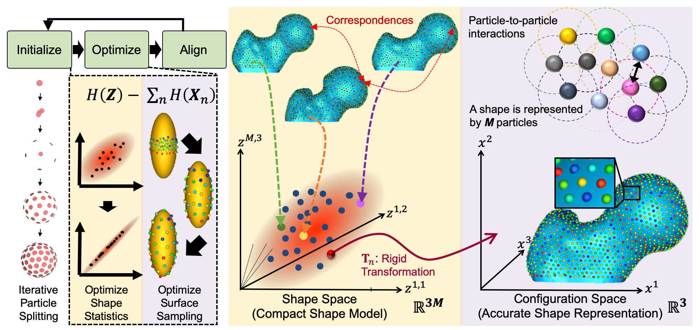

ShapeWorks
=====================

ShapeWorks is an open-source software that learns population-specific shape parameterization directly from user data. It enables the automated placement of dense corresponding landmarks on a group of shapes given as either binary volumes or surface meshes. Please visit [ShapeWorks website](http://sciinstitute.github.io/ShapeWorks/) for more information. ShapeWorks has been effective in a range of applications, including psychology, biological phenotyping, cardiology, and orthopedics. [See relevant papers](http://sciinstitute.github.io/ShapeWorks/users/papers). 

Quick Links
=====================
- [How to install ShapeWorks?](http://sciinstitute.github.io/ShapeWorks/users/install)
- [How to cite ShapeWorks?](http://sciinstitute.github.io/ShapeWorks/users/citation)
- [How to contact us?](http://sciinstitute.github.io/ShapeWorks/about/contact)
- [Meet ShapeWorkers!](http://sciinstitute.github.io/ShapeWorks/about/team)

Documentation
=====================

Getting Started
---------------------
[GettingStarted](Documentation/GettingStarted.md) provides overviews of dataset grooming, optimization, and analysis, ShapeWorks Studio and command line instructions, and practical use cases. See [ShapeWorks in action](Documentation/GettingStarted.md#shapeworks-interfaces)!

Using
---------------------
[ShapeWorks Commands](Documentation/GettingStarted.md#shapeworks-command)  
[ShapeWorks Studio](Documentation/GettingStarted.md#shapeworksstudio)  
[Python API](Documentation/GettingStarted.md#shapeworks-in-python) _(Coming Soon!)_  
[Clouds Deployments](Documentation/GettingStarted.md#shapeworks-in-the-cloud) _(Coming Soon!)_  

How Tos
---------------------
- How to run and see ShapeWorks in action on exemplar [use cases](Documentation/UseCases/UseCases.md). 
- How to preprocess or [groom](Documentation/Workflow/Groom.md) your dataset.
- How to [optimize](Documentation/Workflow/Optimize.md) your shape model.
- How to [visualize and analyze](Documentation/Workflow/Analyze.md) your optimized shape model.
- [...and more](Documentation/GettingStarted.md#how-tos)

