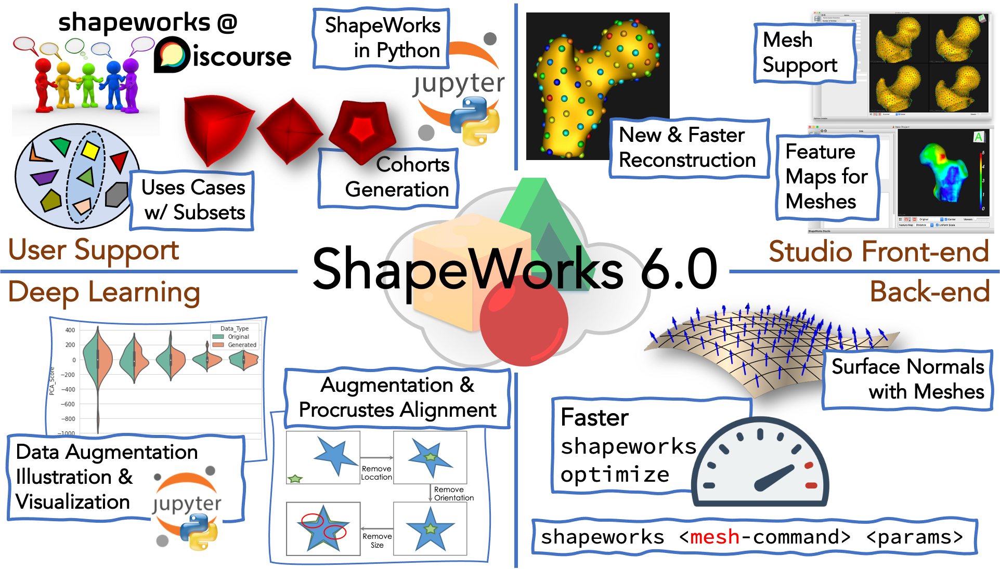
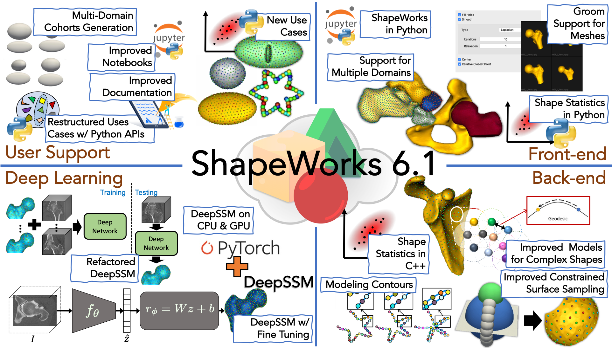
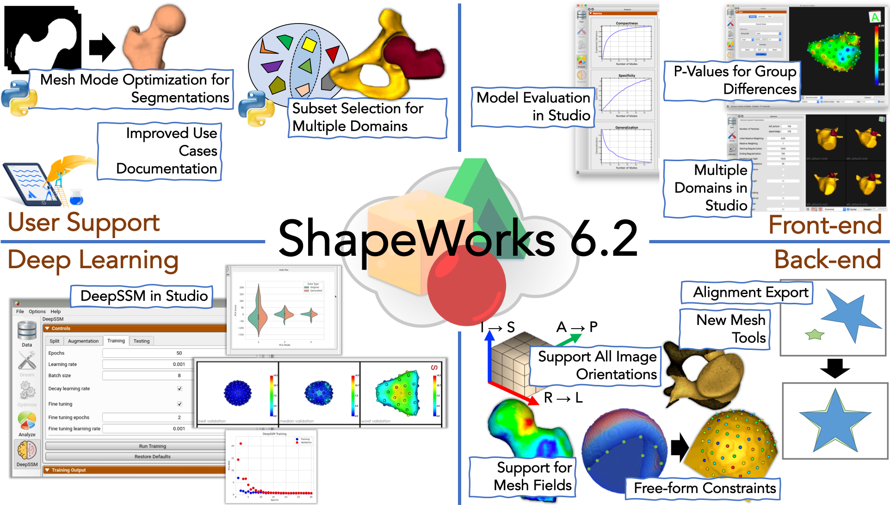
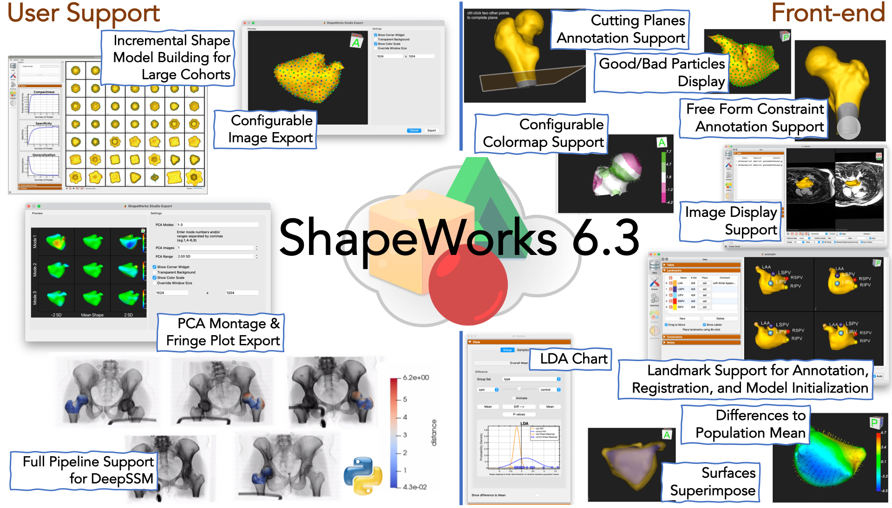
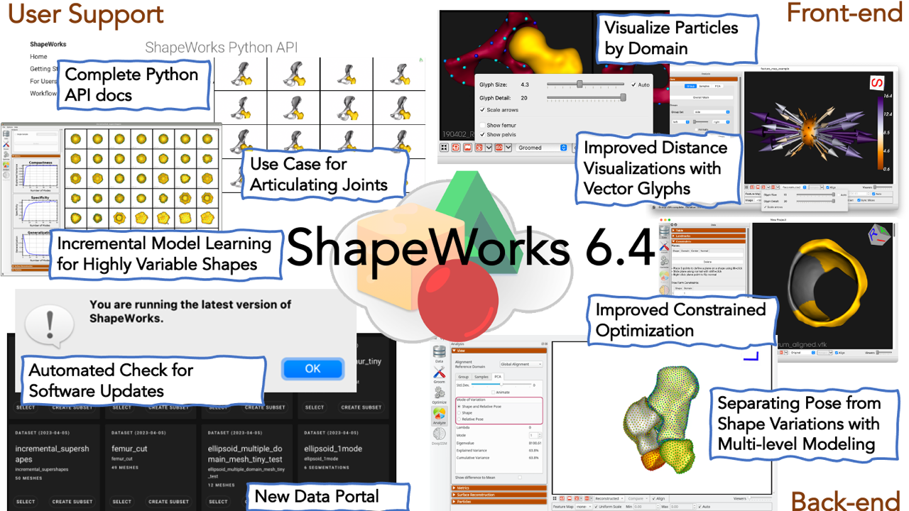

<!--ShapeWorks
=====================-->

<!---->

ShapeWorks is an open-source software that learns population-specific shape parameterization directly from user data. It enables the automated placement of dense corresponding landmarks on a group of shapes given as either binary volumes or surface meshes. Please visit [ShapeWorks website](http://sciinstitute.github.io/ShapeWorks/) for more information. ShapeWorks has been effective in a range of applications, including psychology, biological phenotyping, cardiology, and orthopedics. [See relevant papers](http://sciinstitute.github.io/ShapeWorks/latest/users/papers). 

Latest Release
=====================

<!---->
<!---->
<!---->
<!---->
<!---->

Quick Links
=====================
- [How to install ShapeWorks?](http://sciinstitute.github.io/ShapeWorks/latest/users/install)
- [How to cite ShapeWorks?](http://sciinstitute.github.io/ShapeWorks/latest/users/citation)
- [How to get started with shape modeling?](http://sciinstitute.github.io/ShapeWorks/latest/getting-started/shapes)
- See [ShapeWorks in action](http://sciinstitute.github.io/ShapeWorks/latest/getting-started/interfaces)!
- How to run and see ShapeWorks in action on exemplar [use cases](http://sciinstitute.github.io/ShapeWorks/latest/use-cases/use-cases). 
- [How to contact us?](http://sciinstitute.github.io/ShapeWorks/latest/about/contact)
- [Meet ShapeWorkers!](http://sciinstitute.github.io/ShapeWorks/latest/about/team)
- [...and more](http://sciinstitute.github.io/ShapeWorks/latest/getting-started/how-tos)

Using
=====================
[ShapeWorks Commands](http://sciinstitute.github.io/ShapeWorks/latest/tools/ShapeWorksCommands)  
[ShapeWorks Studio](http://sciinstitute.github.io/ShapeWorks/latest/getting-started/interfaces#shapeworksstudio)  
[Python API](http://sciinstitute.github.io/ShapeWorks/latest/getting-started/interfaces#shapeworks-in-python) _(New!)_  
[Clouds Deployments](http://sciinstitute.github.io/ShapeWorks/latest/cloud/getting-started-with-cloud.html) _(New!)_

