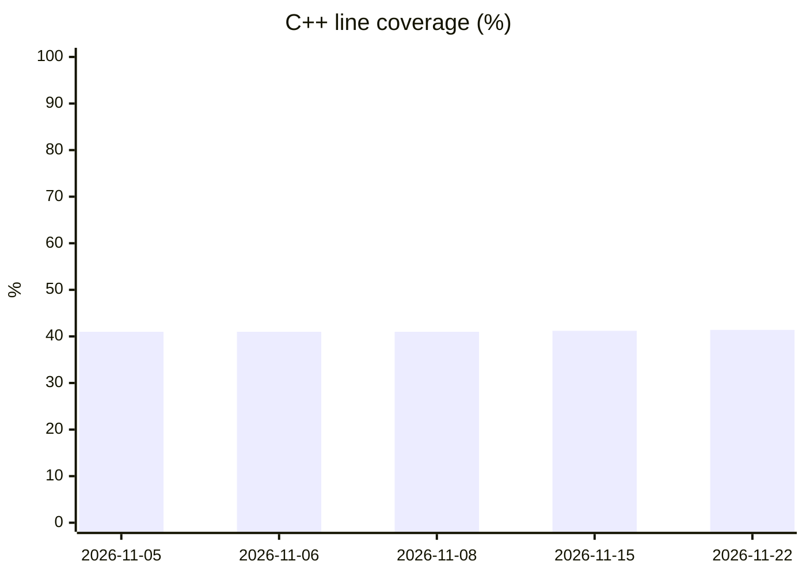
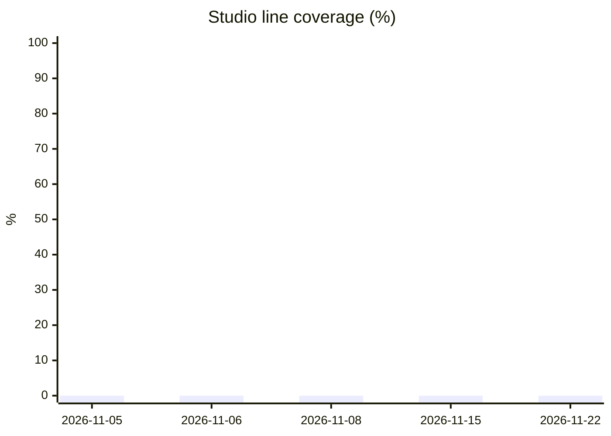
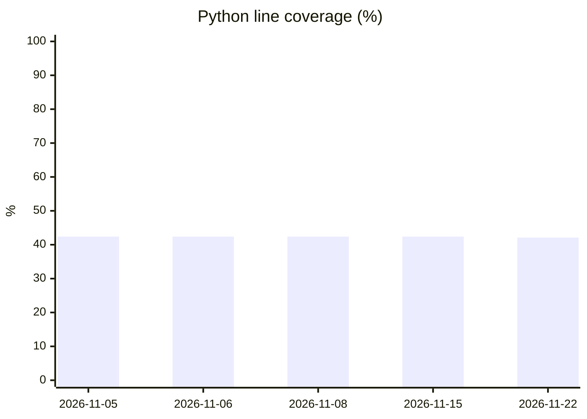

# ShapeWorks test coverage

Updated weekly by the [Linux Coverage](https://github.com/SCIInstitute/ShapeWorks/actions/workflows/coverage.yml) workflow. Raw data is in [history.csv](history.csv); full HTML reports are attached to each workflow run.

Latest: 2026-11-22, commit [218e509014](https://github.com/SCIInstitute/ShapeWorks/commit/218e509014ca893a2b8771739243b09c7c8dfdb6)

| | Coverage |
|---|---|
| C++ lines | 41.4% |
| C++ functions | 47.9% |
| C++ branches | 37.4% |
| Studio lines | 0.0% |
| Python lines | 42.1% |

```mermaid
xychart-beta
    title "C++ line coverage (%)"
    x-axis ["2026-11-05", "2026-11-06", "2026-11-08", "2026-11-15", "2026-11-22"]
    y-axis "%" 0 --> 100
    bar [41.0, 41.0, 41.0, 41.2, 41.4]
```

```mermaid
xychart-beta
    title "Studio line coverage (%)"
    x-axis ["2026-11-05", "2026-11-06", "2026-11-08", "2026-11-15", "2026-11-22"]
    y-axis "%" 0 --> 100
    bar [0.0, 0.0, 0.0, 0.0, 0.0]
```

```mermaid
xychart-beta
    title "Python line coverage (%)"
    x-axis ["2026-11-05", "2026-11-06", "2026-11-08", "2026-11-15", "2026-11-22"]
    y-axis "%" 0 --> 100
    bar [42.4, 42.4, 42.4, 42.4, 42.1]
```

## Recent runs

| Date | Commit | C++ lines | C++ functions | C++ branches | Studio lines | Python lines | Run |
|---|---|---|---|---|---|---|---|
| 2026-11-22 | [218e509014](https://github.com/SCIInstitute/ShapeWorks/commit/218e509014ca893a2b8771739243b09c7c8dfdb6) | 41.4 | 47.9 | 37.4 | 0.0 | 42.1 | [run](https://github.com/SCIInstitute/ShapeWorks/actions/runs/45031186808) |
| 2026-11-15 | [f36715f1dd](https://github.com/SCIInstitute/ShapeWorks/commit/f36715f1dd08f1dbd883ef82d902b8e9b077a5fc) | 41.2 | 47.8 | 37.3 | 0.0 | 42.4 | [run](https://github.com/SCIInstitute/ShapeWorks/actions/runs/43719279593) |
| 2026-11-08 | [015365d365](https://github.com/SCIInstitute/ShapeWorks/commit/015365d3658eab9ea3c37cb4caf651c4ce63b850) | 41.0 | 47.6 | 37.1 | 0.0 | 42.4 | [run](https://github.com/SCIInstitute/ShapeWorks/actions/runs/42482091130) |
| 2026-11-06 | [015365d365](https://github.com/SCIInstitute/ShapeWorks/commit/015365d3658eab9ea3c37cb4caf651c4ce63b850) | 41.0 | 47.6 | 37.1 | 0.0 | 42.4 | [run](https://github.com/SCIInstitute/ShapeWorks/actions/runs/42099879708) |
| 2026-11-05 | [2606b12c19](https://github.com/SCIInstitute/ShapeWorks/commit/2606b12c193019bb0af14323004d43b854da1277) | 41.0 | 47.6 | 37.1 | 0.0 | 42.4 | [run](https://github.com/SCIInstitute/ShapeWorks/actions/runs/42051801372) |
