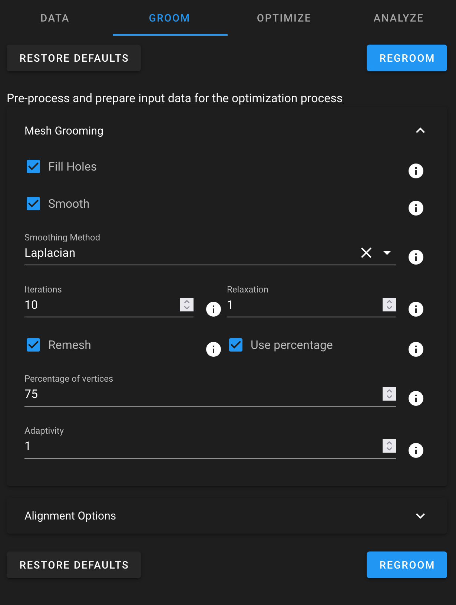

# ShapeWorks Cloud Groom Module

**Note**: This documentation version could be outdated. [Click here](http://sciinstitute.github.io/ShapeWorks/dev/cloud/cloud-groom-module.html) to get the most up-to-date version.

{: width="400"}

The groom module provides option for mesh grooming and alighnment. The groomed object is able to be viewed in the [Shape Viewer](cloud-shape-viewer.md). You also have the option of skipping grooming if your data is already prepped. For more information on how to groom your data, navigate [here](http://sciinstitute.github.io/ShapeWorks/latest/workflow/groom.html){target=_blank}.

To groom the data, click the "Groom" option. If you wish to re-groom data, simply click "Regroom".

To restore the groom parameters to the default values, click "Restore Defaults".

Mesh Grooming Parameters

| Parameter | Description |
| --- | ----------- |
| Fill Holes | Fill small holes in the mesh |
| Smooth | Perform either Laplacian or Windowed Sinc smoothing |
| Laplacian Smoothing | Laplacian smoothing option with specified iterations and relaxation factor.  In general, it is recommended to use smaller relaxation factors and more iterations rather than larger relaxation and fewer iterations |
| Windowed Sinc Smoothing | Windowed Sinc smoothing with specified iterations and passband (typically between 0 and 2).  Lower passpand values produce more smoothing |
| Smoothing Iterations | Number of iterations of selected smoothing. More iterations provides more smoothing |
| Laplacian Relaxation | Controls the amount of smoothing in each iteration |
| Windowed Sinc Pass Band | Alters how much smoothing each iteration performs |
| Remesh | Enabled remeshing using ACVD library |
| Remesh Percent | Specify target vertices as a percentage of existing vertices |
| Remesh Vertices | Specify target vertices directly |
| Remesh Adaptivity | Curvature adaptivity of remeshing (0 = uniform, 2.0 most adaptive).  This allocates more triangles/vertices to areas of higher curvature |

Alignment Parameters

| Parameter | Description |
| --- | ----------- |
| Reflect | Option to reflect some shapes over a given axis if a given column matches a given value (e.g. reflect 'side' over 'Y' if 'left') |
| Alignment | Option to align with centering (center of mass), iterative closest point (translation and rotation), or landmarks (best fit, when specified) |
