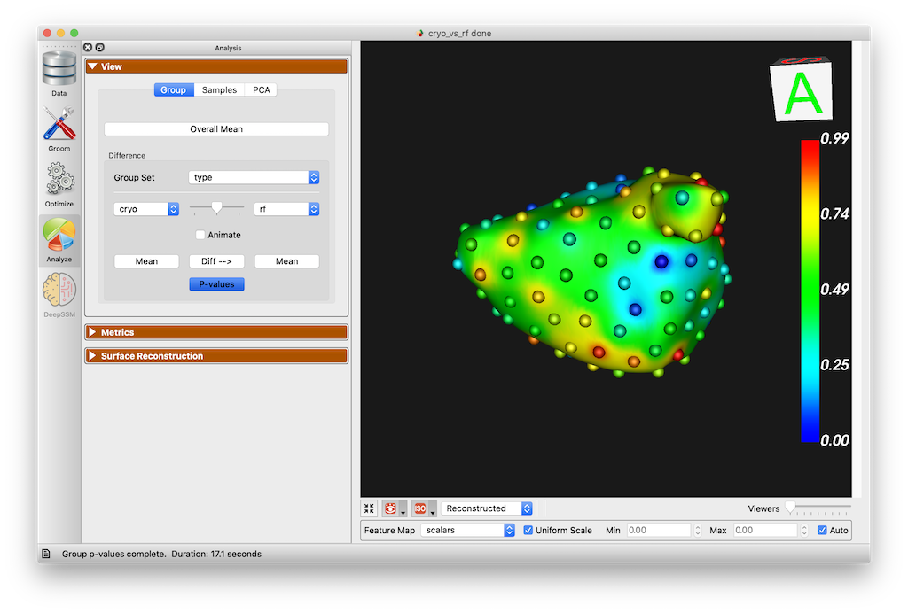
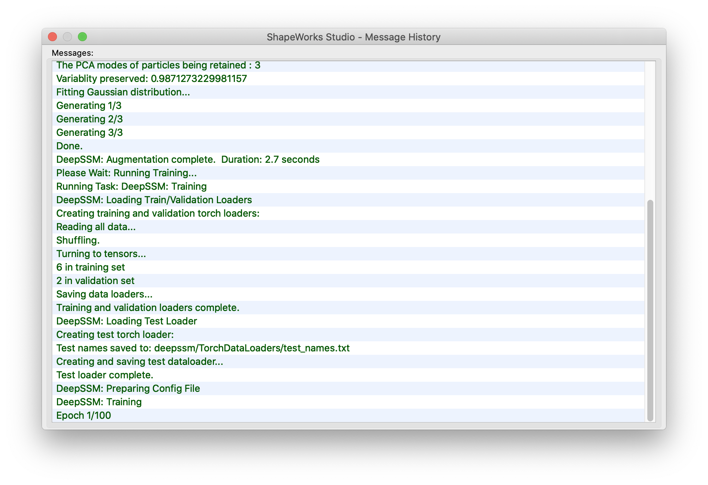
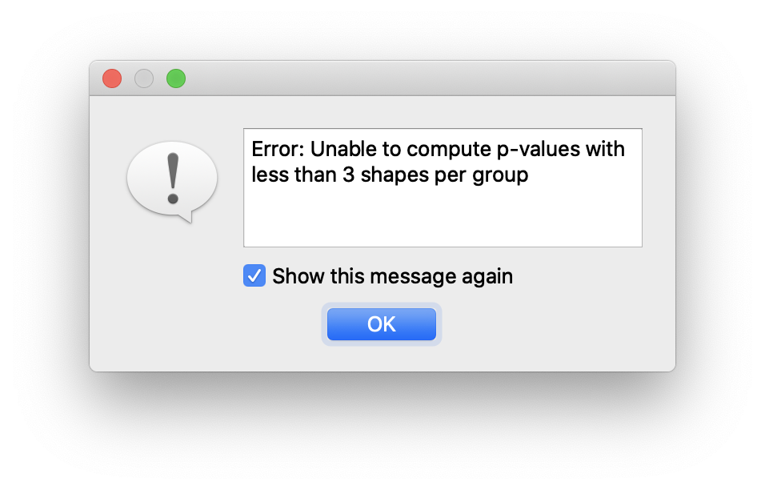
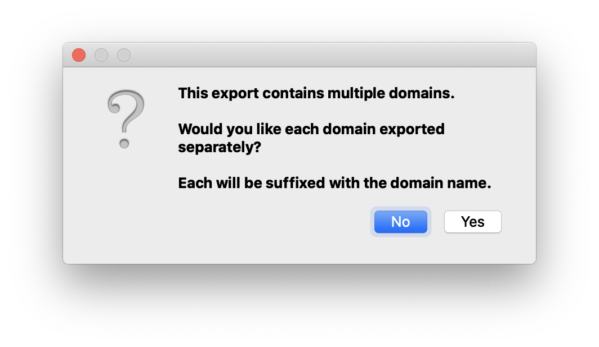
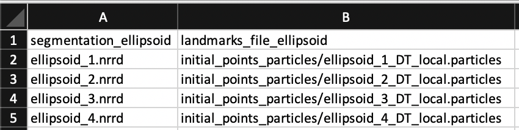
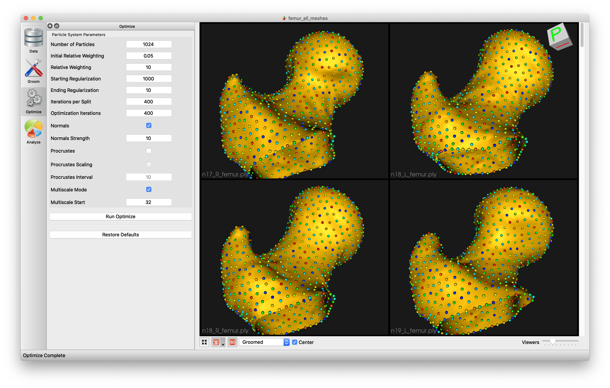
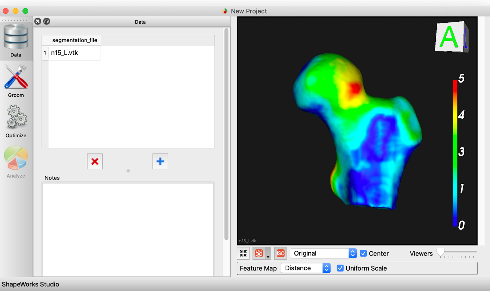
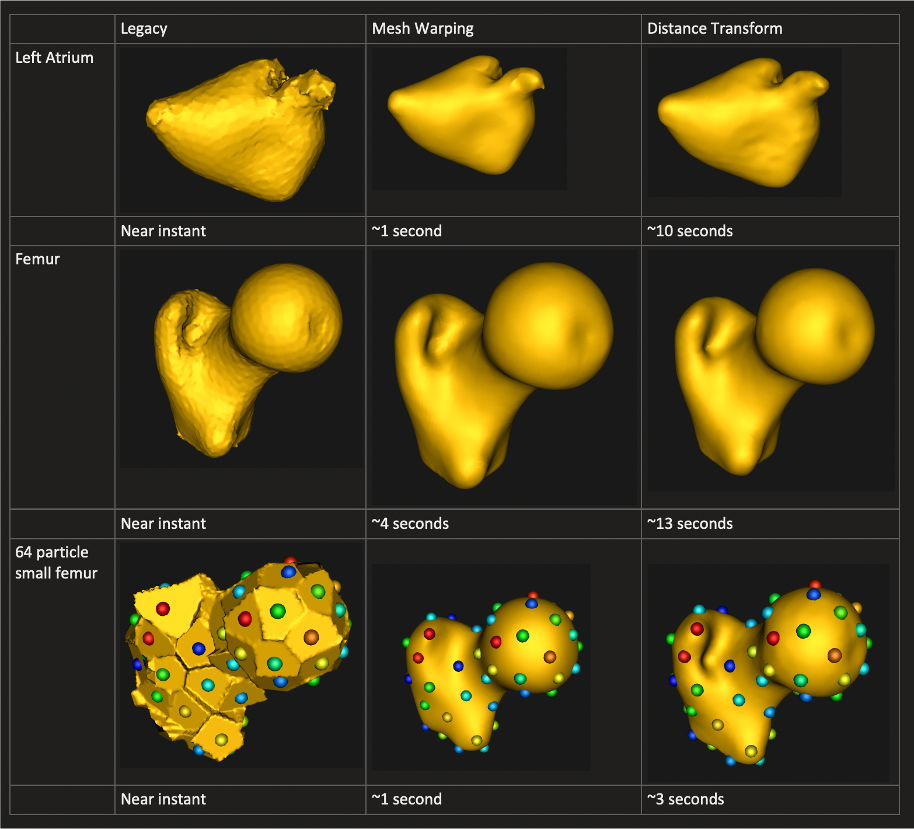
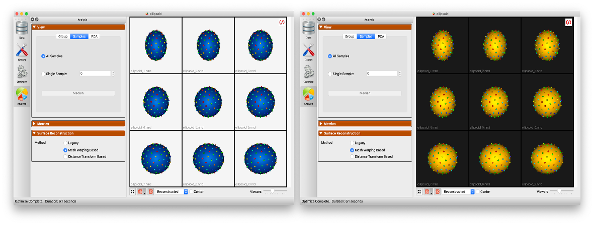

# New in ShapeWorks Studio 6.2

## DeepSSM in Studio

New in ShapeWorks 6.2, we have added the ability to run DeepSSM tools in ShapeWorks Studio.

{: width="600" }

See [DeepSSM in Studio](../studio/deepssm-in-studio.md) for more information.

## Multiple Domain Alignments

New in ShapeWorks 6.2, we have added support for multiple alignment strategies in ShapeWorks Studio.  This allows analysis with and without articulation with a choice of reference domain, or global alignment.

<video src="https://sci.utah.edu/~shapeworks/doc-resources/mp4s/studio_alignments.mp4" autoplay muted loop controls style="width:100%">

See [Multiple Domain Alignments](../studio/multiple-domains.md#multiple-domain-alignments) for more information.

## Shape Evaluation Charts

New in ShapeWorks 6.2, we have added new shape evaluation charts.  Charts for Compactness, Specificity and Generalizaion are provided.

See [Studio Metrics Panel](../studio/getting-started-with-studio.md#metrics-panel) for more information.

{: width="600" }

## Usability Features
### Group p-value Display

New in ShapeWorks 6.2, Studio has the ability to view group-wise p-values for surface differences.

{: width="600" }

### Scalar range controls

New in ShapeWorks 6.2, Studio feature maps, p-value displays, deepssm surface error displays allow for manual control over scalar colormap values.

<video src="https://sci.utah.edu/~shapeworks/doc-resources/mp4s/studio_feature_scale.mp4" autoplay muted loop controls style="width:100%">

### Surface opacity controls

Shape surface opacity can now be controlled on a per domain basis.

<video src="https://sci.utah.edu/~shapeworks/doc-resources/mp4s/studio_opacity_controls.mp4" autoplay muted loop controls style="width:100%">

### Added narrow band optimization parameter

The narrow band optimization parameter has been added to Studio's Optimize parameter dialog.  This allows the user to modifiy the narrow band from the default of 4 in the rare event that it needs modification.

### New message history window

A new button in the lower corner has been added that brings up the message history from the status bar.

{: width="600" }

### New suppressible error dialog

The error dialog has been replaced with a new dialog containing a checkbox to suppress further messages

{: width="400" }

### Multiple domain export options (combined + separate)

When exporting data in the presences of multiple anatomies/domains, you may now export a combined file, or one for each domain.

{: width="400" }

### Allow initial landmark points

Initial particle positions can be specified in a Project Spreadsheet using the column prefix `landmarks_file_<name>` where `<name>` is the name of each shape domain.  For example:

{: width="400" }

These landmarks will be used as the initial positions of particles during optimization.  They are not yet visualized within Studio before optimization.

## Mesh warping improvements
Multiple sources of crashes during mesh warping have been fixed and the overall speed has been dramatically improved.

---

# New in ShapeWorks Studio 6.1

## Multiple Domains

As of ShapeWorks 6.1, we added support in ShapeWorks Studio for modeling multiple domains (e.g. anatomies) in joint correspondance model.

See [Multiple Domains](../studio/multiple-domains.md) for more information.

## Mesh Grooming

As of ShapeWorks 6.1, we added support in ShapeWorks Studio for mesh grooming, including smoothing, hole filling, and iterative closest point pre-alignment.

{: width="300" }

See [Groom Module](../studio/getting-started-with-studio.md#groom-module) for more information.

## Mesh Support 

As of ShapeWorks 6.0, we added mesh support to ShapeWorks Studio including loading meshes, optimizing shape models directly on meshes, and visualizing meshes with scalar feature values. Meshes can store values at vertices such as "cortical thickness", or "fibrosis” and ShapeWorks Studio uses them in a similar manner as feature maps/volumes.

*Open meshes in Studio*

 
*Visualizing features on surface mesh*

We also added a new surface reconstruction method with support for both mesh or image inputs. This method is much faster and is the new default.

*New and faster surface reconstruction*

## Improved Studio Interface

As of ShapeWorks 6.0, we added support for automatic glyph sizing, draging/dropping of images and meshes. Scalar bar color is now opposite of background color (e.g., when background is white, text should be dark) (user request).

*Samples names color is opposite of the background color for a better contrast*

## Surface Reconstruction 

ShapeWorks Studio provides a particle-based surface reconstruction that can reconstruct high quality surface meshes with fewer number of particles. See [How to Analyze Your Shape Model?](../workflow/analyze.md#surface-reconstruction) for details about the method.

*With particle-based surface reconstruction, there is not need to optimize denser particle systems (i.e., with more particles) to reconstruct surface meshes with subvoxel accuracy*

*(old) VTK-based surface reconstruction*

<video src="https://sci.utah.edu/~shapeworks/doc-resources/mp4s/vtk_reconstruction.mp4" autoplay muted loop controls style="width:100%">

*(new) particle-based surface reconstruction*

<video src="https://sci.utah.edu/~shapeworks/doc-resources/mp4s/particles_reconstruction.mp4" autoplay muted loop controls style="width:100%">

## Dynamic Loading

ShapeWorks Studio support load-on-demand, which makes it more scalable by supporting loading in order of 100s of samples. For instance, an old small project that took 10+ seconds to load now starts instantly in Studio.

*(old) without dynamic loading*

<video src="https://sci.utah.edu/~shapeworks/doc-resources/mp4s/studio_load_old.mp4" autoplay muted loop controls style="width:100%">

*(new) with dynamic loading*

<video src="https://sci.utah.edu/~shapeworks/doc-resources/mp4s/studio_load_new.mp4" autoplay muted loop controls style="width:100%">

## Live Particles Movement 

ShapeWorks Studio allows for live introspection of the correpsondence placement optimization process and the ability to abort the optimization at any time (e.g., changing algorithmic parameters).

<video src="https://sci.utah.edu/~shapeworks/doc-resources/mp4s/studio_optimize_live.mp4" autoplay muted loop controls style="width:100%">

## Feature Maps

ShapeWorks Studio has the ability to integrate **feature maps**.  A **feature map** is a 3d image volume that contains scalar values to be associated with each shape’s surface.  For example, this could be raw or processed CT/MRI data.  The feature map can be displayed for each surface by choosing the desired feature map in the feature map combobox at the bottom of the screen. 
After the correspondence is generated, the average feature map can be displayed on the mean shape in the analysis tab.

<video src="https://sci.utah.edu/~shapeworks/doc-resources/mp4s/studio_feature_map.mp4" autoplay muted loop controls style="width:100%">

