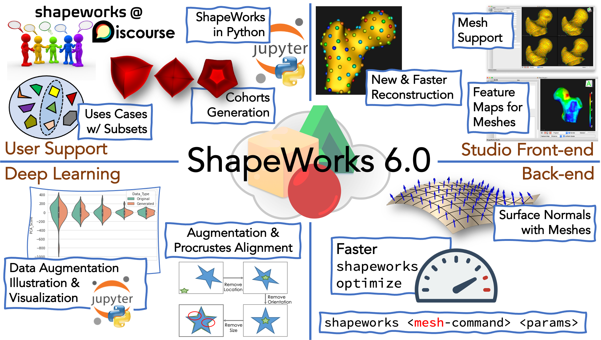

# Release Notes

## ShapeWorks 6.0 - 2020-03-10

### What's New

#### User's Support

* **New discussion forum:** We started an online discussion forum ([shapeworks.discourse.group](shapeworks.discourse.group)). This forum is a place for ShapeWorks users to discuss how to customize shape modeling workflows for their own use cases, troubleshoot issues end-users facing when using ShapeWorks, keep track of suggestions to improve the software and documentation, and ensure awareness of the latest ShapeWorks tools within the research community. 
* **Interactive Jupyter notebooks:** We developed a set of Jupyter notebooks to interactively demonstrate the usage of ShapeWorks Python APIs. These notebooks enable users to explore their data before just throwing it all in a huge batch job. We also added notebooks that reflect the thought process to learn about shapeworks classes/functions. See [ShapeWorks in Python](http://sciinstitute.github.io/ShapeWorks/new/shapeworks-python) for more details.
* **Tiny tests for use cases:** All use cases now have a tiny test that can be run using the `--tiny_test` option. When the tiny test is run, only the data necessary for the test is downloaded rather than all of the data.
* **Running use cases on subsets:** All of the use cases (mesh or segmentation based) can now be run on a subset of the data using the `--use_subsample` option. Note that the entire dataset is downloaded in this case so that a subset that is representative of the entire dataset can be selected.
* **Generating shape cohorts:** Example shape cohorts with analytic correspondences can now be generated using the ShapeWorks package `GenerateShapeCohort`. Currently, cohorts of parameterized ellipsoids or supershapes can be generated. Options are available to specify the degree to which the cohort is groomed (i.e., a cohort can be generated to be in alignment or misaligned in various ways). These cohorts can help with troubleshooting the shape modeling workflow.
* **Notebook demonstrating cohort generation:** A [Jupyter notebook](http://sciinstitute.github.io/ShapeWorks/notebooks/tutorials/getting-started-with-shape-cohort-generation.ipynb) was added that demonstrates how to use GenerateShapeCohort.

#### ShapeWorks Back-end

* **Support for use_normals with meshes:** Added support for surface normals when optimizing directly on meshes. This results in improved shape models on thin domains. See [ShapeWorks Directly on Meshes](http://sciinstitute.github.io/ShapeWorks/new/sw-meshes) for more details.

* **Consolidation of mesh-based grooming tools:** Updated the `shapeworks` API to include mesh-based grooming tools (smooth, decimate, invert normals, reflect, alignment, fill holes, probe volume at mesh vertices, clip, translate, scale, bounding box, quality control, surface to surface distance, to image and to distance transform). Added mesh-based query tools (center, center of mass, number of points, number of faces, get field names, set field, get field, set field value, get field value, get field range, get field mean, get field std and comparison). This includes a full complement of unit tests.

* **New Python ShapeWorks API:** In addition to the command line and C++ interface, there is a Python interface for existing image-based, segmentation-based, and mesh-based grooming tools and query tools. This includes a full complement of unit tests.

#### All-in-one Studio Front-end

* **Mesh support in Studio:** Added support for mesh inputs with minimal grooming. See [New in ShapeWorksStudio](http://sciinstitute.github.io/ShapeWorks/new/new-studio#mesh-support) for more details.
* **New and faster surface reconstruction:** Added a new surface reconstruction method with support for both mesh or image inputs. This method is much faster and is the new default. See [New in ShapeWorksStudio](http://sciinstitute.github.io/ShapeWorks/new/new-studio#mesh-support) for more details.
* **Feature maps support for meshes:** Added support for loading and displaying scalar values from mesh inputs. See [New in ShapeWorksStudio](http://sciinstitute.github.io/ShapeWorks/new/new-studio#mesh-support) for more details.
* **User help in Studio:** Added user interface tooltips and Help->Keyboard shortcuts.
* **Detailed optimization progress:** Added particle count, initialization/optimization phase, and iteration count on the status bar in addition to the progress bar. (user feature request)
* **Enabled aborting grooming:** Added ability to abort grooming step.

#### Deep Learning & Shape Modeling

* **DeepSSM now saves both the "best" and "final" model:** The final model is saved after all training epochs have run. The best model is saved after the epoch that had the lowest prediction error on the validation set. The best model makes use of early stopping to prevent overfitting.
* **Visualization of DeepSSM errors:** The error meshes that are output from running the DeepSSM use case can now be visualized in Studio. These meshes have a distance scalar field that captures the distance between the true and predicted mesh. To view in Studio simply run: `ShapeWorksStudio path/to/error/mesh.vtk`.
* **Data augmentation handles modeling scenarios that need Procrustes alignment:** Data augmentation can now be run on a dataset for which Procrustes was used in optimization. When both the local and world .particle files are passed as arguments for data augmentation, the translation is accounted for in the augmented data.
* **Visualizing data augmentation:** Parallel violin plots are used to compare the distribution of real and augmented data visually.
* **Demonstrating data augmentation:** A [Jupyter notebook](http://sciinstitute.github.io/ShapeWorks/notebooks/tutorials/getting-started-with-data-augmentation.ipynb) that demonstrates the data augmentation process has been added. In this notebook, parallel violin plots are used to compare the distribution of real and augmented data visually.

### Improvements

#### User's Support
* **Improved Python grooming utils:** GroomUtils.py now uses Python binding rather than calling command-line tools.

#### ShapeWorks Back-end

* **Enable multi-threading on Mac platforms:** Switched from OpenMP to TBB (thread building blocks), allowing multithreading on Mac. Performance improvements include a ~4x speedup on Mac laptop and same speed or better on Linux/Windows.
* **Performance improvements in `shapeworks optimize`:** ~20% faster optimization in mesh and image domains by replacing specific data structures (that were initially in place to allow interactive removal of particles during the optimization). ~50% faster optimization in mesh domain by caching nearest-triangle lookups.

#### All-in-one Studio Front-end

* **Improved Studio viewer:** Added ability to use 2 viewers (in between 1 and 4). Added ability to choose orientation marker (medical, triad) and location (corner).
* **Improved Studio interface:** Added new checkbox for automatic glyph sizing. Added support for drag and drop of images and meshes. Scalar bar color is now opposite of background color (e.g., when the background is white, the text should be dark) (user request).
* **Improved responsiveness:** Improved particle shape statistics computation speed. Improved user interface responsiveness during optimization. Improved distance transform loading for surface reconstruction.
* **Improved error handling:** Enhanced error handling and graceful reporting of errors such as attempts to write/save to read-only directories and filesystems.

#### Deep Learning & Shape Modeling

* **More control on data augmentation:** In data augmentation, the user can now either specify how many PCA components to retain in embedding OR what percentage of population variability to retain. For example, suppose the user specifies that 95% of population variability should be kept. In that case, the number of components will be automatically selected such that less than 5% of shape variation is lost in embedding.

### Fixes

<!--#### User's Support
-->

#### ShapeWorks Back-end

* **Replaced mesh library:** Replaced backend mesh library to fix bugs that caused optimizer crashing when optimizing particles directly on meshes.
* **Gradient of normals for image domain:** Corrected a long-standing bug where we used the hessian in place of the gradient of the normal. If you have an existing use case with use_normals enabled, the normal weighting may have to be adjusted.
* **Cutting planes constraints for mesh domains:** Fixed a bug in the integration of mesh domains with cutting planes constraints, where the optimization gets stuck due to the fact that constraints get violated when not being considered by geodesic walks.

#### All-in-one Studio Front-end

* **Fixed bugs in Data:** Fixed a bug when adding and removing shapes. Studio now appends `.xlsx` when saving a project file.
* **Fixed bugs in Optimize:** Studio optimize default for initial relative weighting is smaller than relative weighting to enable a better surface sampling during initialization. Enable file menu when the optimization is aborted.
* **Fixed bugs in Analyze:** Limit PCA modes to the number of samples - 1. Surface reconstruction for spheres is fixed. Fixed a bug that produced blank screens and error messages on the consoles when switching out of analysis while PCA animation is running. Fixed a sample display bug that occurred when loading XML project for analysis and exploring individual samples after switching to PCA animation.

<!--#### Deep Learning & Shape Modeling-->

-------------------------------------------------------------------------------------------------------------------------
## ShapeWorks 5.5.0 - 2020-10-15

### What's New

#### User's Support

* **Revamped documentation:** [New documentation](http://sciinstitute.github.io/ShapeWorks) to support both end-users and open-source developer community in one easily navigable place. This documentation includes background information about statistical shape modeling, the scientific premise of ShapeWorks, and how to get started. It also demonstrates the latest software features, exemplar use cases, and instructions to build/install ShapeWorks.

* **Optimized shape models for use cases:** All datasets on the [ShapeWorks Data Portal](http://cibc1.sci.utah.edu:8080/) now have the shape model output from running the use cases with a corresponding `analyze.xml` for launching Studio. Users can `cd` to where the data is extracted and call `ShapeWorksStudio analyze.xml` to visualize these shape models.

#### ShapeWorks Back-end

* **ShapeWorks directly on meshes:** ShapeWorks now supports particle optimization directly on triangular surface meshes. This mesh support also enables working with open meshes without additional user inputs. See [ShapeWorks Directly on Meshes](http://sciinstitute.github.io/ShapeWorks/new/sw-meshes) for more details. For exemplar use cases, see [Femur Mesh: SSM directly from meshes](http://sciinstitute.github.io/ShapeWorks/use-cases/femur-mesh) and [Lumps: SSM directly from meshes](http://sciinstitute.github.io/ShapeWorks/use-cases/lumps) to learn how to get started. *This mesh support allows for significant memory savings (9.2GB to 53MB in the femur use case)*.

* **New ShapeWorks API:** Consolidation of image-based and segmentation-based grooming tools that creates a stable and reusable API making it much easier and more flexible for users to groom their datasets. This includes a full complement of unit tests. See [ShapeWorks API](http://sciinstitute.github.io/ShapeWorks/new/shapeworks-api) for more details.

#### All-in-one Studio Front-end

* **Feature maps support:** Studio supports the integration of 3d volume feature maps to map imaging data to the optimized shape model. See [New in ShapeWorksStudio](http://sciinstitute.github.io/ShapeWorks/new/new-studio#feature-maps) for more details.

* **New interface for group analysis:** Studio supports group definitions from spreadsheets. The new interface supports multiple group sets within the same project file and categorical groups compared to the old binary groups (i.e., yes/no) setting. See [New in ShapeWorksStudio](http://sciinstitute.github.io/ShapeWorks/workflow/analyze#group-differences) for more details.

* **User notes in Studio:** Studio stores/loads a rich text notes section in the spreadsheet.

#### Deep Learning & Shape Modeling

* **New Python package for model-based data augmentation:** A Python package for data augmentation has been added. See [Data Augmentation for Deep Learning](http://sciinstitute.github.io/ShapeWorks/deep-learning/data-augmentation) for more details.

* **DeepSSM Python package:** A Python package has been added for a deep learning framework that estimates statistical representations of shape directly from unsegmented images once trained. See [SSMs Directly from Images](http://sciinstitute.github.io/ShapeWorks/deep-learning/deep-ssm) for more details. 

* **New DeepSSM use case:** We added a new use case called `deep_ssm` that demonstrates data augmentation and deep learning on the femur data. See [Femur SSM Directly from Images](http://sciinstitute.github.io/ShapeWorks/use-cases/deep-ssm-femur) for more details. 

### Improvements

#### User's Support

* **Improved data/output organization for use cases:** Use case organization has been updated such that downloaded data goes into one folder (`ShapeWorks/Examples/Python/Data/`) and use case output goes into another (`ShapeWorks/Examples/Python/Output/`). This organization will avoid re-downloading use case datasets if the user deleted the output folder. 

* **Enable only-shape data for the femur use case:** Femur use case demonstrates the processing workflow starting from surface meshes and can now be run without grooming images (in case they are not available). To groom with images, use the `--start_with_image_and_segmentation_data` tag. If this tag is not included, images will not be used in grooming.

#### ShapeWorks Back-end

* **Improved constrained particle optimization:** An improved implementation for cutting planes that support single and multiple cutting planes per sample has been added. This can be used in modeling scenarios where statistical modeling/analysis is needed for a region-of-interest on the anatomy/object-class at hand without having to affect the input data. See [Ellipsoid: Cutting Planes](http://sciinstitute.github.io/ShapeWorks/use-cases/ellipsoid-cutting-planes) and [Femur with Cutting Planes](http://sciinstitute.github.io/ShapeWorks/use-cases/femur-cutting-planes) for exemplar use cases.

#### All-in-one Studio Front-end

* **Improved interface design for Studio:** User interface improvements to Studio have been added. These improvements include collapsable analysis panels to improve screen usability, a cleaner file menu, an about box that shows website information and software version, and a splash screen that enables the opening of new/recent projects.

### Fixes

#### ShapeWorks Back-end

* **Constraint-aware particles initialization and optimization:** The initialization and optimization steps now respect the user-defined constraints when using signed distance transforms. Hence, at no point, particles will violate the constraints, allowing for arbitrarily defined cutting planes. 

* **Constraint-aware particles splitting:** Added constraint aware particle splitting for signed distance transforms. The particle splitting only occurred towards a single quadrant. This is fixed by allowing particle splits to shift in a different direction for each particle in every domain.

* **Constraint-aware particle projection:** Projecting particles on the surface while manipulating/optimizing particle position now respects the user-defined constraints.

-------------------------------------------------------------------------------------------------------------------------
## ShapeWorks 5.4.1 - 2020-06-15

### Fixes
* **ShapeWorksStudio:** Fixed crash when importing data on a new/blank project.	

-------------------------------------------------------------------------------------------------------------------------
## ShapeWorks 5.4.0 - 2020-06-10

### What's New

* **New, flexible ShapeWorks project file format:** New spreadsheet (XLSX) based project file format that can easily handle multiple shape modeling scenarios. It is now fully integrated into Studio. See the ellipsoid studio example in `Examples/Studio/ellipsoid.xlsx` for an example.
* **Exporting shape parameters:** Added PCA Raw Component Score Export to Studio.
* **New Getting Started documentation:** New [Getting started](../getting-started/workflow.md) documentation goes over shape modeling workflow documentation, different ShapeWorks interfaces with a video illustration for Studio.
* **Lower memory footprint and faster optimization:** ShapeWorks is now using [OpenVDB](https://www.openvdb.org/), a more memory-efficient data structure, for signed distance transforms. Along with other refactoring and code optimizations, ShapeWorks now uses *85% less memory* (from 57.09GB to 9.67GB in one use case). Additionally, the particle optimizer is now *2X faster*.
* **Automated development builds:** We now offer up-to-date development binary builds that track the master branch, available [here](https://github.com/SCIInstitute/ShapeWorks/releases). Please understand that these are in-progress development builds, not official releases.

### Improvements

* **Improved scalability for Studio:** Files now loaded on-demand as necessary.
* **Restructured datasets portal:** Better and more consistent directory structure for use cases datasets. See [datasets guidelines](../dev/datasets.md) for more details. Visit our [ShapeWorks Portal](http://cibc1.sci.utah.edu:8080) to register and download datasets to run [use cases](../use-cases/use-cases.md).
* **Lower memory footprint for estimating correspondences for new shapes on existing shape models:** For <fixed_domains> usage, only distance transforms for the new shapes will be loaded.
* **Improved use case documentation:** Better documentation for the [RunUseCase](../use-cases/use-cases.md) input arguments.
* **Documentation for running existing shape models:** Added [instructions](../use-cases/use-cases.md#running-subsequent-analysis) on how to load a pre-trained shape model without running the full pipeline.
* **Consistent cross-platform splitting direction:** Correspondence point splits take a random direction, but are now consistent and repeatable across platforms for reproducible shape models.

### Fixes
* **Mesh export in Studio:** Changed exported meshes to be compatible with CloudCompare

-------------------------------------------------------------------------------------------------------------------------
## ShapeWorks 5.3.0 - 2020-02-20

### What's New

* Use cases: Added fixed domains use case that demonstrates adding a single shape to an existing shape model
* Use cases: Added ellipsoid evaluation use that demonstrates the quantitative evaluation of the ellipsoid
* New commands: Added commands to the `shapeworks` executable to quantitatively evaluate shape models: read-particle-system, compactness, generalization, specificity
* New shapeworks executables commands: read-image, write-image, antialias, isoresample, binarize, recenter-image, pad.
* New build method: Separate build_dependencies script (see Documentation/Build/BUILD.md)

### Improvements
* Use cases: Updated femur use case with an interactive cutting plane selection
* Studio: Replaced bar chart with explained variance chart

-------------------------------------------------------------------------------------------------------------------------
## ShapeWorks 5.2.2 - 2020-01-09

### Fixes

* Returned to superbuild.sh build process
* Fixed non-Qt build
* Fixed Windows conda_installs.bat
* Studio: Fixed import and processing of non-RAI image volumes
* Studio: Fix centering of groomed and reconstructed volumes

-------------------------------------------------------------------------------------------------------------------------
## ShapeWorks 5.2.1 - 2019-11-09

### Fixes

* Fix examples, binaries

-------------------------------------------------------------------------------------------------------------------------
## ShapeWorks 5.2.0 - 2019-11-07

### What's New

* Studio: Added live particle optimization updates
* Studio: Added "Stop optimization" button
* Use cases: Added a femur use case that demonstrates grooming surface meshes along with imaging data for shape modeling
* Use cases: Added a left atrium use case that demonstrates grooming images data along with shape data and build multi-scale shape models
* Use cases: New portal downloadable example data (ellipsoid, left atrium, and femurs)
* Windows installer and binary releases for Mac and Linux
* CMake-based superbuild with all dependencies built automatically

### Improvements

* Studio: Added support for reading View2 parameter files
* Studio: Added legacy (View2) surface reconstructor
* Studio: Replaced optimization library with same used by ShapeWorksRun

### Fixes
* Studio: Fixes crashes on exit during optimizations (clean shutdown of threads)

