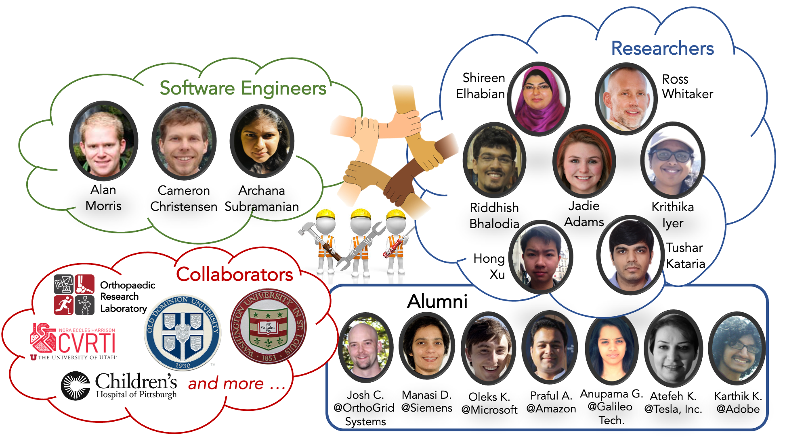

# Meet ShapeWorkers!

## Principal Investigators

- [Shireen Elhabian](http://www.sci.utah.edu/~shireen/)
- [Ross Whitaker](http://www.cs.utah.edu/~whitaker/)

## Software Developers

- [Alan Morris](https://www.sci.utah.edu/people/amorris.html)
- [Cameron Christensen](https://www.sci.utah.edu/people/cam.html)
- [Archanasri Subramanian](https://www.sci.utah.edu/people/archanasri.html)

## Researchers

- [Riddhish Bhalodia](https://www.sci.utah.edu/people/riddhishb.html)
- [Jadie Adams](https://www.sci.utah.edu/people/jadie.html)
- [Hong Xu](http://www.sci.utah.edu/people/hxu.html)
- [Krithika Iyer](https://www.sci.utah.edu/people/iyerkrithika.html)
- [Tushar Kataria](https://www.sci.utah.edu/people/tushar.kataria.html)
<!--- [Wasim Akram Gazi](https://www.sci.utah.edu/people/wasim.html)-->

## Past Contributors

- [Joshua Cates](http://www.sci.utah.edu/~cates/) (now @Orthogrid Inc.)
- [Manasi Datar](https://manasidatar.github.io/index.html) (now @Siemens)
- [Brig Bagley](http://www.cs.utah.edu/~bbagley/)
- [Praful Agrawal](https://www.linkedin.com/in/praful-agrawal-78a72b33) (now @Amazon Inc.)
- [Oleks Korshak](https://www.linkedin.com/in/olekskorshak) (now @Microsoft)
- [Anupama Goparaju](https://www.linkedin.com/in/anupamagoparaju) (now @ Galileo Financial Technologies)
- [Atefeh Ghanaatikashani](https://www.sci.utah.edu/people/atefeh.gk.html) (now @ Tesla Inc.)
- [Karthik Karanth](http://www.sci.utah.edu/people/karthik.html) (now @ Adobe)
