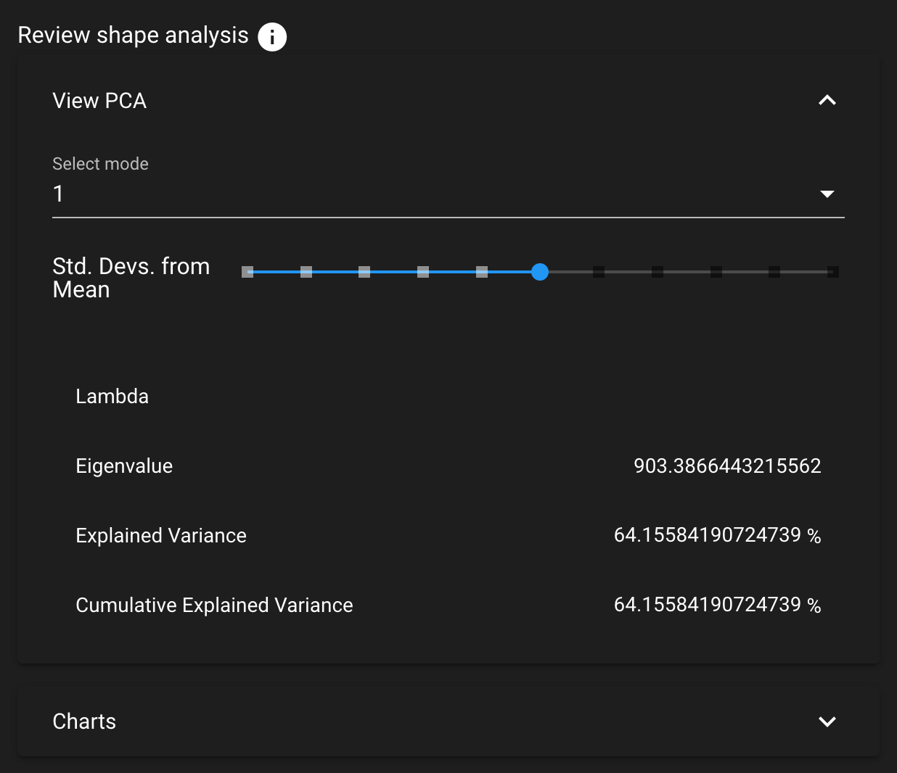
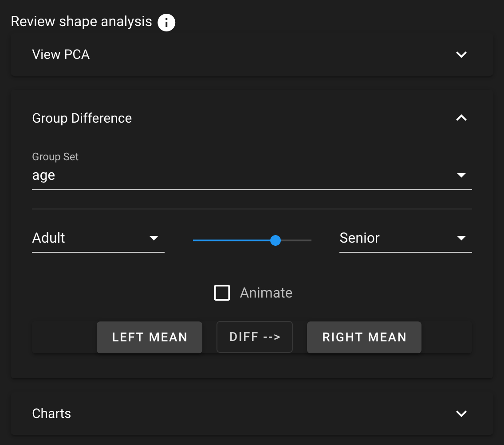
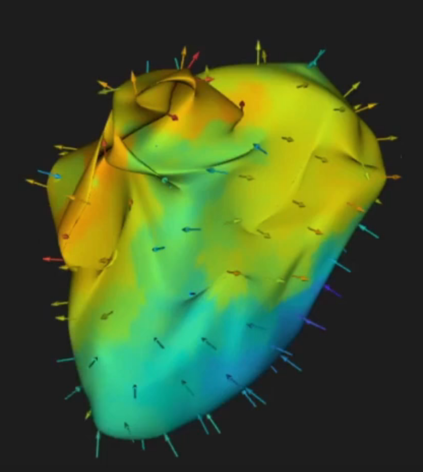

# ShapeWorks Cloud Analyze Module

**Note**: This documentation version could be outdated. [Click here](http://sciinstitute.github.io/ShapeWorks/dev/cloud/cloud-analyze-module.html) to get the most up-to-date version.

The analyze module can be viewed after a successful optimization job. There are three panels in the analyze module, [View PCA](#view-pca), [Charts](#charts), [Shape Viewer](#shape-viewer).

{: width="400"}

## View PCA

The View PCA panel shows reconstructed shapes (surface meshes) along PCA modes of variation. Modes of variations are shape parameters learned/discovered from your data that describes shape variations. You can control the location along the PCA mode with the Standard Deviation slider and/or the animate option.

The animate option allows for an automatic adjustment of the Standard Deviation slider within a mode of variation. Upon selecting the animate option, the comparison vectors and colormap for each shape in the mode will be calculated. This will only occur the first time that the option is selected for a given mode.

Values displayed:

`Lambda` - This shows the PCA loading of current position of the slider.  The middle of the slider, at the mean value, will be 0.  The extent of lambda is defined by the number of standard deviations of the slider as described above.  At standard deviation of 1.0, it will be the square root of the mode's eigenvalue.

`Eigenvalue` - This shows the eigenvalue of the currently selected mode.  This is a unitless measure of how much variance is explained by this mode.  The modes are sorted in decreasing order of eigenvalue, corresponding to the most variance explained first.

## Group Difference

The Group Difference mode allows for group comparison to quantify and visualize population-level differences. Each `group_<value>` column from the project can be selected and the differences between any two values (i.e., group identifiers) in the groups can be displayed by selecting the group values in the left and right dropdown boxes. A group difference display showing vectors and a colormap of distance can be shown using the "Diff -->" button.

The animate option allows for an automatic adjustment of the slider to display real-time changes between the group pairing selected. Upon selecting the animate option, the comparison vectors and colormap for each shape in the group comparison will be calculated. This will only occur the first time that the option is selected for a given group value pairing.

{: width="400"}

## Charts

The analysis charts provide visualizations of the shape evaulation data. For more information about shape evaluation, see [Shape Model Evaluation](../new/ssm-eval.md). You can zoom into a chart with the mouse scroll wheel and click and drag to pan.

Chart Options

| Tool | Description |
| --- | ----------- |
| Save as Image | Save the chart as an SVG |
| View Data | View the chart data in table format |
| View Data: Download | Download the chart data as a .csv file |
| View Data: Copy to Clipboard | Copy the chart data in CSV format |
| Zoom | Zoom into an area by mouse rectangle selection |
| Zoom Reset | Reset the zoom level to zero |
| Restore | Restore the chart to default view |

## Shape Viewer

While in the analyze tab, the Shape Viewer displays the mean (average) shape generated.

## Show Difference From Mean

{: width="300"}

This checkbox allows for visualization from any surface to the mean. The arrows are placed on each particle. The direction and color of the vector/surface indicate the difference from the mean shape.
