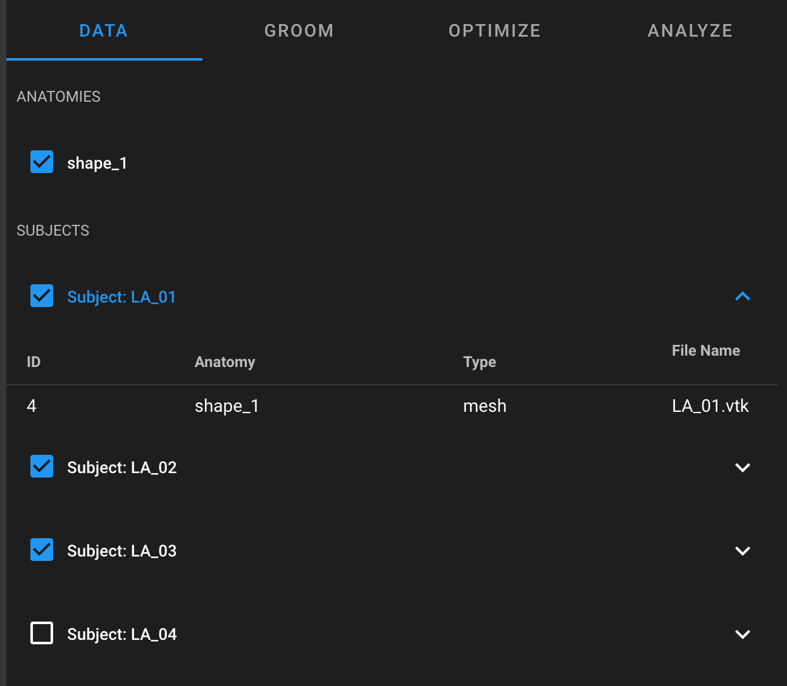
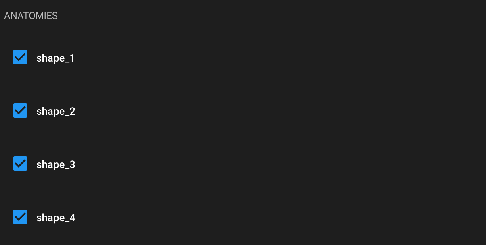
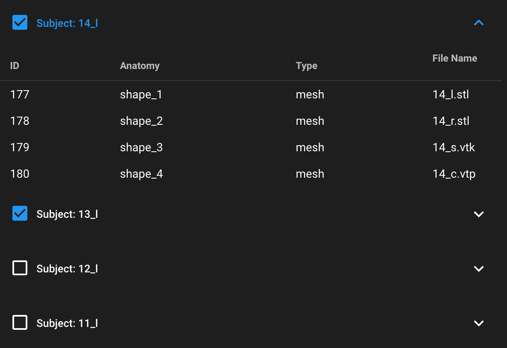
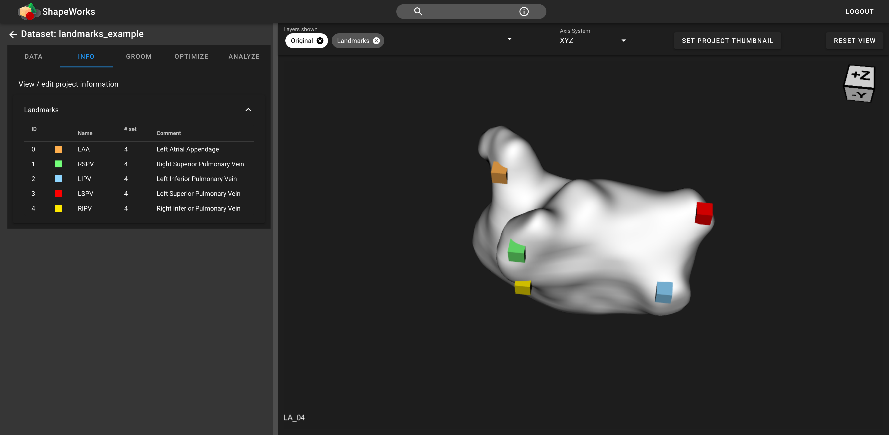

# ShapeWorks Cloud Data Module

**Note**: This documentation version could be outdated. [Click here](http://sciinstitute.github.io/ShapeWorks/dev/cloud/cloud-data-module.html) to get the most up-to-date version.

The ShapeWorks Cloud data module contains the project's [anatomies](#anatomies) and [subjects](#subjects), including the associated data.

{: width="400"}

## Anatomies

Anatomies can be selected or deselected to allow you to choose what is viewed in the [Shape Viewer](cloud-shape-viewer.md). For more information on how multiple anatomies are implemented in ShapeWorks Studio, navigate [here](../studio/multiple-domains.md).

{: width="400"}

## Subjects

Subjects contain each individual mesh in the dataset. Each subject can be selected or deselected to allow you to choose what is viewed in the [Shape Viewer](cloud-shape-viewer.md).

{: width="500"}

## Landmarks

{: width="600"}

Landmarks can be displayed in ShapeWorks Cloud to mark anatomical features. Landmarks can be viewed and/or modified in the "Info" tab while in a project with landmarks.
