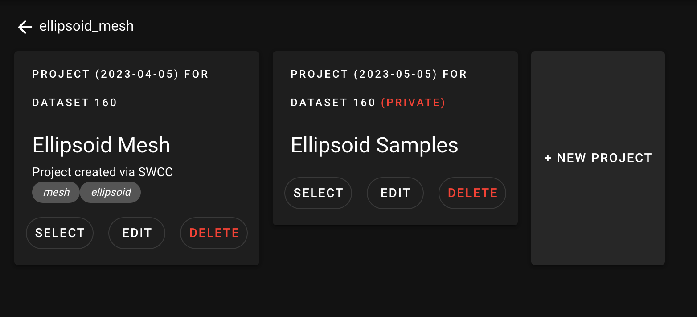
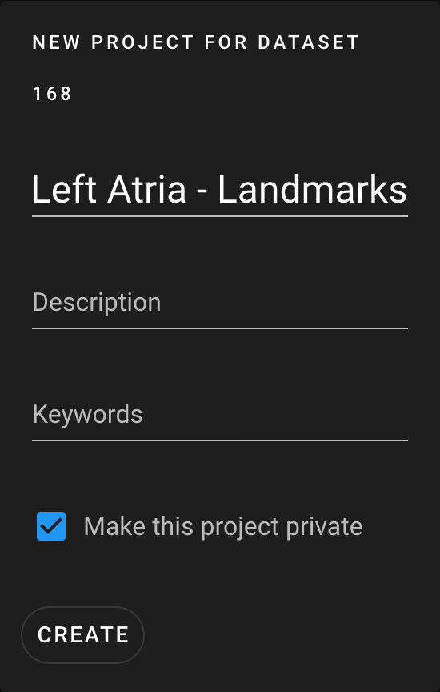

# ShapeWorks Cloud Project

**Note**: This documentation version could be outdated. [Click here](http://sciinstitute.github.io/ShapeWorks/dev/cloud/cloud-project.html) to get the most up-to-date version.

{: width="600"}

Within the project list, you can select or delete a project as well as create a new project.

Each project contains a separate copy of the data.

## Create a Project

To create a project, select a [dataset](cloud-dataset.md) and click "Create Project". Here, you will be able to add a name, description, and keywords for the project, as well as designate the new project as `private`.

A project can also be created via the [ShapeWorks Cloud Client](swcc.md#projects).

{: width="250"}

## Edit a Project

To edit a project, select "EDIT" on any project you have permissions to edit. You are able to modify the name, description, or keywords.

{: width="250"}
