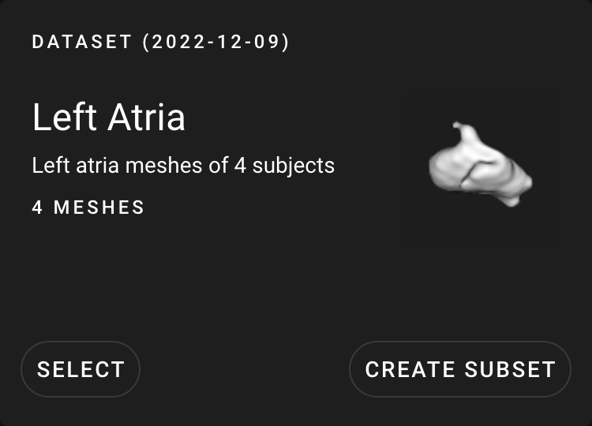

# ShapeWorks Cloud Shape Viewer

**Note**: This documentation version could be outdated. [Click here](http://sciinstitute.github.io/ShapeWorks/dev/cloud/cloud-shape-viewer.html) to get the most up-to-date version.

{: width="600"}

The Shape Viewer displays the subjects selected in the [data module](cloud-data-module.md). The Shape Viewer contains options to select layers, select an axis system, set the dataset thumbnail, reset view, and if the [analyze module](cloud-analyze-module.md) is active, the difference from mean.

## Shape Viewer Options

| Option | Description |
| --- | ----------- |
| [Layers](#layers) | Set the layer(s) to display |
| Axis System | Choose which axis system to use. Options: XYZ, Medical |
| [Set Thumbnail](#set-thumbnail) | Set the dataset thumbnail |
| [Show Difference From Mean](cloud-analyze-module.md#show-difference-from-mean) | Shows the difference from the mean shape (analyze module only) |
| Reset View | Reset the view back to the default zoom and angle |

## Layers

The layer choice option is NOT available in the [analyze module](cloud-analyze-module.md).

| Layer | Description |
| --- | ----------- |
| Original | The original mesh data |
| Groomed | The groomed mesh (colored green) |
| Reconstructed | The reconstructed mesh (colored red) |
| Particles | Optimization particles for the shape |
| Landmarks | Landmarks which mark anatomical features |

## Set Thumbnail

Set the thumbnail for the dataset. The current shape orientation will be saved and then be visible in the dataset list for that dataset.

{: width="400"}
