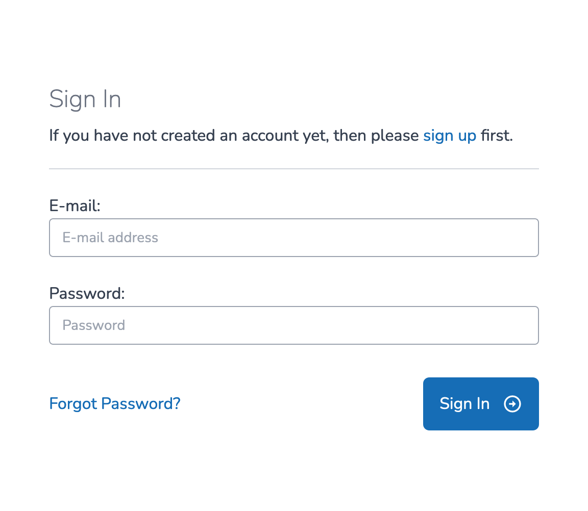
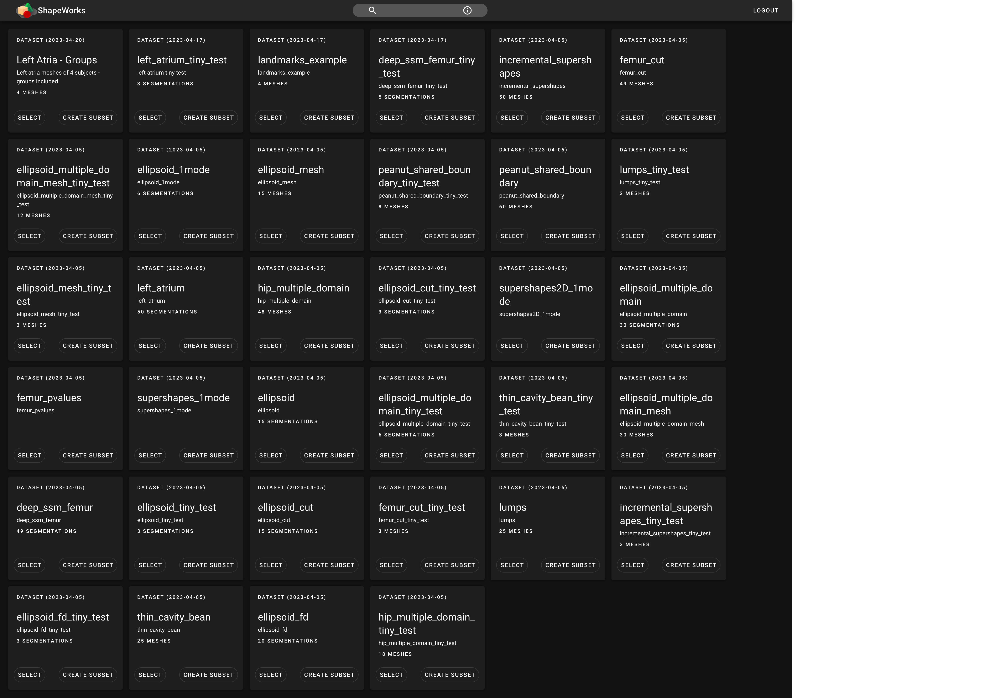
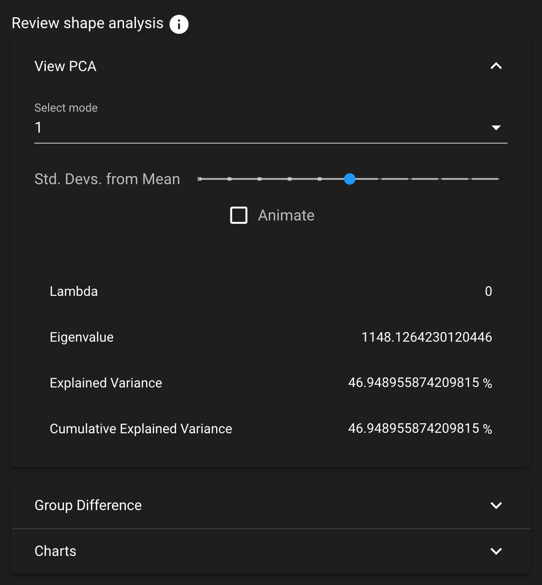
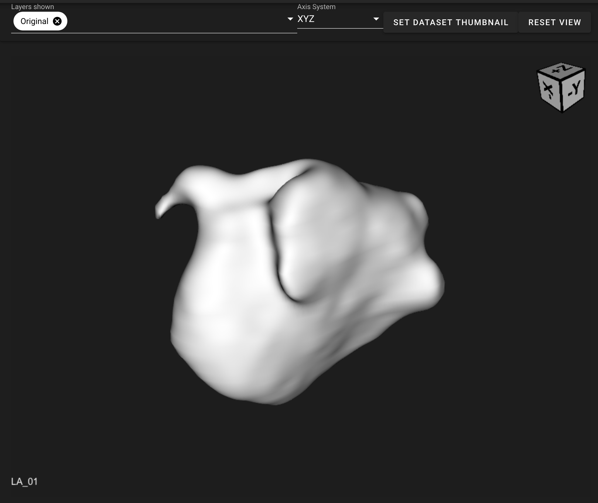

# Getting Stared with ShapeWorks Cloud

**Note**: This documentation version could be outdated. [Click here](http://sciinstitute.github.io/ShapeWorks/dev/cloud/getting-started-with-cloud.html) to get the most up-to-date version.

ShapeWorks Cloud provides an All-in-one browser interface to the ShapeWorks toolkit.
In ShapeWorks Cloud, you can access datasets, create projects, as well view and interact with, groom, optimize, and analyze your data.

## Login Screen

To access and use ShapeWorks Cloud, you must first create an account. To login to ShapeWorks Cloud, navigate to [www.shapeworks-cloud.org/](https://www.shapeworks-cloud.org/){target=_blank}.

{: width="500" }

## Dataset List

The dataset list shows uploaded datasets. In this page you can preview a dataset via the thumbnail, select a dataset and create a subset. By selecting a dataset, you access the [project list](#project-list) for the selected dataset.

See [ShapeWorks Cloud Dataset](cloud-dataset.md) for more information.

## Project List

The project list for a selected dataset displays the current projects for that dataset. Each project can be selected to interact with the data and run ShapeWorks operations. The project list also allows the creation of more projects within the dataset.

See [ShapeWorks Cloud Project](cloud-project.md) for more information.

## Data Module

The data module contains the project's anatomies/domains and subjects and their associated data.

{: width="400"}

See [ShapeWorks Cloud Data Module](cloud-data-module.md) for more information.

## Groom Module

The groom module provides options for mesh grooming and alignment. The groomed object is able to be viewed in the [Shape Viewer](#shape-viewer). If the data is already groomed, you do not need to run a groom step in ShapeWorks Cloud.

{: width="400"}

See [ShapeWorks Cloud Groom Module](cloud-groom-module.md) for more information.

## Optimize Module

The optimize module provides options for particle-based optimization. The optimization particles can be viewed on the shapes in the [Shape Viewer](#shape-viewer).

{: width="400"}

See [ShapeWorks Cloud Optimize Module](cloud-optimize-module.md) for more information.

## Analyze Module

The analyze module can be viewed after a successful optimization job. The analyze module contains PCA data and analysis charts.

{: width="400"}

See [ShapeWorks Cloud Analyze Module](cloud-analyze-module.md) for more information.

## Shape Viewer

The Shape Viewer displays the subjects selected in the [data module](#data-module). The Shape Viewer contains options to select layers, select an axis system, set the dataset thumbnail, reset view, and if the [analyze module](#analyze-module) is active, the difference from mean.

{: width="600"}

See [ShapeWorks Cloud Shape Viewer](cloud-shape-viewer.md) for more information.
