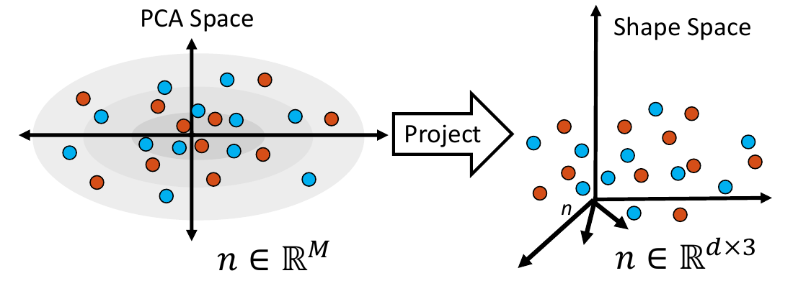

## ShapeWorks Data Augmentation 

ShapeWorks includes a Python package for running data augmentation which is useful when a larger amount of data than what is available is required (such as when training DeepSSM).
In data augmentation, realistic fabricated examples are generated based on the available real data in a way that preserves the population statistics.
Here we explain the basic steps to data augmentation.

### Data Augmentation Steps
#### 0. Collect Real Data
As a prelimanry step, the data which augmentation will be based off of is needed. This includes the shape model .particle files and can also include corresponding images.

#### 1. Embed Data
First the true data is embedded into a lower dimensional subspace. This is done by creating a matrix which contains all of the real examples, then reducing the dimension via Principal Component Analysis (PCA).

#### 2. Fit a Distribution
Next a distribution which can be sampled from is fit to the examples embedded in the low-dimension subspace.

#### 3. Sample from the Distribution 
Samples are randomly drawn from this distribution and the closest real example to each sample is saved.

#### 4. Project Samples
The embedded samples are then projected back to data space, providing new generated examples.

#### 5. Complete Sample Generation
The closest real example to each sample is then used to generate any part of the sample that is still missing. 
For example, if particles are used in embedding and sampling, the closest real example can be used to generate a corresponding image for the sampled particles to provide a complete generated example.

### Sampling Distributions

The sampler_type variable determines which type of distribution to fit to the embedded data. The options are Gaussain ( a single multivariate Gaussian distribution), mixture (a mixture of Gaussian distributions) or KDE (kernel density estimate).

#### Multivariate Gaussian Distribution

To fit multivariate Gaussian distribution, the probability density function is parameterized by the mean of and covariance of the embedded data matrix. This normal distribution is then randomly sampled from to get new examples. The closest real example to each sampled point is found by calculating the Mahalanobis distance. 

#### Mixture of Multivariate Gaussians Distribution

A Gaussian mixture model can provide a more appropriate probability density function when the embedded data distribution is mutli-modal. To fit a mixture model, first we cluster on the embedded data and select the optimal number of clusters by minimizing Akaike information criterion (AIC) and Bayesian information criterion (BIC). This number determines how many Gaussian distributions (or components) should be used. Next the expectation-maximization (EM) algorithm is used to fit a mixture-of-Gaussian model with this number of components. This distribution can then be randomly sampled from and the closest real example is chosen using Mahalanobis distance. 

#### Kernel Density Estimate Distribution

Kernel Density Estimation (KDE) is a non-parametric way of estimating the probability density function of the embedded data. It is fit by defining a Gaussian ball around each real data point in the embedded space, the combination of which provides the distribution. The kernel bandwidth or variance of the Gaussian balls is computed as the average nearest neighbor Mahalanobis distance in the PCA subspace.

To sample from the KDE distribution, a real example is chosen then a point is randomly sampled from it's kernel. The chosen real example is also returned as it is the closest to the sample. 

