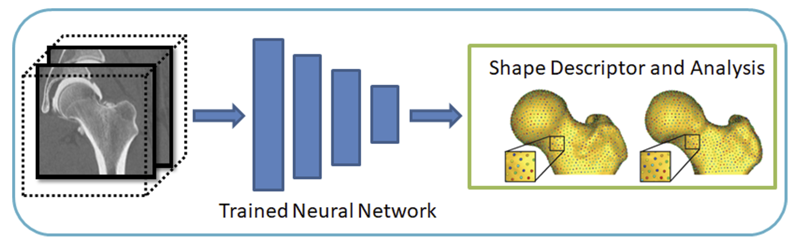
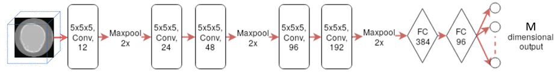
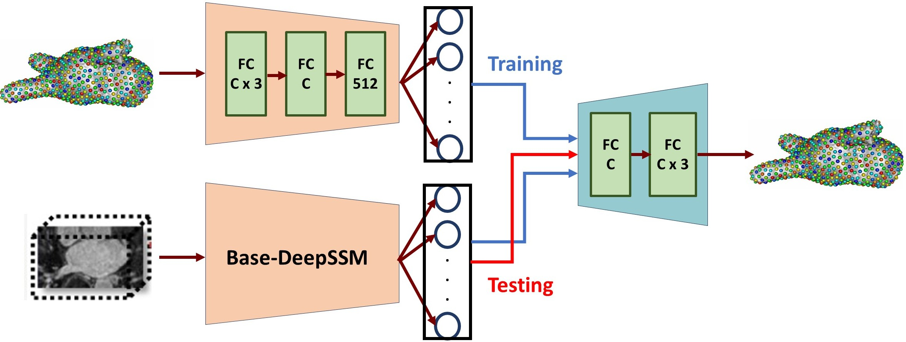
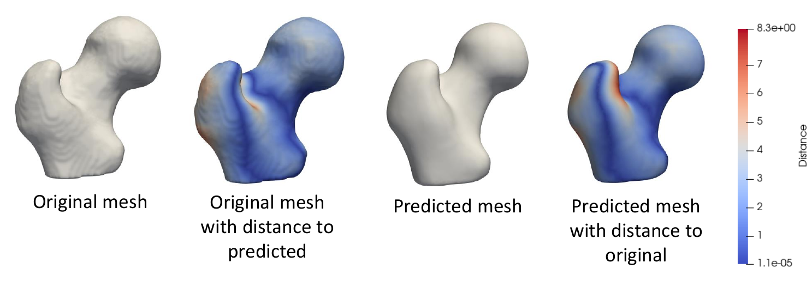

# SSMs Directly from Images

DeepSSM is a deep learning framework that estimates statistical representations of shape directly from unsegmented images once trained. DeepSSM includes a data augmentation process and a convolutional neural network (CNN) model. This documentation provides an overview of the DeepSSM process; see relevant papers for a full explanation.

!!! note "Relevant papers"
    - Jadie Adams, Riddhish Bhalodia, Shireen Elhabian. Uncertain-DeepSSM: From Images to Probabilistic Shape Models. In MICCAI-ShapeMI, Springer, Cham, 2020.
    - Riddhish Bhalodia, Shireen Elhabian, Ladislav Kavan, and Ross Whitaker. DeepSSM: a deep learning framework for statistical shape modeling from raw images. In MICCAI-ShapeMI, pp. 244-257. Springer, Cham, 2018.
    - Riddhish Bhalodia, Anupama Goparaju, Tim Sodergren, Alan Morris, Evgueni Kholmovski, Nassir Marrouche, Joshua Cates, Ross Whitaker, Shireen Elhabian. Deep Learning for End-to-End Atrial Fibrillation Recurrence Estimation. Computing in Cardiology (CinC), 2018.


## What is DeepSSM?

The input to the DeepSSM network is unsegmented 3D images of the anatomy of interest, and the output is the point distribution model (PDM). 



DeepSSM requires training examples of image/PDM pairs that are generated via the traditional Shapeworks grooming and optimization pipeline or other particle distribution models. Once the network has been trained on these examples, it can predict the PDM of unseen examples given only images of the same anatomy/object class, bypassing the need for labor-intensive segmentation, grooming, and optimization parameter tuning. 


## Why DeepSSM?

The benefits of the DeepSSM pipeline include:

* **Less Labor**: DeepSSM does not require segmentation, only a bounding box about where the anatomy of interest lies in the image.  
* **End-to-end**: Does not require separate grooming and optimization steps; it is an end-to-end process. This also reduces memory requirement as images do not need to be saved after intermediate grooming steps.
* **Faster Results**: Once a DeepSSM network has been trained, it can be used to predict the shape model on a new image in seconds on a GPU.

The DeepSSM network is implemented in PyTorch and requires a GPU to run efficiently. 

## DeepSSM Steps 

### 1. Data Augmentation

The first step to creating a DeepSSM model is generating training data. Deep networks require thousands of training instances and since medical imaging data is typically limited, data augmentation is necessary. The data augmentation process is described here:  [Data Augmentation for Deep Learning](data-augmentation.md).

The data augmentation process involves reducing the PDM's to a low-dimensional space via Principal Component Analysis (PCA), preserving a chosen percentage of the variation. The PCA scores are saved and used as the target output for DeepSSM prediction. The PCA scores are deterministically mapped back to the PDM (i.e., shape space) using the eigenvalues and vectors once the DeepSSM model makes a prediction. 

### 2. Creation of Data Loaders

The next step is to reformat the data (original and augmented) into PyTorch tensors. 80% of the data is randomly selected to be training data, and the remaining 20% of the data is used as a validation set. The input images are whitened and turned into tensors. They can also be optionally downsampled to a smaller size to allow for faster training. The corresponding PCA scores are also normalized or whitened to avoid DeepSSM learning to favor the primary modes of variation and are then turned to tensors. PyTorch data loaders are then created with a batch size specified by the user. 

### 3. Training

PyTorch is used in constructing and training DeepSSM. We have implemented two different network architectures: 

* **Base-DeepSSM:** The network architecture is defined to have five convolution layers followed by two fully connected layers, as illustrated in the figure below. Parametric ReLU activation is used, and the weights are initialized using Xavier initialization. The network is trained for the specified number of epochs using Adam optimization to minimize the L2 loss function with a learning rate of 0.0001. The average training and validation error are printed and logged each epoch to determine convergence.



* **TL-DeepSSM:** In TL-DeepSSM, the input is an image and correspondence pair. The network architecture of the TL-DeepSSM consists of two parts: (i) the autoencoder that learns the latent dimension for each correspondence, and (ii) the network that learns the latent dimension from the image (this is called the T-flank and it is similar to the Base-DeepSSM architecture). The training routine is broken into three parts. First, the correspondence autoencoder is trained. Next, the T-flank is trained while the correspondence autoencoder weights are kept frozen. Finally, the entire model is trained jointly. For inference using a testing sample, one can directly obtain the correspondences from an image via the T-flank and decoder.



### 4. Testing

The trained model is then used to predict the PCA score from the images in the test set. These PCA scores are then un-whitened and mapped back to the particle coordinates using the eigenvalues and eigenvectors from PCA. Thus a PDM is acquired for each test image.

### 5. Evaluation

To evaluate the accuracy of DeepSSM output, we compare a mesh created from the ground truth segmentation to a mesh created from the predicted PDM. To obtain the original mesh, we use the ShapeWorks `MeshFromDistanceTransforms` command to the isosurface mesh from the distance transform created from the true segmentation. To obtain the predicted mesh, we use the ShapeWorks `ReconstructSurface` command with the mean and predicted particles to reconstruct a surface.

We then compare the original mesh to the predicted mesh via surface-to-surface distance. To find the distance from the original to the predicted, we consider each vertex in the original and find the shortest distance to the predicted mesh's surface. This process is not symmetric as it depends on the vertices of one mesh, so the distance from the predicted to the original will be slightly different. We compute the Hausdorff distance that takes the max of these vertex-wise distances to return a single value as a measure of accuracy. We also consider the vertex-wise distances as a scalar field on the mesh vertices and visualize them as a heat map on the surface. This provides us with a way of seeing where the predicted PDM was more or less accurate.



## Using the DeepSSM Python Package

The ShapeWorks DeepSSM package, `DeepSSMUtils`, is installed with the rest of the ShapeWorks Anaconda environment using `install_shapeworks`.

!!! danger "Activate shapeworks environment"
    Each time you use ShapeWorks and/or its Python packages, you must first activate its environment using the `conda activate shapeworks` command on the terminal.


To use the `DeepSSMUtils` package, make sure you have the shapeworks conda environment is activated and add the following import to your Python code:

```python 
import DeepSSMUtils
```


### Get train and validation torch loaders

This function turns the original and augmented data into training and validation torch loaders. The data provided is randomly split so that 80% is used in the training set and 20% is used in the validation set.

```python
DeepSSMUtils.getTrainValLoaders(out_dir, data_aug_csv, batch_size=1, down_factor=1, down_dir=None)
```

**Input arguments:**

* `out_dir`: Path to the directory to store the torch loaders.
* `data_aug_csv`: The path to the csv containing original and augmented data, which is the output when running data augmentation as detailed in [Data Augmentation for Deep Learning](data-augmentation.md).
* `batch_size`: The batch size for training data. The default value is 1.
* `down_factor` Determines if the images should be downsampled for faster training. For example a value of 1 indicates the images should not be downsampled, while a value of 0.5 indicates the images should be downsampled to half of their original size. The default value is 1. 
* `down_dir` The directory to which downsampled images should be written. The default value is `None`.

### Get test torch loader

This function turns the provided data into a test torch loader.


```python
DeepSSMUtils.getTestLoader(out_dir, test_img_list, down_factor=1, down_dir=None)
```

**Input arguments:**

* `out_dir`: Path to the directory to store the torch loader.
* `test_img_list`: A list of paths to the images that are in the test set.
* `down_factor` Determines if the images should be downsampled for faster training. For example a value of 1 indicates the images should not be downsampled, while a value of 0.5 indicates the images should be downsampled to half of their original size. This should match what is done for the training and validation loaders. The default value is 1. 
* `down_dir` The directory to which downsampled image should be written. The default value is `None`.

### Train DeepSSM

This function defines a DeepSSM model and trains it on the data provided. After training the "final" and "best" model are saved. The final model is saved after all training epochs have run. The best model is saved after the epoch which had the lowest prediction error on the validation set. The best model makes use of early stopping to prevent overfitting.


```python
DeepSSMUtils.trainDeepSSM(config_file)
```

**Config file:**

Training requires a JSON config file which defines all model architecture and training parameters.

#### Config File Parameter Descriptions

* `model_name`: The name of the model, typically this matches the name of the JSON configuration file. The model and predictions will be saved in the directory: `out_dir/model_name/`
* `num_latent_dim`: The size of the latent dimension.
* `paths`: A dictionary with all the needed paths.
    * `out_dir`: The directory to which output should be written.
    * `loader_dir`: The directory that has the training, validation, and test torch data loaders.
    * `aug_dir`: The directory that has the augmented data.
* `encoder`: A dictionary with information about the encoder. 
    * `deterministic`: If true indicates the _encoder_ should be deterministic. If false indicates the encoder should be stochastic.
* `decoder`: A dictionary with information about the decoder.
    * `deterministic`: If true indicates the _decoder_ should be deterministic. If false indicates the decoder should be stochastic.
    * `linear`: If true indicates the decoder should be linear. If false indicates the decoder should be non-linear.
* `loss`: A dictionary with info about the loss. 
    * `function`: The loss function to be used in training. Options: `MSE` or `Focal`. Default: `MSE`.
    * `supervised_latent`:  If true then the latent space is supervised during training. For example, the PCA scores in the original DeepSSM model. If false then the latent space is unsupervised. 
* `trainer`: A dictionary with info about training.
    * `epochs`: The number of training epochs.
    * `learning_rate`: The learning rate to use in training.
    * `decay_lr`: A dictionary with the information about the learning rate decay during training. 
        * `enabled`: If true the learning rate should decay during training. 
        * `type`: The type of learning rate scheduler to be used.  Options: `CosineAnnealing` or `Step`. Default: `CosineAnnealing`.
        * `parameters`: A dictionary with the information about the learning rate scheduler.
    * `val_freq`: How often to evaluate the error on the validation set in training (i.e., one means every epoch, two means every other, etc.)
* `fine_tune`: A dictionary with the information about fine tuning.
    * `enabled`: If true the model should be fine tuned after general training. If false fine tuning should not be done and the following fine tuning parameters need not be set.
    * `loss`: The loss function to be used in fine tuning.
    * `epochs`: The number of fine tuning epochs.
    * `learning_rate`: The learning rate to use in fine tuning.
    * `decay_lr`: If true the learning rate should decay during fine tuning.
    * `val_freq`: How often to evaluate the error on the validation set in fine tuning (i.e., one means every epoch, two means every other, etc.)
* `tl_net`: A dictionary with the information about the TL-DeepSSM model.
    * `enabled`: If true the model will be trained using TL-DeepSSM model. If false the Base DeepSSM will be used.
    * `ae_epochs`: The number of epochs to train the autoencoder.
    * `tf_epochs`: The number of epochs to train the T-flank.
	* `joint_epochs`: The number of epochs to train the whole model.
	* `alpha`: The weight applied to the T-flank with respect to the autoencoder loss when training the whole model.
	* `a_ae`: Focal loss parameter when calculating the autoencoder loss. `a` is a scaling parameter that adjusts the intensity of the loss; higher values accentuate the loss, while lower values dampen it.
    * `c_ae`: Focal loss parameter when calculating the autoencoder loss. `c` is a threshold parameter that modulates the loss contribution of each particle. When the particle difference is below c, the particle's impact on the overall loss is reduced.
	* `a_lat`: Focal loss parameter when calculating the T-flank loss.
	* `c_lat`: Focal loss parameter when calculating the T-flank loss.
* `use_best_model`: If true the model from the epoch which achieved the best validation accuracy is used in testing (essentially the early stopping model). If false then the final model after all training epochs is used in testing.

### Test DeepSSM

This function gets predicted shape models based on the images provided using a trained DeepSSM model.

```python
DeepSSMUtils.testDeepSSM(config_file)
```
The testing function takes the [same config paremeters file](#Config-File-Parameter-Descriptions) as the training function above.

**Input arguments:**

* `out_dir`: Path to directory where predictions are saved.
* `model_path`: Path to train DeepSSM model.
* `loader_dir`: Path to the directory containing test torch loader.
* `PCA_scores_path`: Path to eigenvalues and eigenvectors from data augmentation that are used to map predicted PCA scores to particles.
* `num_PCA`: The number of PCA scores the DeepSSM model is trained to predict.

### Analyze Results

This function analyzes the shape models predicted by DeepSSM by comparing them to the true segmentation. 

```python
DeepSSMUtils.analyzeResults(out_dir, DT_dir, prediction_dir, mean_prefix)
```

**Input arguments:**

* `out_dir`: Path to the directory where meshes and analysis should be saved.
* `DT_dir`: Path to the directory containing distance transforms based on the true segmentations of the test images.
* `prediction_dir`: Path to the directory containing predicted particle files from testing DeepSSM.
* `mean_prefix`: Path to the mean particle and mesh files for the dataset.

### Visualizing Error

The error meshes that are output from the analiyze step can be visualized in Studio. These meshes have a distance scalar field on them which captures the distance between the true and predicted mesh. To view in Studio, run the following from the command line:

```
ShapeWorksStudio path/to/error/mesh.vtk
```


