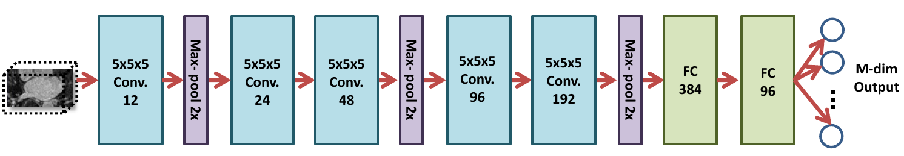

## ShapeWorks DeepSSM
DeepSSM is a convolutional neural network (CNN) model that can provide particles directly from unsegmented images after it has been trained. This documentation provides an overview of the DeepSSM process, for a full explanation see: [DeepSSM: A Deep Learning Framework for Statistical
Shape Modeling from Raw Images](https://arxiv.org/abs/1810.00111).

The input to the DeepSSM network are unsegmented 3D images of the anatomy of interest and the output are the particle-based shape models. DeepSSM requires training examples of image/PBM pairs which are generated via the traditional Shapeworks grooming and optimization pipeline or otherwise. Once the network has been trained on these examples it can predict the PBM of unseen examples given only images, bypassing the need for labor intensive segmentation, grooming, and optimization parameter tuning. 

The benefits of the DeepSSM pipeline include:
* Less Labor  - DeepSSM does not require segmentation, only a bounding box about where the anatomy of interest lies in the image.  
* End-to-end - Does not require separate grooming and optimization steps, it is an end-to-end process. This also reduces memory requirement as images don’t need to be saved after intermediate grooming steps.
* Faster Results - Once a DeepSSM network has been trained, it can be used to predict the shape model on a new image in seconds on a GPU.

The DeepSSM network is implemented in PyTorch and requires a GPU to run efficiently. 

### DeepSSM Steps 

#### 1. Data Augmentation

The first step to creating a DeepSSM model is generating training data. Deep networks require thousands of training instances and so because medical imaging data is typically limited, data augmentation is necessary. The data augmentation process is described here:  [Running Data Augmentation](DataAugmentation.md).

The data augmentation process involves reducing the PBM's to a low dimensional space via Principal Component Analysis (PCA), preserving a chosen percent of the variation. The PCA scores are saved and used as the labels for DeepSSM prediction. The PCA scores are deterministically mapped back to the PDM using the eigenvalues and vectors once the DeepSSM model makes a prediction. 

#### 2. Creation of Data Loaders

The next step is to reformat the data into PyTorch tensors. 80% of the data is randomly selected to be training data and the remaining 20% of the data is used as a validation set. The input images are whitened and turned into tensors. They can also be optionally downsampled to a smaller size to allow for faster training. The corresponding PCA scores are also normalized or whitened to avoid DeepSSM learning to favor the primary modes of variation then turned to tensors. Pytorch data loaders are then created with batch size specified by the user. 

#### 3. Training

PyTorch is used in constructing and training DeepSSM. The network architecture is defined to have five convolution layers followed by two fully connected layers as illustrated in the figure below. Parametric ReLU activation is used and the weights are initialized using Xavier initialization. The network is trained for the specified number of epochs using Adam optimization to minimize the L2 loss function with a learning rate of 0.0001. The average training and validation error are printed and logged each epoch to determine convergence.

#### 4. Testing

The trained model is then used to predict the PCA score from the images in the test set. These PCA scores are then un-whitened and mapped back to the particle coordinates using the eigenvalues and eigenvectors from PCA. Thus a PDM is acquired for each test image.

#### 5. Evaluation

To evaluate the accuracy of DeepSSM output, we compare a mesh created from segmentation to a mesh created from the predicted PDM. To obtain the original mesh, we use the ShapeWorks MeshFromDistanceTransforms command to get a mesh from the distance transform created from the true segmentation. To obtain the predicted mesh, we use the ShapeWorks ReconstructSurface command with the mean and predicted particles to reconstruct a surface.

We then compare the original mesh to the predicted mesh via surface-to-surface distance. To find the distance from the original to the predicted, we consider each vertex in the original and find the shortest distance to the surface of the predicted. This process is not symmetric as it depends on the vertices of one mesh, so the distance from the predicted to the original will be slightly different. We compute the Hausdorff distance which takes the max of these vertex-wise distances to return a single value as a measure of accuracy. We also consider the vertex-wise distances as a scalar field on the mesh vertices and visualize them as a heat map on the surface. This provides us with a way of seeing where the predicted PDM was more or less accurate.

## Using the DeepSSM Python Package
The ShapeWorks DeepSSM package is installed to the ShapeWorks anaconda environment when [conda_installs.sh](https://github.com/SCIInstitute/ShapeWorks/tree/master/conda_installs.sh) is run. To use, make sure you have the shapeworks conda environment activated and add the following import to your Python code:

`import DeepSSMUtils`

### Functions

#### Get train and validation torch loaders
This function turns the original and augmented data into training and validation torch loaders. The data provided is randomly split so that 80% is used in the training set and 20% is used in the validation set.

Call:

`DeepSSMUtils.getTrainValLoaders(out_dir, data_aug_csv, batch_size=1, down_sample=False)`

Arguments:

* out_dir - Path to directory to store torch loaders.
* data_aug_csv - The path to the csv containing original and augmented data which is output when running data augmentation.
* batch_size - The batch size for training data. Default value is 1.
* down_sample - If true the images will be downsampled to a smaller size to decrease the time needed to train the network. If false the full image will be used. Default is false.

#### Get test torch loader
This function turns the provided data into a test torch loader.

Call:

`DeepSSMUtils.getTestLoader(out_dir, test_img_list, down_sample)`

Arguments:

* out_dir - Path to directory to store torch loader.
* test_img_list - A list of paths to the images that are in the test set.
* down_sample - If true the images will be downsampled, if false the full image will be used. This should match what is done for the training and validation loaders. Default is false.

#### Train DeepSSM
This function defines a DeepSSM model and trains it on the data provided.

Call:

`DeepSSMUtils.trainDeepSSM(loader_dir, parameters, out_dir)`

Arguments:

* loader_dir - Path to directory where train and validation torch loaders are.
* parameters - A dictionary of network parameters:
  - epochs - The number of epochs to train for.
  - learning_rate - The value of the learning rate.
  - val_freq - How often to evaluate on the validation set. 1 means test on validation set every epoch, 2 means every other epoch, and so on.
* out_dir - Directory to save the model and logs in.

#### Test DeepSSM
This function gets predicted shape models based on the images provided using a trained DeepSSM model.

Call:

`DeepSSMUtils.testDeepSSM(out_dir, model_path, loader_dir, PCA_scores_path, num_PCA)`

Arguments:

* out_dir - Path to directory where predictions are saved.
* model_path - Path to train DeepSSM model.
* loader_dir - Path to directory containing test torch loader.
* PCA_scores_path - Path to eigenvalues and eigenvectors from data augmentation which are used to map predicted PCA scores to particles.
* num_PCA - The number of PCA scores the DeepSSM model is trained to predict.

#### Analyze Results
This function analyzes the shape models predicted by DeepSSM by comparing them to the true segmentation. 

Call:

`DeepSSMUtils.AnalyzeResults(out_dir, DT_dir, prediction_dir, mean_prefix)`

Arguments:

* out_dir - Path to the directory where meshes and analysis should be saved.
* DT_dir - Path to the directory containing distance transforms based on the true segmentations of the test images.
* prediction_dir - Path to the directory containing predicted particle files from testing DeepSSM.
* mean_prefix - Path to the mean particle and mesh files for the dataset.
