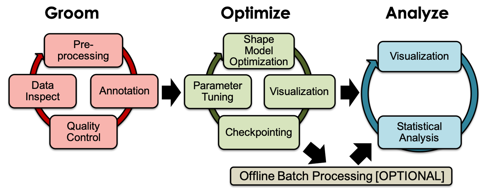
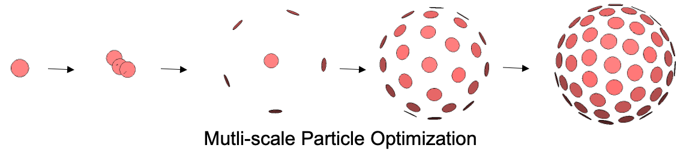

# Shape Modeling Workflow

ShapeWorks supports the typical three-stage workflow for shape modeling. 

## Groom Stage

The [groom stage](../workflow/groom.md) entails data inspection and preprocessing, including conversion of the input segmentations and surface meshes into the appropriate data types that are optimization friendly so that landmarks can be optimized in a numerically stable way. It also includes visualization for preprocessed/groomed data for quality control, and we are planning to include annotations for user-defined modeling preferences such as landmarks and constraints.

The grooming stage entails rigid transformations to align samples for groupwise modeling and analysis. Imaging data (e.g., CT, MRI) becomes out of alignment and cannot be tied to the resulting shape models. We have developed [segmentation-based](../use-cases/segmentation-based/left-atrium.md) and [mesh-based](../use-cases/mesh-based/femur.md) grooming tools and associated python scripts (i.e., use cases) to carry volumetric data through each grooming step with the shapes (meshes or segmentations) such that they can be used for subsequent analysis and visualization. These tools include image reflection (for paired anatomies), isotropic voxel resampling, image padding, applying shape-based alignment to images (center of mass and rigid alignment), and image cropping.

## Optimize Stage

The [optimize stage](../workflow/optimize.md) is an iterative cycle of correspondences (landmarks/particles) optimization, visualization/quality control of resulting correspondence model and parameter tuning. 

The model initialization proceeds simultaneously with the optimization in a multi-scale fashion using an iterative particle splitting strategy to generate progressively detailed correspondence models with each split.

## Analyze Stage

The [analyze stage](../workflow/analyze.md) is the model analysis phase that supports the computation and visualization of the principal components of shape variation, average shapes, and group differences. 

