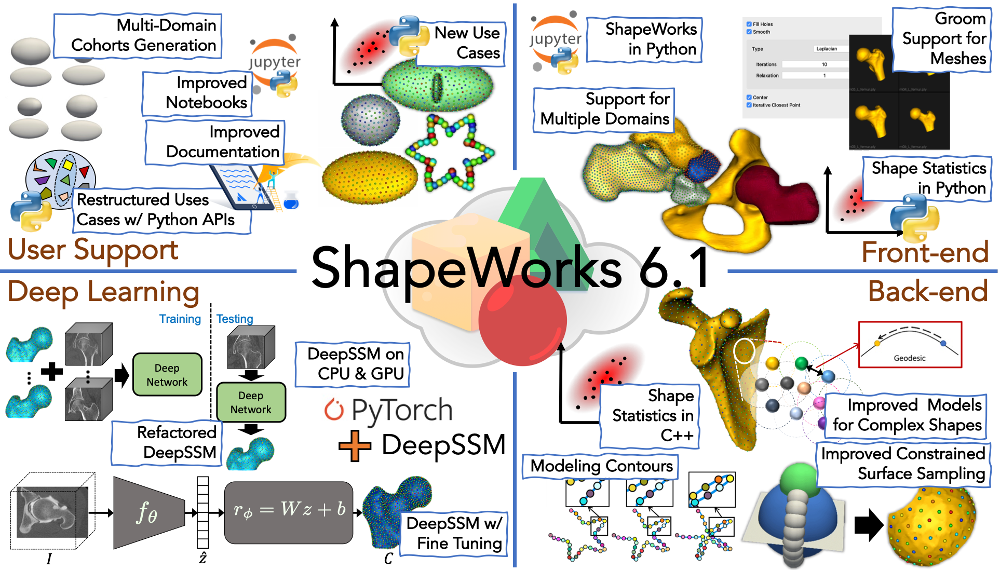

# Welcome to ShapeWorks!

<!---     
*An Integrated Suite for Shape Representation and Analysis & more...* -->

## What is ShapeWorks?

ShapeWorks is a free, open-source suite of software tools that uses a flexible method for automated construction of compact statistical landmark-based shape models of ensembles of anatomical shapes that do not rely on any specific surface parameterization. The method requires very little preprocessing or parameter tuning and applies to a wide range of shape analysis problems, including nonmanifold surfaces and arbitrary topology objects. ShapeWorks includes tools for preprocessing data, computing landmark-based shape models, and visualizing the results.

## Latest & Greatest
    
 <!---->
 <!---->

!!! note "Release Notes"    
    Please visit [Release Notes](about/release-notes.md) to know about the ShapeWorks' cutting-edge features and improvements.

## Why use ShapeWorks?

ShapeWorks is the only publicly available tool that learns a population-specific anatomical mapping in a way that respects population variability without relying on a user-defined template/atlas. 
    
It produces more detailed surface-to-surface correspondences than traditional landmark-based approaches. 

Its optimized approach offers increased power for testing biological hypotheses of shape and shape differences, captures subtle shape variations, and decreases observer bias for reproducible scientific results. 
    

*ShapeWorks can discover the underlying mode of variation in the box-bump ensemble in comparison to existing publicly available shape modeling software packages*

## ShapeWorks Get-Togethers

!!! note "Where to start? What are the latest features? How to customize existing workflows?"
    A monthly virtual get-together meeting for ShapeWorks users is organized to demonstrate new features, discuss the customization of the shape modeling workflow to users' own use cases, and get suggestions to improve the software and documentation. **If you would like to be added to the invitation list, please send an email to `shireen-at-sci-dot-utah-dot-edu`.**

## ShapeWorks Workshops & Webinars

### ShapeWorks @SB3C 2021

*Part 1: Statistical Shape Modeling & ShapeWorks*  
Speakers: Shireen Elhabian and Alan Morris

<video src="https://sci.utah.edu/~shapeworks/doc-resources/mp4s/ShapeWorks-SB3C-PartA.mp4" autoplay muted loop controls style="width:100%">

*Part 2: ShapeWorks Success Stories in Orthopedics*   
Speakers: Heath Henninger, Andrew Anderson, and Amy Lenz

<video src="https://sci.utah.edu/~shapeworks/doc-resources/mp4s/ShapeWorks-SB3C-PartB.mp4" autoplay muted loop controls style="width:100%">

*Part 3: Next Generation of ShapeWorks*   
Speakers: Shireen Elhabian, Andrew Anderson, Penny Atkins, and Riddhish Bhalodia

<video src="https://sci.utah.edu/~shapeworks/doc-resources/mp4s/ShapeWorks-SB3C-PartC.mp4" autoplay muted loop controls style="width:100%">

## ShapeWorks in Action!

The underlying scientific premise of ShapeWorks, particle-based shape modeling, is a groupwise approach to placing landmarks (i.e., correspondences) that consider variability in the entire cohort of images. 

ShapeWorks uses a set of interacting particle systems, one for each shape, to produce optimal sets of surface correspondences in an ensemble. Particles interact with one another via mutually repelling forces to cover and, therefore, describe surface geometry optimally. Particles are positioned on surfaces automatically by optimizing the model's information content via an entropy optimization scheme. 

In particular, ShapeWorks explicitly models the inherent trade-off between the model's statistical simplicity (i.e., compactness) in the shape space and the accuracy of the shape representations (i.e., good surface samplings) in the configuration space. 

ShapeWorks has been effective in various applications, including psychology, biological phenotyping, cardiology, and orthopedics. [See relevant papers](users/papers.md) and [ShapeWorks Success Stories](getting-started/sw-stories.md). 

Now enjoy some tour videos for different recent software releases.

*ShapeWorks 6.2 tour - DeepSSM in Studio, multi-domain alignments, shape evaluation charts, scalar and opacity controls, and more ...*

<video src="https://sci.utah.edu/~shapeworks/doc-resources/mp4s/ShapeWorks6.2.mp4" autoplay muted loop controls style="width:100%">

*ShapeWorks 6.1 tour - multi-domain support, mesh grooming, improved models for complex anatomies, and more ...*

<video src="https://sci.utah.edu/~shapeworks/doc-resources/mp4s/ShapeWorks6.1.mp4" autoplay muted loop controls style="width:100%">

*ShapeWorks 6.0 tour - mesh support and more in ShapeWorks Studio*

<video src="https://sci.utah.edu/~shapeworks/doc-resources/mp4s/studio_6.0_tour.mp4" autoplay muted loop controls style="width:100%">

*ShapeWorks 5.5 tour - feature support in ShapeWorks Studio*

<video src="https://sci.utah.edu/~shapeworks/doc-resources/mp4s/studio_5.5_tour.mp4" autoplay muted loop controls style="width:100%">

    
*Grooming segmentations, optimizing correspondences, and analyzing shape models in ShapeWorks Studio*   

<video src="https://sci.utah.edu/~shapeworks/doc-resources/mp4s/studio_ellipsoid.mp4" autoplay muted loop controls style="width:100%">

