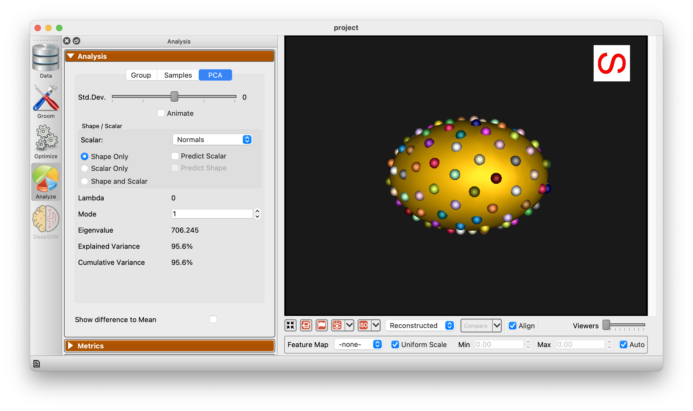

# Using the ShapeWorks Java Interface

This example Java program demonstrates how to use the ShapeWorks Java interface to perform the following tasks:

1. Create a ShapeWorks project
2. Add a shape to the project
3. Set grooming parameters
4. Set correspondence parameters
5. Save/Load the project
6. Run the ShapeWorks grooming pipeline
7. Run the ShapeWorks correspondence optimization
8. Launch the ShapeWorks Analysis GUI

# Building the ShapeWorks Java Interface

The ShapeWorks Java interface is built using the Java Compiler.  To build it:

```
cd shapeworks/Java
javac -d . *.java
```

This will place the compiled classes in the `shapeworks/Java` directory.

# Building the Example Java Program

```
cd shapeworks/Examples/Java
javac -cp ../../Java *.java
```

# Running the Example Java Program

Note: The example Java program assumes that the ShapeWorks executable is in $PATH.  Ensure that you can run `shapeworks` from the command line before running the example Java program.

```
java -cp ../../Java:. JavaExample
```

This will run the example Java program. The output should look like this:

```
Saving project...
Loading project...
Running groom...
Running optimize...
Opening ShapeWorksStudio...
```

And the ShapeWorks Analysis GUI will open.

From here you can change to the analysis module and examine the shape model.

{: width="600" }


