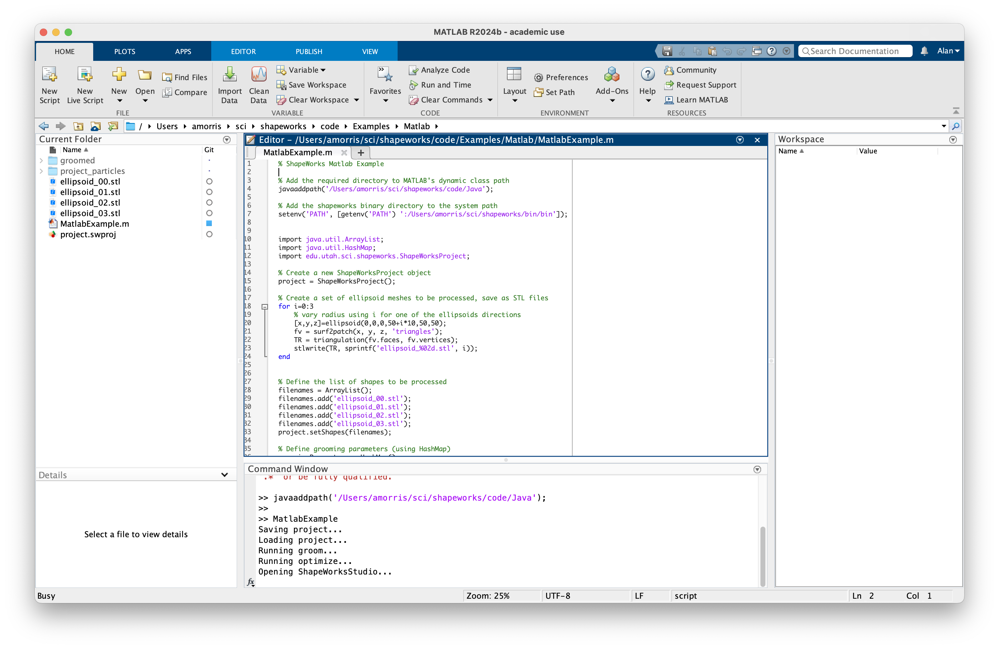
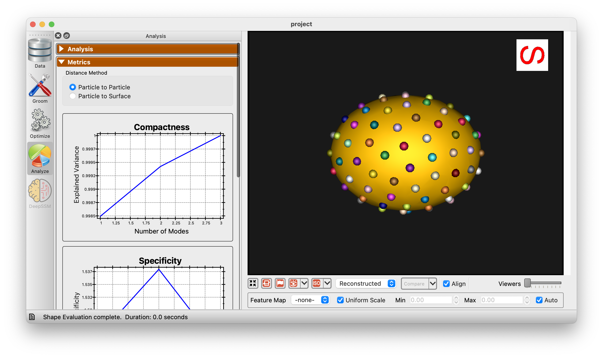

# Using the ShapeWorks Matlab Interface

This example Matlab program demonstrates how to use the ShapeWorks Matlab interface via Java to perform the following tasks:

1. Create a ShapeWorks project
2. Generate Ellipsoids
3. Add shapes to the project
4. Set grooming parameters
5. Set correspondence parameters
6. Save/Load the project
7. Run the ShapeWorks grooming pipeline
8. Run the ShapeWorks correspondence optimization
9. Launch the ShapeWorks Analysis GUI

# Building the ShapeWorks Java Interface

The ShapeWorks Java interface is built using the Java Compiler.  To build it:

```
cd shapeworks/Java
javac -d . *.java
```

This will place the compiled classes in the `shapeworks/Java` directory.

# Building the Example Java Program

```
cd shapeworks/Examples/Java
javac -cp ../../Java *.java
```

# Running the Example Matlab Program

Note: The example Matlab program uses the Java interface and needs the paths to the ShapeWorks executables.  Ensure that you update the paths in the start of the script.

# Running the Example Matlab Program

From the Matlab terminal, run the following:

```
cd shapeworks/Examples/Matlab
javaaddpath('../../Java')
MatlabExample
```

{: width="600" }


{: width="600" }


