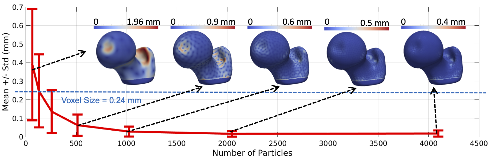

# New in ShapeWorksStudio

## Surface Reconstruction 

ShapeWorksStudio provides a particle-based surface reconstruction is can reconstruct high quality surface meshes with fewer number of particles. See [How to Analyze Your Shape Model?](../workflow/analyze.md#surface-reconstruction) for details about the method.

*With particle-based surface reconstruction, there is not need to optimize denser particle systems (i.e., with more particles) to reconstruct surface meshes with subvoxel accuracy*

*(old) VTK-based surface reconstruction*

<video src="https://sci.utah.edu/~shapeworks/doc-resources/mp4s/vtk_reconstruction.mp4" autoplay muted loop controls style="width:100%">

*(new) particle-based surface reconstruction*

<video src="https://sci.utah.edu/~shapeworks/doc-resources/mp4s/particles_reconstruction.mp4" autoplay muted loop controls style="width:100%">

## Dynamic Loading

ShapeWorksStudio support load-on-demand, which makes it more scalable by supporting loading in order of 100s of samples. For instance, an old small project that took 10+ seconds to load now starts instantly in Studio.

*(old) without dynamic loading*

<video src="https://sci.utah.edu/~shapeworks/doc-resources/mp4s/studio_load_old.mp4" autoplay muted loop controls style="width:100%">

*(new) with dynamic loading*

<video src="https://sci.utah.edu/~shapeworks/doc-resources/mp4s/studio_load_new.mp4" autoplay muted loop controls style="width:100%">

## Live Particles Movement 

ShapeWorksStudio allows for live introspection of the correpsondence placement optimization process and the ability to abort the optimization at any time (e.g., changing algorithmic parameters).

<video src="https://sci.utah.edu/~shapeworks/doc-resources/mp4s/studio_optimize_live.mp4" autoplay muted loop controls style="width:100%">

