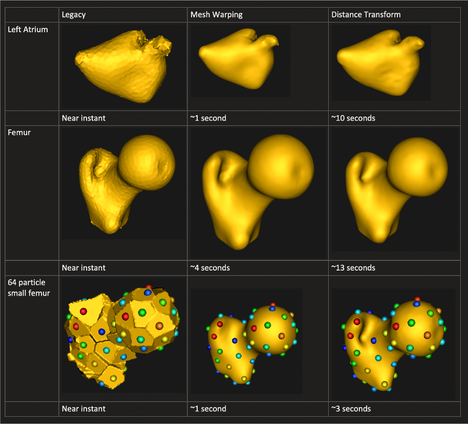

# New in ShapeWorks Studio

## Multiple Domains

As of ShapeWorks 6.1, we added support in ShapeWorks Studio for modeling multiple domains (e.g. anatomies) in joint correspondance model.

See [Multiple Domains](../studio/multiple-domains.md) for more information.

## Mesh Grooming

As of ShapeWorks 6.1, we added support in ShapeWorks Studio for mesh grooming, including smoothing, hole filling, and iterative closest point pre-alignment.

{: width="300" }

See [Groom Module](../studio/getting-started-with-studio.md#groom-module) for more information.

## Mesh Support 

As of ShapeWorks 6.0, we added mesh support to ShapeWorks Studio including loading meshes, optimizing shape models directly on meshes, and visualizing meshes with scalar feature values. Meshes can store values at vertices such as "cortical thickness", or "fibrosis” and ShapeWorks Studio uses them in a similar manner as feature maps/volumes.

*Open meshes in Studio*

 
*Visualizing features on surface mesh*

We also added a new surface reconstruction method with support for both mesh or image inputs. This method is much faster and is the new default.

*New and faster surface reconstruction*

## Improved Studio Interface

As of ShapeWorks 6.0, we added support for automatic glyph sizing, draging/dropping of images and meshes. Scalar bar color is now opposite of background color (e.g., when background is white, text should be dark) (user request).

*Samples names color is opposite of the background color for a better contrast*

## Surface Reconstruction 

ShapeWorks Studio provides a particle-based surface reconstruction that can reconstruct high quality surface meshes with fewer number of particles. See [How to Analyze Your Shape Model?](../workflow/analyze.md#surface-reconstruction) for details about the method.

*With particle-based surface reconstruction, there is not need to optimize denser particle systems (i.e., with more particles) to reconstruct surface meshes with subvoxel accuracy*

*(old) VTK-based surface reconstruction*

<video src="https://sci.utah.edu/~shapeworks/doc-resources/mp4s/vtk_reconstruction.mp4" autoplay muted loop controls style="width:100%">

*(new) particle-based surface reconstruction*

<video src="https://sci.utah.edu/~shapeworks/doc-resources/mp4s/particles_reconstruction.mp4" autoplay muted loop controls style="width:100%">

## Dynamic Loading

ShapeWorks Studio support load-on-demand, which makes it more scalable by supporting loading in order of 100s of samples. For instance, an old small project that took 10+ seconds to load now starts instantly in Studio.

*(old) without dynamic loading*

<video src="https://sci.utah.edu/~shapeworks/doc-resources/mp4s/studio_load_old.mp4" autoplay muted loop controls style="width:100%">

*(new) with dynamic loading*

<video src="https://sci.utah.edu/~shapeworks/doc-resources/mp4s/studio_load_new.mp4" autoplay muted loop controls style="width:100%">

## Live Particles Movement 

ShapeWorks Studio allows for live introspection of the correpsondence placement optimization process and the ability to abort the optimization at any time (e.g., changing algorithmic parameters).

<video src="https://sci.utah.edu/~shapeworks/doc-resources/mp4s/studio_optimize_live.mp4" autoplay muted loop controls style="width:100%">

## Feature Maps

ShapeWorks Studio has the ability to integrate **feature maps**.  A **feature map** is a 3d image volume that contains scalar values to be associated with each shape’s surface.  For example, this could be raw or processed CT/MRI data.  The feature map can be displayed for each surface by choosing the desired feature map in the feature map combobox at the bottom of the screen. 
After the correspondence is generated, the average feature map can be displayed on the mean shape in the analysis tab.

<video src="https://sci.utah.edu/~shapeworks/doc-resources/mp4s/studio_feature_map.mp4" autoplay muted loop controls style="width:100%">

