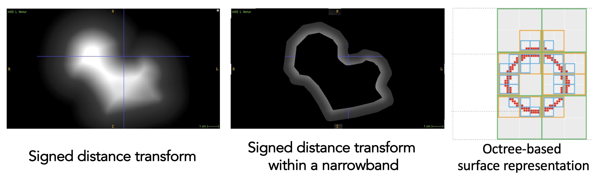

# ShapeWorks Takes ~85% Less Memory

ShapeWorks uses signed distance transforms to represent shape samples. This, and other quantities computed from the distance transforms consumed a lot of memory.

Instead, we now store only a subset of these values that lie within a narrow band off the surface (inside and outside the surface). A default narrow band of 4 units is used. This works well for the tested use cases and is configurable using the `<narrow_band>` parameter,  see: [How to Optimize Your Shape Model](../workflow/optimize.md).

We make use of [OpenVDB](https://www.openvdb.org/), a more memory-efficient data structure, for signed distance transforms. OpenVDB uses a tree-based data structure to store data in only the relevant voxels. We verified that same distance transform values are obtained and made sure optimizer loudly crashes if we sample outside the narrow band.

!!! danger "Lower memory footprint and faster optimization"
    Along with other refactoring and code optimizations, ShapeWorks now uses *85% less memory* (from 57.09GB to 9.67GB in one use case). Additionally, the particle optimizer is now *2X faster*.

*ShapeWorks now uses 85% less memory. The particles optimizer is now 2X faster. These benchmarks are reported on a Pelvis datasets of 40 NRRD files and a femur dataset of 57 NRRD files.*

