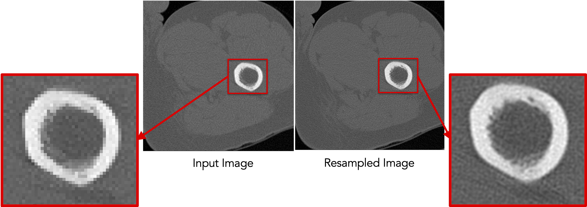
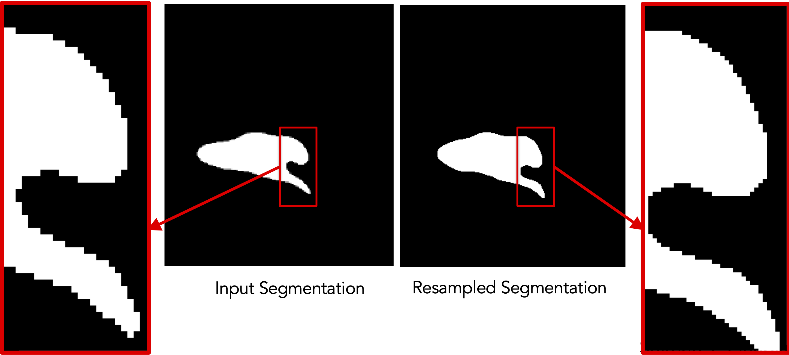

# ShapeWorks Command

ShapeWorks provides a single [`shapeworks`](../tools/ShapeWorksCommands.md) command with subcommands for grooming, optimization, and other operations. Each subcommand has interactive `--help` documentation.

The codebase is organized as shared libraries rather than independent executables, providing a common backbone for both command-line and GUI-based tools. This also enables ShapeWorks functionality to be linked into new applications.

## Example: ResampleVolumesToBeIsotropic


!!! note "Old command-line: `ResampleVolumesToBeIsotropic `"
    ```
    ./ResampleVolumesToBeIsotropic --inFilename <input-file> --outFilename <output-file>
                                   --isoSpacing <voxel-spacing>
                                  [--isBinaryImage] [--isCenterImageOn]
    ```


### Resampling images

!!! important "Command-line: `isoresample` (for images)"
    ```
    shapeworks readimage --name <input-file> recenter
               isoresample --isospacing <voxel-spacing>
               writeimage --name <output-file>
    ```

!!! important "C++ (without chaining): `isoresample` (for images)"
    ```c++
    Image img(<input-file>);
    img.recenter();
    img.isoresample(<voxel-spacing>);
    img.write(<output-file>);
    ```

!!! important "C++ (with chaining): `isoresample` (for images)"
    ```c++
    Image img(<input-file>).recenter().isoresample(<voxel-spacing>).write(<output-file>);
    ```




### Resampling segmentations

The resampling functionalities are broken down into modular subcommands:

- Antialias using `shapeworks antialias`
- Recenter using `shapeworks recenter`
- Binarize using `shapeworks binarize`

This allows the user to choose the set of commands to run, modify parameters at each step, and save intermediate outputs for troubleshooting.

!!! important "Command-line: `isoresample` (for segmentations)"
    ```
    shapeworks readimage --name <input-file>
               recenter antialias --iterations <num-iter>
               isoresample --isospacing <voxel-spacing> binarize
               writeimage --name <output-file>
    ```

!!! important "C++ (without chaining): `isoresample` (for segmentations)"
    ```c++
    Image img(<input-file>);
    img.recenter();
    img.antialias(<num-iter>);
    img.isoresample(<voxel-spacing>);
    img.binarize();
    img.write(<output-file>);
    ```

!!! important "C++ (with chaining): `isoresample` (for segmentations)"
    ```c++
    Image img(<input-file>).recenter().antialias(<num-iter>).isoresample(<voxel-spacing>).binarize().write(<output-file>);
    ```

