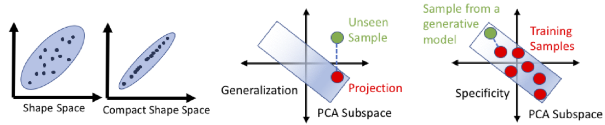
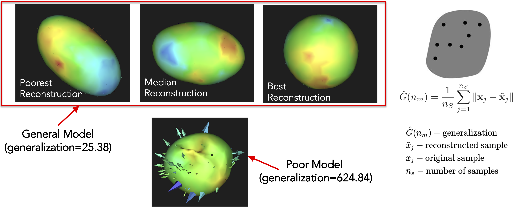
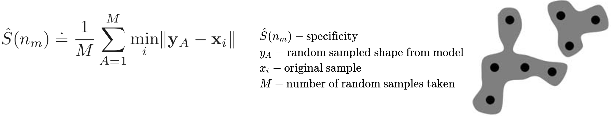

# Shape Model Evaluation


ShapeWorks support quantitative evaluation of shape models, which can be used for algorithmic parameter tuning. Quantitative metrics are generalizability, specificity, and compactness. In `Examples/Python/`, run `python RunUseCase.py ellipsoid_evaluate` to see an example of how to compute these metrics.



!!! note "Compactness"
    For fixed training data, a compact model pdf should describe the data's distribution using the smallest possible number of parameters.

*Poor Model  (compactness = 0.3)*
<p><video src="https://sci.utah.edu/~shapeworks/doc-resources/mp4s/eval_bad_pca.mov" autoplay muted loop controls style="width:100%"></p>

*Compact Model  (compactness = 0.99)*
<p><video src="https://sci.utah.edu/~shapeworks/doc-resources/mp4s/eval_good_pca.mov" autoplay muted loop controls style="width:100%"></p>


!!! note "Generalization"
    The model should be able to generalize from the examples given in the training set, hence describing any valid instance of the class of object, not just those seen in the training set.
    


!!! note "Specificity"
    This is the requirement that the model can only represent valid instances of the class(es) of objects presented in the training set. Hence, the model is specific for this training set.



!!! danger "What is a good shape model?"
    A good shape model should balance the trade-off between three requirements, namely specificity, generalization, and compactness. In particular, a shape model needs to generate samples that are plausible (i.e., respect the population statistics). It also needs to generate samples beyond the training data (i.e., generalizable) while describing the population with few parameters (i.e., compact).

## ShapeWorks Commands

```
shapeworks readparticlesystem --name *.particles -- compactness    --nmodes 1
shapeworks readparticlesystem --name *.particles -- generalization --nmodes 1
shapeworks readparticlesystem --name *.particles -- specificity    --nmodes 1
```

## ShapeWorks Python tools

```python
# Read the particle files from a pre-trained shape model
particle_data = sw.ParticleSystem(<list of local point files>)
#evaluation tools
shapeworks.ShapeEvaluation.ComputeCompactness(particleSystem=particle_data, nModes=1, saveTo="scree.txt")
shapeworks.ShapeEvaluation.compute_generalization(particleSystem=particle_data, nModes=1, saveTo=save_dir)
shapeworks.ShapeEvaluation.ComputeSpecificity(particleSystem=particle_data, nModes=1, saveTo=save_dir)
```
Details about the evaluation functions can be found [in the API Reference](http://sciinstitute.github.io/ShapeWorks/latest/api/Classes/classshapeworks_1_1ShapeEvaluation.html#function-shapeevaluation)

<p><video src="https://sci.utah.edu/~shapeworks/doc-resources/mp4s/eval_ShellDemo.mp4" autoplay muted loop controls style="width:100%"></p>


## Model Evaluation in Studio

Model evaluation is performed in Studio automatically under the metrics panel. See [Studio - Metrics Panel](../studio/getting-started-with-studio.md#metrics-panel) for more information.
