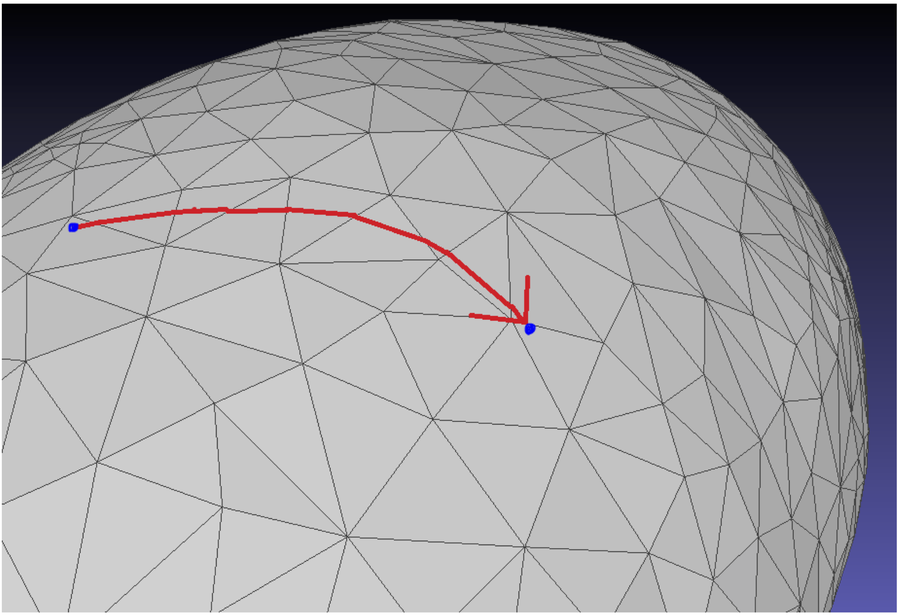

# ShapeWorks Directly on Meshes

Surface meshes are capable of representing complex surfaces with thin structures while using at most several megabytes of data. By allowing ShapeWorks to optimize shape models directly on meshes, we are reducing the hardware requirements and memory load of the software, allowing it to run faster on weaker systems, including personal computers.

!!! note 
    Femur dataset segmentation data: 9.2GB vs. mesh data: 53.1MB

*Particle updates using geodesic walks so particles never leave the surface*

*Optimizing particles on spheres with lumps of different sizes*

<video src="https://sci.utah.edu/~shapeworks/doc-resources/mp4s/lumps_live.mp4" autoplay muted loop controls style="width:100%">

*Optimizing particles on open meshes*

<video src="https://sci.utah.edu/~shapeworks/doc-resources/mp4s/hemisphere_live.mp4" autoplay muted loop controls style="width:100%">

As of ShapeWorks 6, we enabled using surface normals as correspondence features.
 

*Surface normals enable better modeling of thin structures*

*Better surface sampling and correspondences with surface normals*

