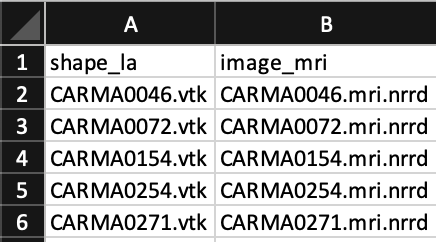
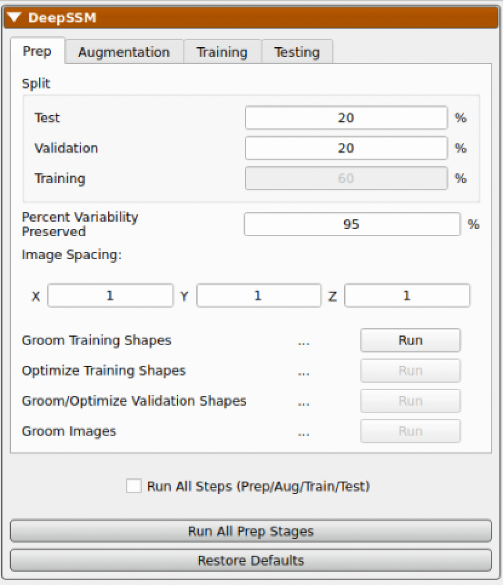
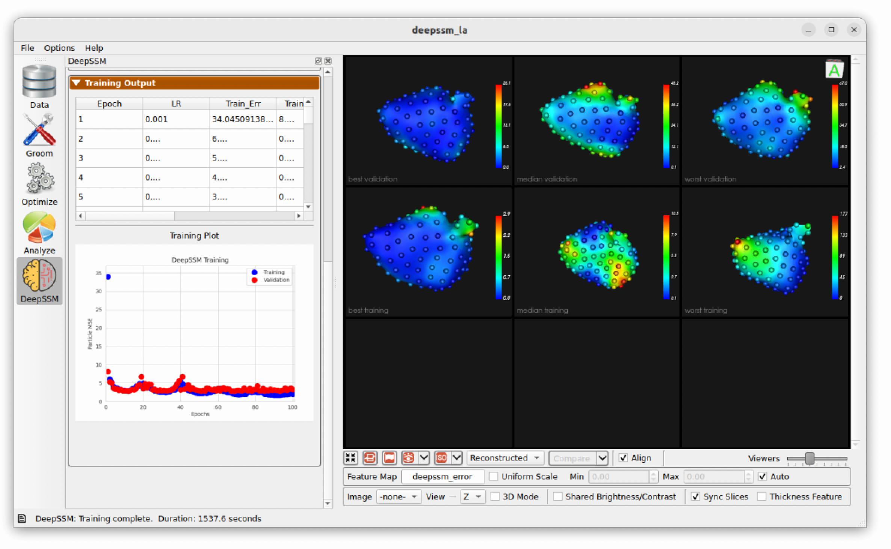
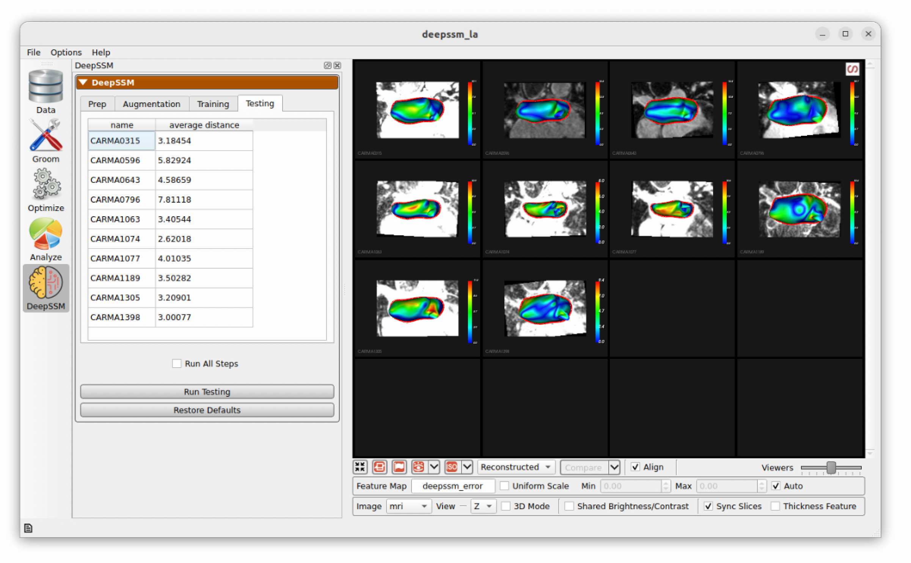

# DeepSSM in Studio

ShapeWorks Studio supports data augmentation and DeepSSM model training and testing. For a full explanantion of the process see: [Data Augmentation for Deep Learning](../deep-learning/data-augmentation.md) and [SSMs Directly from Images](../deep-learning/deep-ssm.md). 

Running DeepSSM requires an optimized shape model for training data. To run DeepSSM in Studio, load a ShapeWorks Project Spreadsheet with the following columns: local_particles, world_particles	image, groomed, meshes. The input to DeepSSM is the unsegmented images given in the image column and the predicted output is the world particles. The groomed and mesh inputs are used for visualization and error maps.

{: width="600" }

## Importing Data for DeepSSM

In this example, we demonstrate DeepSSM in studio with parameterized Supershapes that have three dominant PCA modes. The data is available at `ShapeWorks/Examples/Studio/supershapes.zip`. Loading the project spreadsheet and clicking to the analyze tab we see:

have defined two domains, `left_atrium` and `appendage`.  The multiple domains are shown in the Data panel when importing a ShapeWorks Project Spreadsheet file with more than one column with the `shape` prefix. When we open this in Studio, we will see:

{: width="600" }

## Defining Data Split

The first step is to define what percentage of the input data to use in training, validation, and testing. First, the testing data is split from the dataset and kept out of data augmentation and model training. For example, if the dataset is comprised of 10 samples and the test split is set to 20 percent, then the test set will have two samples. After data augmentation, the validation split is used to define a validation set. For example, if there are 8 real samples (excluding test examples) and 2 are augmented and the validation split is set to 30 percent, then the validation set will have 3 of those 10. 

{: width="600" }

## Data Augmentation

The next step is to run data augmentation to create more training examples. Users can specify how many samples to generate, how many PCA dimensions to us or how much variability to preserve, and what type of sampling distribution to use. For a more detailed description of these parameters, please see: [Data Augmentation for Deep Learning](../deep-learning/data-augmentation.md) and [Data Augmentation Notebook](../notebooks/getting-started-with-data-augmentation.ipynb).

{: width="600" }

While data augmentation is running a progress bar is displayed across the bottom. After it has completed, the newly generated data is displayed below the real data in the right panel for comparison. A table is shown which contains the real and augmented image paths, particle paths, and PCA scores. Parallel violin plots are displayed to compare the distribution of each PCA score across the real and augmented data. This can be helpful in visually assessing if the type of distribution used in augmentation provided a good fit for the data. 

{: width="600" }

## Training

The next step is to train the DeepSSM model. Some training parameters are exposed which are explained in detail here: [SSMs Directly from Images](../deep-learning/deep-ssm.md).

{: width="600" }

As the model trains, each epoch the display updates. The "Training Output" table logs the epochs, learning rate, and training and validation errors. The training and validation error are also plotted over epochs in a scatterplot below. To the right, examples of validation predictions are displayed and updated every epoch. Here we can see the examples with the greatest, smallest, and closest to the mean error. The distance from the predicted particles to the true particles is displayed as a heat map with a corresponding scale. This gives an idea of model prediction quality as the model trains. 

{: width="600" }

## Testing

In the final step, predictions are made on the testing set which is unseen to the DeepSSM model. A mesh is created based on these particle positions and the surface to surface distance from this mesh to the true mesh is calculated. This is displayed as a heat map on the predictions and the average for each sample is shown in the table. 

{: width="600" }

