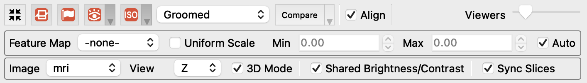
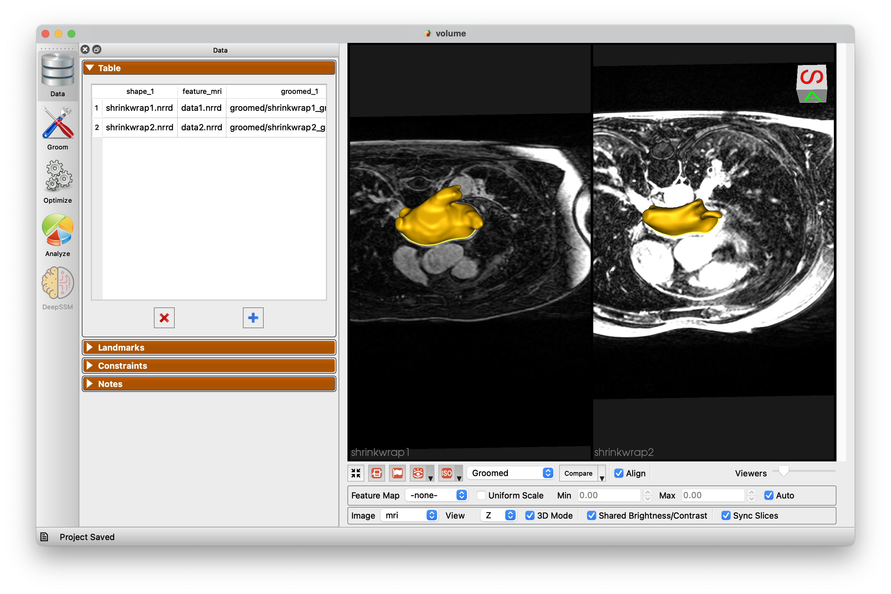
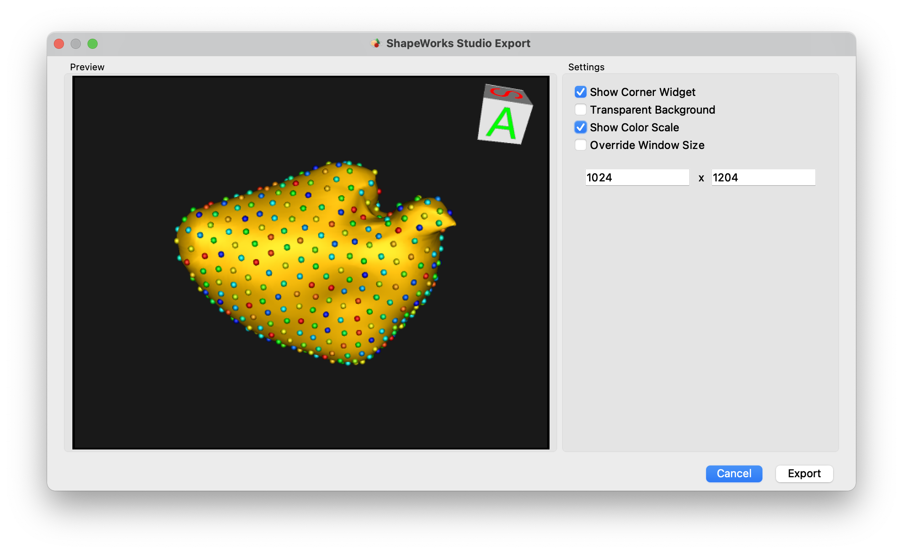
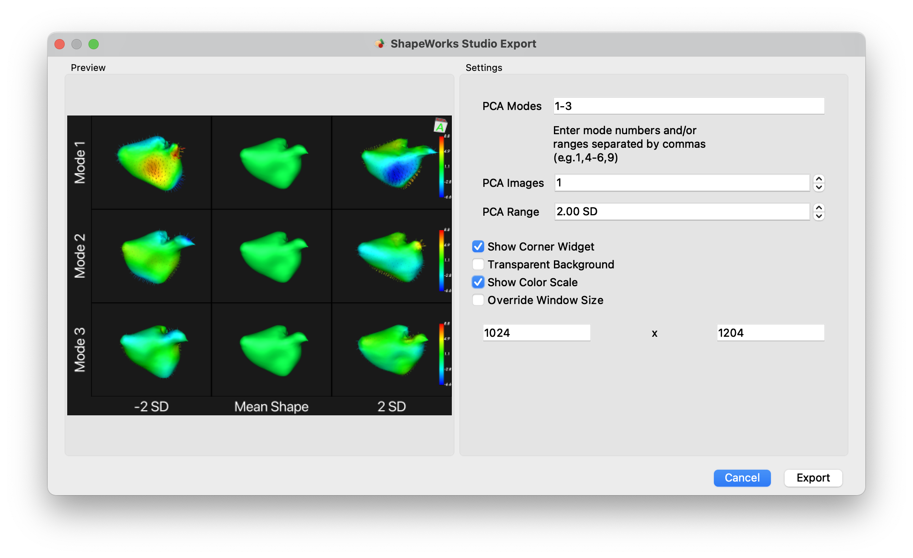

# Getting Started With ShapeWorks Studio

ShapeWorks Studio provides an all-in-one GUI based interface to the
ShapeWorks toolkit.  In Studio, you can manage input Data, Groom, Optimize and Analyze your data all within a single interface.

## Splash Screen

The splash screen provides access to recent projects and an option to create a new blank project.

## Data Module

The Data Module shows the project data table, landmarks, constraints as well as user-defined/saved notes. This module enables you to add and remove shapes (segmentations and surface meshes) to your cohort, define anatomical landmarks, place cutting planes and free form constraints for surface exclusion.

{: width="300" }

See [Studio Data Module](studio-data.md) for more information.

## Groom Module

The Groom module provides options to preprocess/groom the input data.  Options differ for binary segmentations and meshes. You also have the option of skipping grooming if your data is already prepped.

{: width="300" }

See [Studio Groom Module](studio-groom.md) for more information.

## Optimize Module

The Optimize module provides options for the particle-based optimization.  After selecting options and clicking "Run Optimize", you can monitor the process of the optimization in real-time.  Particle positions will be displayed on individual shapes as they progress where color encodes surface correspondences across different shapes in your cohort.

{: width="300" }

See [Studio Optimize Module](studio-optimize.md) for more information.

## Analysis Module

After optimization is complete, you may analyze the data in Studio using the Analysis module.  There are several panels available in the Analysis Module.

See [Studio Analyze Module](studio-analyze.md) for more information.

## Preferences

Studio provides a number of preference options.

| Option | Description |
| --- | ----------- |
| Color Scheme | Base foreground and background colors for viewers |
| Color Map | Color map used for scalar ranges |
| Reverse Color Map | Option to reverse the color map |
| Discrete Color Mode | Option to use discrete colors for color map |
| Groom Output | Folder name for groom output |
| Optimize Output | Folder name for optimize particle output |
| Mesh Cache Enabled | Whether to use a cache of meshes |
| Mesh Cache Memory to Use | Percentage of phyisical memory to allow mesh cache to use |
| Mesh Parallel Reconstruction | Whether to use parallelized mesh reconstruction |
| Mesh Parallel Number of Threads | How many threads to use for parallelized mesh reconstruction |
| Orientation Marker Type | Medical, Triad, or None |
| Orientation Marker Corner | Upper Right, Upper Left, Lower Left, Lower Right |
| PCA Range | Number of standard deviations for PCA slider |
| Number of PCA Steps | Number of steps for PCA slider bar |
| Geodesics Cache Size Multiplier |  Multiplier value for geodesics caching |
| Log Location | A display of where the current log file is located |

 

## Viewer Controls

At the bottom of the viewers are the controls for the viewers:

Each button has tooltips with descriptions.  The controls from left to right are:

* Autoview / reset view
* Cutting plane visibility
* Landmark visibility
* Glyph visibility with dropdown for glyph size and detail
* Isosurface visibility with dropdown for surface opacity (of each domain)
* View mode (original/groomed/reconstructed)
* Align (whether to align each object based on the alignment strategy)
* Compare mode (e.g. compare original vs groomed)
* Number of views in lightbox (1,2,4,9,16,25,36,49,64)

Additionally, when feature volumes or meshes with scalars are loaded, the extended panel will be displayed:

This adds the feature map / scalar selection and a checkbox to apply a uniform scale to all viewers, vs local scale for each.  Additionally, the auto range can be turned off and specified range can be set.

When image volumes are provided, another extended panel will be displayed:

* Image selection
* Plane direction (X/Y/Z)
* Enabled 2D/3D viewere mode
* Shared Brightness/Contrast between viewers
* Sync slice position between viewers

## Keyboard Shortcuts

The keyboard shortcuts are available from the Help -> Keyboard Shortcuts menu item.

### Point selection 

As shown in the keyboard shortcuts panel, you can hover over a particle and press the '1' key.  This will select this point on all viewers.

The selected point will become white and all other points will change to a color based on the distance to the chosen point.

To turn off this display, press '1' while hovering over something other than a particle.

Additionally, after selecting a point, you may select another point by pressing '2' while hovering.  This will set the first point to white, the second point to yellow and the rest to black.  This is an easy way to see how particlar particles vary and correspond across shapes.

## Menus
### File Menu

{: width="300" }

* `New Project` - Create a new project
* `Open Project` - Open a project from disk
* `Show Project folder` - Open Explorer/Finder for project location (windows/mac)
* `Save Project` - Save project to disk
* `Save Project As` - Save a copy of the project to a new file
* `Import Shapes...` - Import new shapes
* `Export` - See export below
* Up to 8 recent projects are shown at the bottom

### Export Menu

The File -> Export menu is shown below.

{: width="200" }

* Export Current Mesh - Export the current mesh as a VTK mesh file
* Export Current Particles - Export the currently display particles as an "X Y Z" particles file
* Export Current Particle Scalars - Export the currently displayed particle scalars as a CSV file
* Export Current Mesh Scalars - Export the currently displayed mesh scalars as a CSV file
* Export All Subjects Particle Scalars - Export the particle scalars for all subjects
* Export Eigenvectors - Export the PCA eigenvectors
* Export Eigenvalues - Export the PCA eigenvalues
* Export PCA Component Scores - Export the raw PCA component scores for each subject as a CSV file
* Export PCA Mode Particles - Export the PCA mode particles at each step of the PCA slider
* Export PCA Montage - Launch export dialog for exporting montage of PCA images
* Export Screenshot - Launch export dialog for exporting current display

### Export Screenshot Dialog

{: width="600" }

The Export Screenshot dialog allows you to export the currently displayed image using a variety of options

| Option | Description |
| --- | ----------- |
| Show Corner Widget | Show or hide the orientation widget |
| Transparent Background | Enables transparent background in image export |
| Show Color Scale | Show or hide color scale, when applicable |
| Override Window Size | Override the window size and choose a resolution for export |

### Export PCA Montage

{: width="600" }

The PCA Montage exporter allows you to create a multi-image montage across PCA modes. Options are similar to the screenshot export with the addition of controls:

| Option | Description |
| --- | ----------- |
| PCA Modes | Comma separated list of modes or ranges to include |
| PCA Images | Number of images to export on either side of the mean |
| PCA Range | Standard deviation range of PCA export |

## Project setup
ShapeWorks Studio and the `shapeworks` commands `groom` and `optimize` store project data in an XLSX spreadsheet. The spreadsheet format profiles a uniform, easy to edit, easy to organize way of inputing data into shapeworks for grooming, optimizing and analyzing data.
See [Here](../workflow/parameters.md) for more details regaring the project sheet and the python API available to generate the project sheet. 

