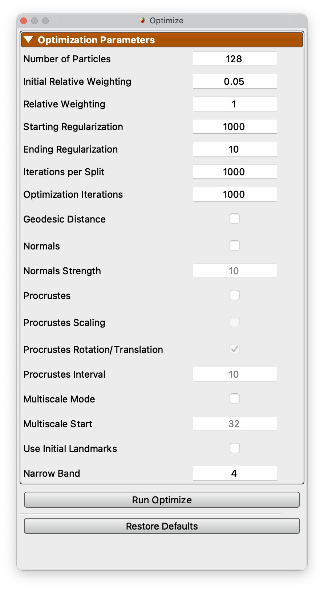
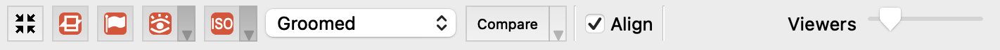
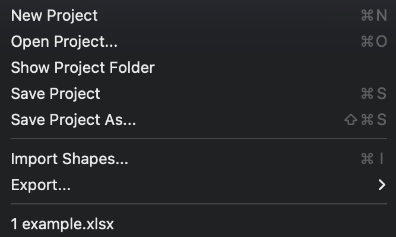

# Getting Started With ShapeWorks Studio

ShapeWorks Studio provides an all-in-one GUI based interface to the
ShapeWorks toolkit.  In Studio, you can Groom, Optimize and Analyze
your data all within a single interface.

## Splash Screen

The splash screen provides access to recent projects and an option to create a new blank project.

## Data Module

The Data Module shows the project data table as well as user-defined/saved notes. This module enables you to add and remove shapes (segmentations and surface meshes) to your cohort for further analysis.

{: width="300" }

## Groom Module

The Groom module provides options to preprocess/groom the input data.  Options differ for binary segmentations and meshes. You also have the option of skipping grooming if your data is already prepped.

Grooming options for binary segmentation volumes:

{: width="300" }

Grooming options for meshes:

{: width="300" }

## Optimize Module

The Optimize module provides options for the particle-based optimization.  After selecting options and clicking "Run Optimize", you can monitor the process of the optimization in real-time.  Particle positions will be displayed on individual shapes as they progress where color encodes surface correspondences across different shapes in your cohort.

{: width="300" }

## Analysis Module

After optimization is complete, you may analyze the data in Studio using the Analysis module.  There are several panels available in the Analysis Module.

### View Panel

The View panel contains all of the options for controlling the analyis viewer options.

#### Group

The Group mode allows for group comparison to quantify and visualize population-level differences.  Each `group_<value>` column from the project can be selected and the differences between any two values (i.e., group identifiers) in the groups can be displayed by selecting the group values in the left and right dropdown boxes.  A group difference display showing vectors and a colormap of distance can be shown using the "Diff -->" button.

#### Samples

The Samples tab of the view panel allows you to view all of the samples in your cohort, view a single sample by index, or view the median sample.

#### PCA

The PCA tab of the View panel shows reconstructed shapes (surface meshes) along PCA modes of variation. Modes of variations are shape parameters learned/discovered from your data that describes shape variations. You can control the location along the PCA mode with the Standard Deviation slider.  The extent of this slider is configurable in [Preferences](#preferences).  Values displayed:

`Lambda` - This shows the PCA loading of current position of the slider.  The middle of the slider, at the mean value, will be 0.  The extent of lambda is defined by the number of standard deviations of the slider as described above.  At standard deviation of 1.0, it will be the square root of the mode's eigenvalue.

`Eigenvalue` - This shows the eigenvalue of the currently selected mode.  This is a unitless measure of how much variance is explained by this mode.  The modes are sorted in decreasing order of eigenvalue, corresponding to the most variance explained first.

### Metrics Panel

The Metrics panel shows the Compactness, Specificity, and Generalization charts.  These are interactive charts with hover menus and the ability to zoom, pan, etc.

### Surface Reconstruction Panel

The surface reconstruction panel provides options for the surface reconstruction method.  There are three surface reconstruction methods available depending on the data you supply.

`Legacy` - If an older XML file with only particle files is supplied, then only this option is available.  This is the fallback option since it requires only the particles.

`Mesh Warping Based` - Mesh warping based method that utilizes the mean mesh.  You must have either meshes supplied or image based (distance transforms).

`Distance Transform Based` - Surface reconstruction based on distance transforms.  Project must have distance transforms.

Below is an example of the difference in using this option.

## Preferences

Studio provides a number of preference options.

| Option | Description |
| --- | ----------- |
| Color Scheme | Base foreground and background colors for viewers |
| Orientation Marker Type | Medical, Triad, or None |
| Orientation Marker Corner | Upper Right, Upper Left, Lower Left, Lower Right |
| PCA Range | Number of standard deviations for PCA slider |
| Mesh Cache Enabled | Whether to use a cache of meshes |
| Mesh Cache Epsilon | Determination of how much different a mesh must be before it is considered a different mesh, for caching purposes |
| Mesh Cache Memory to Use | Percentage of phyisical memory to allow mesh cache to use |
| Mesh Parallel Reconstruction | Whether to use parallelized mesh reconstruction |
| Mesh Parallel Number of Threads | How many threads to use for parallelized mesh reconstruction |
| Log Location | A display of where the current log file is located |

 

## Viewer Controls

At the bottom of the viewers are the controls for the viewers:

Each button has tooltips with descriptions.  The controls from left to right are

* Autoview / reset view
* Glyph visibility with dropdown for glyph size and detail
* Isosurface visibility with dropdown for surface opacity (of each domain)
* View mode (original/groomed/reconstructed)
* Center (whether to center each object based on center of mass)
* Number of views in lightbox (1,2,4,9,16,25,36,49,64)

Additionally, when feature volumes or meshes with scalars are loaded, the extended panel will be displayed:

This adds the feature map / scalar selection and a checkbox to apply a uniform scale to all viewers, vs local scale for each.  Additionally, the auto range can be turned off and specified range can be set.

## Keyboard Shortcuts

The keyboard shortcuts are available from the Help -> Keyboard Shortcuts menu item.

### Point selection 

As shown in the keyboard shortcuts panel, you can hover over a particle and press the '1' key.  This will select this point on all viewers.

The selected point will become white and all other points will change to a color based on the distance to the chosen point.

To turn off this display, press '1' while hovering over something other than a particle.

Additionally, after selecting a point, you may select another point by pressing '2' while hovering.  This will set the first point to white, the second point to yellow and the rest to black.  This is an easy way to see how particlar particles vary and correspond across shapes.

## File menus

Studio's file menu is shown below.

{: width="200" }

* `New Project` - Create a new project
* `Open Project` - Open a project from disk
* `Save Project` - Save project to disk
* `Save Project As` - Save a copy of the project to a new file
* `Import Shapes...` - Import new shapes
* `Export` - See export below
* Up to 4 recent projects are shown at the bottom

The File -> Export menu is shown below.

{: width="200" }

* Export Current Mesh - Export the current mesh as a VTK mesh file
* Export Mesh Scalars - Export the mesh scalars as a CSV file
* Export Eigenvectors - Export the PCA eigenvectors
* Export Eigenvalues - Export the PCA eigenvalues
* Export Variance Graph - Export the variance graph as a PNG file
* Export PCA Component Scores - Export the raw PCA component scores for each subject as a CSV file
* Export PCA Mode Points - Export the PCA mode points at each step of the PCA slider

## Project setup

ShapeWorks Studio and the `shapeworks` commands `groom` and `optimize` are using a new project format based off of XLSX.  The new spreadsheet format profiles a uniform, easy to edit, easy to organize way of inputing data into shapeworks for grooming, optimizing and analyzing data.

Users input shapes (either binary segmentations or meshes) in the first sheet (or data sheet) using special column names to indiate type:

| Prefix | Description |
| --- | ----------- |
| shape_&lt;name&gt; | An input shape (segmentation/mesh) with a given name. * Specify multiple shape_&lt;name&gt; columns to input multiple anatomies for each subject |
| group_&lt;name&gt; | An group column with categorical types |
| feature_&lt;name&gt; | A feature volume (such as an MRI or CT) |

 
Many other columns will be filled in automatically by the ShapeWorks tools.

A more complete example is provided in Examples/Studio/FeatureMap/feature_map_example.xlsx :

{: width="300" }

After completing groom and optimize steps, this worksheet will look like this:

There will also be new worksheets with parameters from those tools and other studio settings.

