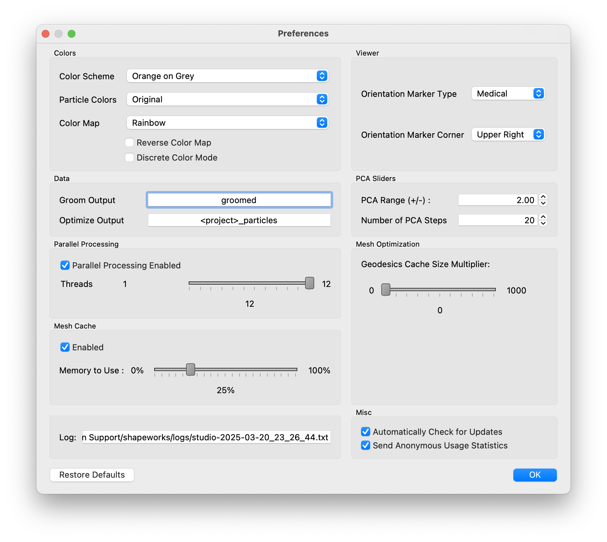

# ShapeWorks Studio

ShapeWorks Studio provides an all-in-one GUI based interface to the
ShapeWorks toolkit.  In Studio, you can Groom, Optimize and Analyze
your data all within a single interface

## Splash Screen

The splash screen provides access to recent projects and an option to create a new blank project

## Data Module

The Data Module shows the project data table as well as notes and provides buttons to add or remove shapes.

## Groom Module

The Groom Module provides options to preprocess/groom the input data.  Options differ for binary segmentations and meshes.

You also have the option of skipping grooming if your data is already prepped.

## Optimize Module

The Optimize Module provides options for the particle based optimization.  After selecting options and clicking "Run Optimize", you can monitor the process of the optimization in real time.  Particle positions will be displayed on individual shapes as they progress.

## Analysis Module

After optimization is complete, you may analyze the data in Studio using the Analysis Module.  There are several panels available in the Analysis Module.

### View Panel

The view panel contains all of the options for controlling the analyis viewer options.

#### Group

The group mode allows for group comparison.  Each column of group values from the project can be selected and the differences between any two values in the groups can be displayed by selecting the group values in the left and right dropdown boxes.  A group difference display showing vectors and a colormap of distance can be shown using the "Diff -->" button.

#### Samples

The samples tab of the view panel allows us to view all of the samples, view a single sample by index, or view the median sample.

#### PCA

The PCA tab of the view panel shows reconstructed shapes along PCA modes of variation.

You can control the location along the PCA mode with the Standard Deviation Slider.  The extent of this slider is configurable in Preferences.

Displayed with each reconstruction is the Lambda value for this position on the slider and the Eigenvalue for this PCA mode.

### Metrics Panel

The Metrics panel shows the Explained Variance chart.  This chart shows how much of the population's variance is explained, cumulatively by each mode.  You can hover over each bar to see the individual values.

### Surface Reconstruction Panel

The surface reconstruction panel provides options for the surface reconstruction method.  Using this option will provide smoother reconstructions.

Below is an example of the difference in using this option.

## Preferences

Studio provides a number of preference options.

| Option | Description |
| --- | ----------- |
| Color Scheme | Base foreground and background colors for viewers |
| Orientation Marker Type | Medical, Triad, or None |
| Orientation Marker Corner | Upper Right, Upper Left, Lower Left, Lower Right |
| PCA Range | Number of standard deviations for PCA slider |
| Mesh Cache Enabled | Whether to use a cache of meshes |
| Mesh Cache Epsilon | Determination of how much different a mesh must be before it is considered a different mesh, for caching purposes |
| Mesh Cache Memory to Use | Percentage of phyisical memory to allow mesh cache to use |
| Mesh Parallel Reconstruction | Whether to use parallelized mesh reconstruction |
| Mesh Parallel Number of Threads | How many threads to use for parallelized mesh reconstruction |
| Log Location | A display of where the current log file is located |

 
## Viewer Controls

## Keyboard Shortcuts
